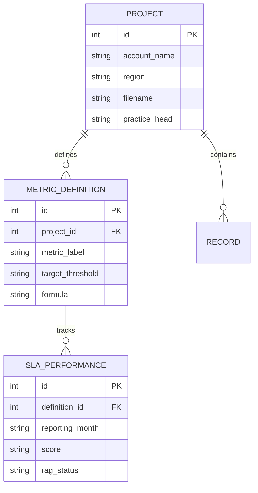

# Database Architecture Upgrade: Client SLA & Metric Monitoring

This document records the architectural changes made to the `revenue_generator.db` to transition from a **Project-Centric** model to a **Multi-Tenant SLA & Metric Monitoring** platform.

## 1. Summary of Changes
The primary goal of this upgrade is to enable the system to ingest a **Master SLA Basefile** (containing 30+ accounts in one file) and track high-granularity performance metrics (Time to Fill, Quality of Hire, etc.) over time.

- **Constraint Relaxation**: `filename` in the `projects` table is no longer unique, allowing one "Master File" to spawn multiple "Account" entries.
- **Enterprise Hierarchy**: New metadata fields added to `projects` for organizational filtering.
- **Metric Definitions**: Introduced a dedicated catalog for storing a "Zero-Loss" representation of Excel metric data.
- **Time-Series Performance**: Added a dedicated table for monthly scores and RAG statuses.

---

## 2. Updated Table: `projects`
Enhanced to act as the primary organizational anchor for both candidate tracking and SLA monitoring.

| Column | Type | Description |
| :--- | :--- | :--- |
| `id` | INTEGER (PK) | Primary Key. |
| `filename` | VARCHAR | **Non-unique.** The source Excel file name. |
| **`account_name`** | VARCHAR (NEW) | **The Client Name** (e.g., HPE, BITS). The primary identifier for this record. |
| **`region`** | VARCHAR (NEW) | Organizational region (e.g., North, South 1, West 2). |
| **`practice_head`** | VARCHAR (NEW) | Senior leader responsible for the client account. |
| **`be_spoc`** | VARCHAR (NEW) | Primary Business Point of Contact for the account. |
| **`category`** | VARCHAR (NEW) | Client categorization (e.g., Category A, Category B). |
| `column_mapping` | JSON | AI-generated mapping for candidate-level trackers. |
| `revenue_logic_code` | TEXT | Python code synthesized for financial logic. |

---

## 3. New Table: `metric_definitions`
Stores the metadata for each SLA or KPI found in the Master Basefile. This table maps directly to the first 15 columns of the `Base File` sheet.

| Column | Type | Description |
| :--- | :--- | :--- |
| `id` | INTEGER (PK) | Primary Key. |
| `project_id` | INTEGER (FK) | Reference to `projects.id`. |
| `metric_label` | VARCHAR | The name of the metric (e.g., "Time to Fill"). |
| `metric_group` | VARCHAR | The group the metric belongs to (e.g., "Speed", "Quality"). |
| `metric_nature` | VARCHAR | The type (e.g., "Contractual SLA", "Internal KPI"). |
| `target_threshold`| VARCHAR | The SLA target (e.g., "85%", "40 days"). |
| `definition` | TEXT | Detailed natural language definition of the metric. |
| `calculation_method`| TEXT | Human-readable instruction for how the metric is computed. |
| `formula` | TEXT | The logical/mathematical expression for the metric. |
| `source_system` | VARCHAR | Where the raw data originates (e.g., "Manual Tracker", "ATS"). |

---

## 4. New Table: `sla_performances`
A high-frequency table that stores the monthly "Snapshot" of a metric's performance.

| Column | Type | Description |
| :--- | :--- | :--- |
| `id` | INTEGER (PK) | Primary Key. |
| `definition_id` | INTEGER (FK) | Reference to `metric_definitions.id`. |
| `reporting_month` | VARCHAR | The month/year string (e.g., "Apr24", "May24"). |
| `score` | VARCHAR | The raw achievement value (e.g., "100%", "92.5"). |
| `rag_status` | VARCHAR | The RAG (Red/Amber/Green) state (e.g., MET, NOT MET). |

---

## 5. Entity Relationship Diagram (ERD)

---

## 6. Connectivity & Logic
- **Horizontal Traceability**: A `Project` can now be filtered by **Region** or **Practice Head** in the "Audit Hub," automatically aggregating metrics from its child `metric_definitions`.
- **Vertical Audit**: Each `SLA_PERFORMANCE` row is linked to a `METRIC_DEFINITION` row, which in turn holds the exact **Formula** used for calculation. This allows the AI agent to verify the scores against the raw candidate data in the `records` table.
