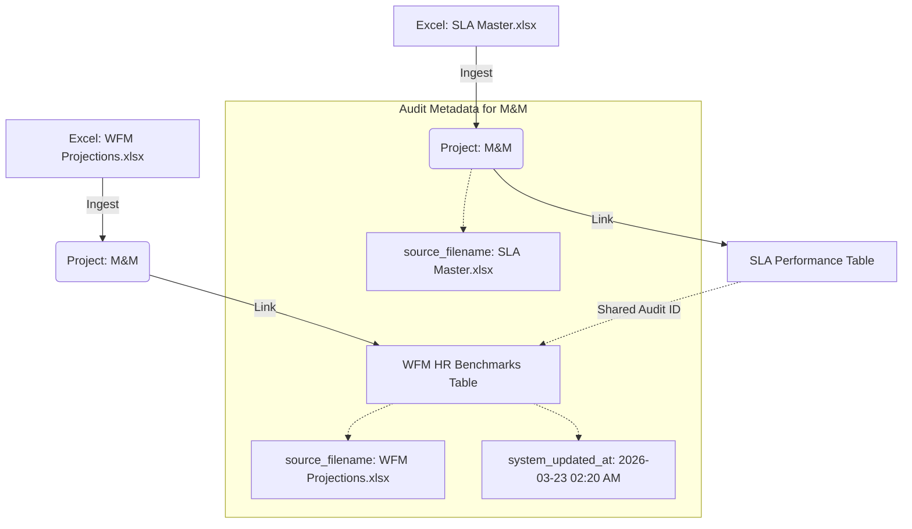

# Database Audit Infrastructure: Traceability & Provenance

This document details the universal **Audit Hub** implemented to track the origin, timing, and accountability of every data point within the system.

---

## 1. The Audit Architecture
We have introduced a core **`AuditMixin`** that is inherited by every single table in the database. This ensures that no data exists in isolation; every row carries a "Provenance Signature."

### **The Audit Signature Columns**
| Column | Type | Purpose |
| :--- | :--- | :--- |
| **`system_created_at`** | DATETIME | The exact timestamp (UTC) the record was first ingested by a script. |
| **`system_updated_at`** | DATETIME | Automatically refreshes whenever a record is modified (e.g., re-uploading an Excel file with updated scores). |
| **`source_filename`** | VARCHAR | The **Physical Ground Truth**: Tracks exactly which Excel file provided this data (e.g., `WFM_v2.xlsx`). |
| **`uploaded_by`** | VARCHAR | Traceability for the user or automated job that triggered the ingestion. |

---

## 2. Core Ingestion Integration
The ingestion pipelines (`ingest_sla.py` and `ingest_wfm.py`) have been re-engineered to be "Audit-Aware."

1.  **Extraction**: The script identifies the `basename` of the Excel file being loaded.
2.  **Stamping**: For every row processed (whether it is a Project, an SLA score, or a WFM benchmark), the script injects the filename into the `source_filename` column.
3.  **Automatic Time-stamping**: The database engine (SQLAlchemy) handles the generation of timestamps on the server side, ensuring high-integrity audit logs that cannot be spoofed by client-side clock drifts.

---

## 3. How Everything is Connected
The **`Project` ID** acts as the high-level anchor, while the **Audit Signature** provides the vertical traceability across different data files.

### **Entity Context Flow**

---

## 4. 📝 Audit Case Study: M&M (Mahindra & Mahindra)

### **The Intelligence Scenario**
If a dashboard user notices that M&M's SLA for "Time to Fill" is failing, they can now use the **Audit Trail** to perform a root-cause analysis:

1.  **Step 1 (SLA Audit)**: Look at the failing SLA record. See that its `source_filename` is `Raw Data SLA Basefile.xlsx`. You know exactly which file was used to report the failure.
2.  **Step 2 (WFM Correlation)**: Look at the WFM table for M&M. The system sees that for the *same* account (M&M), there is a record from `WFM (Projected Headcount & Revenue).xlsx`. 
3.  **Step 3 (The Discovery)**: In the WFM entry, you see a **Resource Gap** (Actual HC < Ideal HC). 
4.  **Step 4 (Validation)**: You check `system_updated_at` and see that both files were ingested on the same morning. 

**Conclusion**: The failure in the SLA is highly likely caused by the staffing deficit identified in the WFM file. The audit trail **proves** both data points are current and come from the correct authorized files.

---

## 5. Table Audit Coverage Roadmap

The following tables are now 100% "Audit-Aware":
- [x] **`projects`**: Tracks account meta-data changes.
- [x] **`records`**: Audit-trail for every candidate tracked.
- [x] **`metric_definitions`**: Tracks when calculation logic or targets were changed.
- [x] **`sla_performances`**: Accountability for monthly scores and RAG status.
- [x] **`wfm_hr_benchmarks`**: Traces recruiter productivity and capacity history.
- [x] **`wfm_resource_gaps`**: Tracks internal Taggd hiring needs.
- [x] **`project_budgets` & `project_forecasts`**: Ensures financial projections are timestamped.
