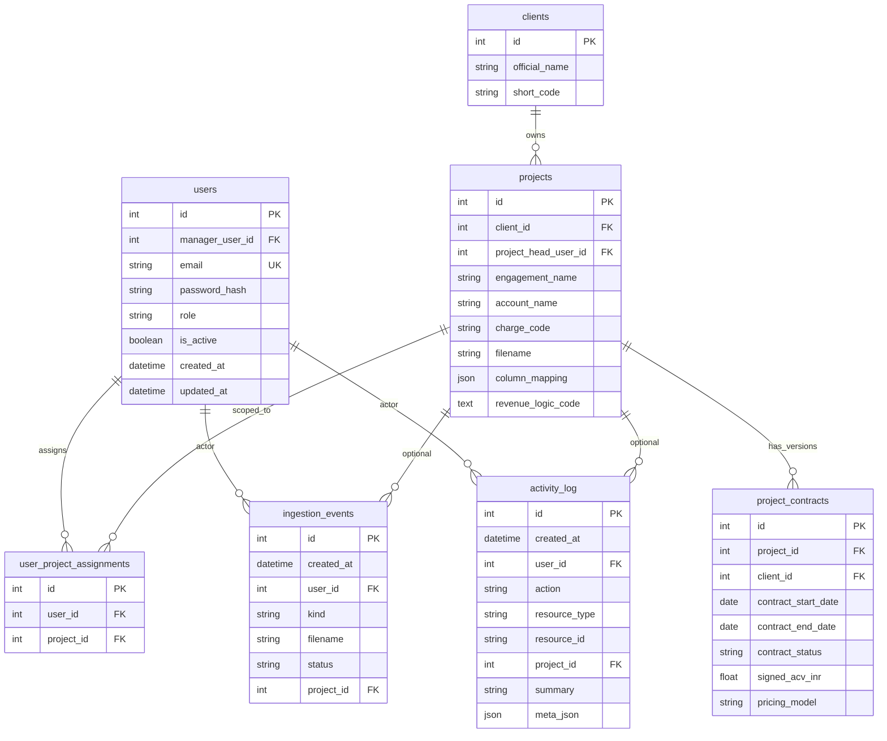
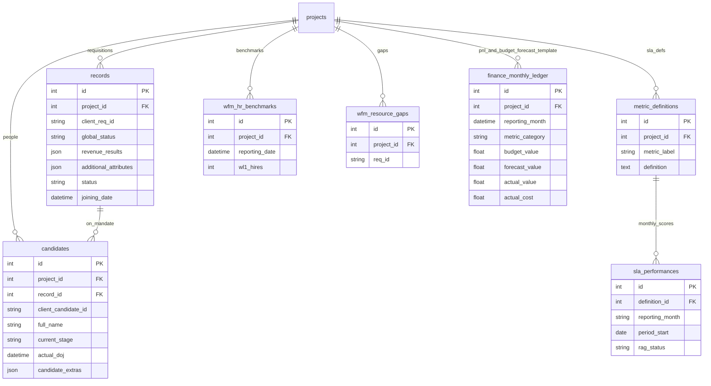
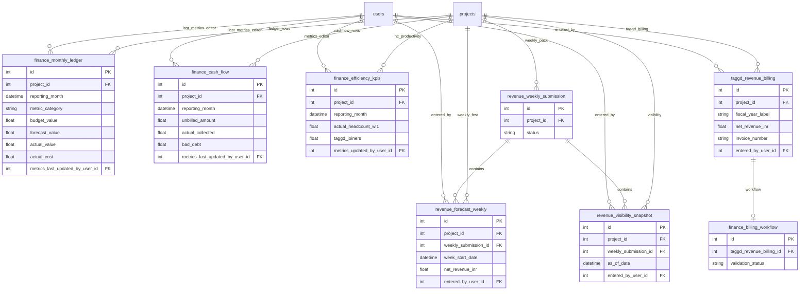
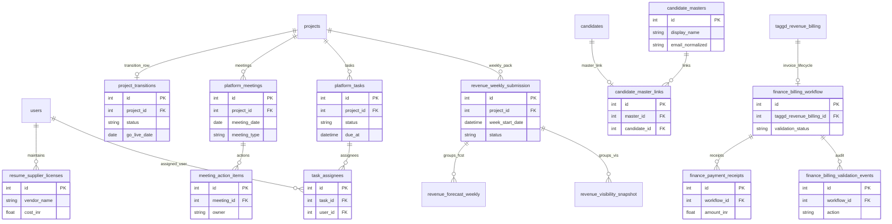
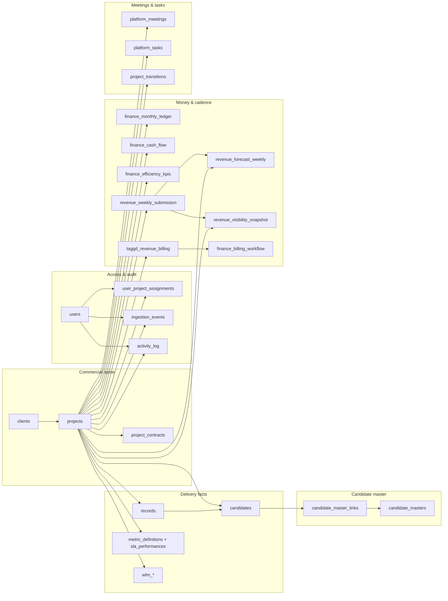

# Database schema reference

This document describes the application database as defined in SQLAlchemy (`backend/db/database.py`). Default connection: `DATABASE_URL` env var, else `sqlite:///./revenue_generator.db`.

**ORM parity:** the tables below mirror `database.py` on the `base_complete` line of development. Older SQLite files pick up **additive** columns and indexes through `_ensure_*` helpers invoked from `init_db()` (listed in *Runtime migrations*). **Destructive** changes (e.g. dropping legacy `project_budgets` / `project_forecasts` after copying into `finance_monthly_ledger`) run only when the migration module detects those legacy tables.

## Design overview

| Theme                  | Detail                                                                                                                                                                                                                                                                                                |
| ---------------------- | ----------------------------------------------------------------------------------------------------------------------------------------------------------------------------------------------------------------------------------------------------------------------------------------------------- |
| **ORM**                | SQLAlchemy declarative `Base`; `init_db()` runs `create_all`, finance dedupe, SLA / client backfills, optional candidate-master backfill (`CANDIDATE_MASTER_BACKFILL_ON_INIT`), then idempotent SQLite DDL for indexes and `revenue_weekly_submission`.                                               |
| **Spine**              | `**clients`** → `**projects`** → `**records`** (requisitions) and `**candidates`** (mandate-level people rows). Optional `**candidate_masters`** + `**candidate_master_links`** cross-link pipeline rows to an enterprise-wide talent identity.                                                       |
| **Auth & RBAC**        | `**users`** (extended profile + `manager_user_id` self-FK, `vertical_access_json`) + `**user_project_assignments`**; application-layer scope. `**project_head_user_id`** on projects; `**hiring_manager_user_id**` / `**assigned_recruiter_user_id**` on records and candidates.                      |
| **Audit**              | `**ingestion_events`**, `**activity_log`**; `**AuditMixin**` on ingest-heavy domain tables (see *Audit mixin*). Several newer tables use explicit `created_at` / `updated_at` instead of the mixin.                                                                                                   |
| **Commercial**         | `**project_contracts`**; `**taggd_revenue_billing*`* with optional 1:1 `**finance_billing_workflow*`* (validation, TDS/GST/partial payment fields), `**finance_payment_receipts*`*, `**finance_billing_validation_events**`, `**finance_tds_certificates**`, stub `**finance_bank_statement_lines**`. |
| **Governance & ops**   | `**platform_meetings`** + `**meeting_action_items`** (MoM-style); `**project_transitions`** (client onboarding milestones, one row per project); `**platform_tasks**` + `**task_assignees**` (cross-cutting work queue); `**resume_supplier_licenses**` (org-level vendor spend).                     |
| **Finance & planning** | `**finance_monthly_ledger`** / `**finance_cash_flow`** / `**finance_efficiency_kpis`**; **budget/forecast template** rows use finer `metric_category` on the ledger (see *Budget / forecast template*).                                                                                               |
| **RevOps cadence**     | `**revenue_forecast_weekly`** and `**revenue_visibility_snapshot`** (unique per project + week / as-of); both may reference `**revenue_weekly_submission`** (draft → submit → review → approve).                                                                                                      |

---

## Entity relationship overview (how tables connect)

| From                                          | To                                      | FK / link                                                                    | `ON DELETE` (where set) | Typical access                                                    |
| --------------------------------------------- | --------------------------------------- | ---------------------------------------------------------------------------- | ----------------------- | ----------------------------------------------------------------- |
| `users`                                       | `users`                                 | `manager_user_id`                                                            | `SET NULL`              | **R/W** org hierarchy (reporting line)                            |
| `user_project_assignments`                    | `users`                                 | `user_id`                                                                    | `CASCADE`               | **R/W** scoped projects                                           |
| `user_project_assignments`                    | `projects`                              | `project_id`                                                                 | `CASCADE`               | **R/W**                                                           |
| `ingestion_events`                            | `users`                                 | `user_id`                                                                    | `SET NULL`              | **W** ingest, **R** feeds                                         |
| `ingestion_events`                            | `projects`                              | `project_id`                                                                 | `SET NULL`              | **W** / **R**                                                     |
| `activity_log`                                | `users`                                 | `user_id`                                                                    | `SET NULL`              | **W** append-only, **R** timeline                                 |
| `activity_log`                                | `projects`                              | `project_id`                                                                 | `SET NULL`              | **W** / **R**                                                     |
| `projects`                                    | `clients`                               | `client_id`                                                                  | `RESTRICT`              | **R/W** spine                                                     |
| `projects`                                    | `users`                                 | `project_head_user_id`                                                       | `SET NULL`              | **R/W** accountable head (FK user)                                |
| `project_contracts`                           | `projects`                              | `project_id`                                                                 | `CASCADE`               | **R/W** contracts                                                 |
| `project_contracts`                           | `clients`                               | `client_id`                                                                  | `SET NULL`              | **R/W** optional                                                  |
| `project_transitions`                         | `projects`                              | `project_id`                                                                 | `CASCADE`               | **R/W** one transition row per project                            |
| `project_transitions`                         | `users`                                 | `transition_done_by_user_id`, `created_by_user_id`, `updated_by_user_id`     | `SET NULL`              | **R/W**                                                           |
| `platform_meetings`                           | `projects`                              | `project_id`                                                                 | `SET NULL`              | **R/W** meetings (nullable project for ad-hoc)                    |
| `platform_meetings`                           | `users`                                 | `organizer_user_id`, `created_by_user_id`                                    | `SET NULL`              | **R/W**                                                           |
| `meeting_action_items`                        | `platform_meetings`                     | `meeting_id`                                                                 | `CASCADE`               | **R/W** MoM follow-ups                                            |
| `records`                                     | `projects`                              | `project_id`                                                                 | (default)               | **R/W** tracker + RPO                                             |
| `records`                                     | `users`                                 | `hiring_manager_user_id`, `assigned_recruiter_user_id`                       | `SET NULL`              | **R/W** attribution                                               |
| `candidates`                                  | `projects`                              | `project_id`                                                                 | `CASCADE`               | **R/W**                                                           |
| `candidates`                                  | `records`                               | `record_id`                                                                  | `CASCADE`               | **R/W**                                                           |
| `candidates`                                  | `users`                                 | `hiring_manager_user_id`, `assigned_recruiter_user_id`, `created_by_user_id` | `SET NULL`              | **R/W**                                                           |
| `candidate_master_links`                      | `candidates`                            | `candidate_id`                                                               | `CASCADE`               | **R/W** 0..1 master link per candidate                            |
| `candidate_master_links`                      | `candidate_masters`                     | `master_id`                                                                  | `CASCADE`               | **R/W**                                                           |
| `metric_definitions`                          | `projects`                              | `project_id`                                                                 | (default)               | **R/W** SLA defs                                                  |
| `sla_performances`                            | `metric_definitions`                    | `definition_id`                                                              | (default)               | **R/W** SLA rows                                                  |
| `wfm_hr_benchmarks`, `wfm_resource_gaps`      | `projects`                              | `project_id`                                                                 | (default)               | **R/W** WFM                                                       |
| `finance_monthly_ledger`, `finance_cash_flow` | `projects`                              | `project_id`                                                                 | (default)               | **R/W** ledger and cash; **W** budget/forecast template on ledger |
| `finance_monthly_ledger`, `finance_cash_flow` | `users`                                 | `metrics_last_updated_by_user_id`                                            | `SET NULL`              | **W** metrics editor                                              |
| `finance_efficiency_kpis`                     | `projects`                              | `project_id`                                                                 | (default)               | **R/W**                                                           |
| `finance_efficiency_kpis`                     | `users`                                 | `metrics_updated_by_user_id`                                                 | `SET NULL`              | **W**                                                             |
| `revenue_weekly_submission`                   | `projects`                              | `project_id`                                                                 | `CASCADE`               | **R/W** weekly pack workflow                                      |
| `revenue_weekly_submission`                   | `users`                                 | `submitted_by_user_id`, `reviewed_by_user_id`, `approved_by_user_id`         | `SET NULL`              | **R/W**                                                           |
| `revenue_forecast_weekly`                     | `projects`                              | `project_id`                                                                 | `CASCADE`               | **R/W**                                                           |
| `revenue_forecast_weekly`                     | `users`                                 | `entered_by_user_id`                                                         | `SET NULL`              | **W**                                                             |
| `revenue_forecast_weekly`                     | `revenue_weekly_submission`             | `weekly_submission_id`                                                       | `SET NULL`              | **R/W** link to governance row                                    |
| `revenue_visibility_snapshot`                 | `projects`                              | `project_id`                                                                 | `CASCADE`               | **R/W**                                                           |
| `revenue_visibility_snapshot`                 | `users`                                 | `entered_by_user_id`                                                         | `SET NULL`              | **W**                                                             |
| `revenue_visibility_snapshot`                 | `revenue_weekly_submission`             | `weekly_submission_id`                                                       | `SET NULL`              | **R/W**                                                           |
| `taggd_revenue_billing`                       | `projects`                              | `project_id`                                                                 | `CASCADE`               | **R/W** TAGGD billing                                             |
| `taggd_revenue_billing`                       | `users`                                 | `entered_by_user_id`                                                         | `SET NULL`              | **W**                                                             |
| `finance_billing_workflow`                    | `taggd_revenue_billing`                 | `taggd_revenue_billing_id`                                                   | `CASCADE`               | **R/W** 1:1 invoice lifecycle                                     |
| `finance_billing_workflow`                    | `users`                                 | several `*_user_id` reviewer/approver FKs                                    | `SET NULL`              | **R/W**                                                           |
| `finance_billing_validation_events`           | `finance_billing_workflow`              | `workflow_id`                                                                | `CASCADE`               | **W** append-only state log                                       |
| `finance_payment_receipts`                    | `finance_billing_workflow`              | `workflow_id`                                                                | `CASCADE`               | **R/W** partial/full receipts                                     |
| `finance_tds_certificates`                    | `projects` / `finance_billing_workflow` | `project_id`, `workflow_id`                                                  | `CASCADE` / `SET NULL`  | **R/W** Form 16A tracking                                         |
| `finance_bank_statement_lines`                | `projects`, `finance_billing_workflow`  | optional links                                                               | `SET NULL`              | **W** recon stub                                                  |
| `platform_tasks`                              | `projects`                              | `project_id`                                                                 | `SET NULL`              | **R/W** task queue                                                |
| `platform_tasks`                              | `users`                                 | `created_by_user_id`, `completed_by_user_id`, `updated_by_user_id`           | `SET NULL`              | **R/W**                                                           |
| `task_assignees`                              | `platform_tasks`                        | `task_id`                                                                    | `CASCADE`               | **R/W**                                                           |
| `task_assignees`                              | `users`                                 | `user_id`                                                                    | `CASCADE`               | **R/W**                                                           |
| `resume_supplier_licenses`                    | `users`                                 | `created_by_user_id`, `updated_by_user_id`                                   | `SET NULL`              | **R/W** org-wide licenses (no `project_id`)                       |

**Read vs write (workload pattern, not SQL privileges)**

- **Read-heavy / analytical:** SLA + finance roll-ups, `records` / `candidates`, billing + workflow status, meetings and tasks for ops views.  
- **Write-heavy / transactional:** `records` ingest, `finance_monthly_ledger` / `finance_cash_flow`, weekly revenue rows, `revenue_weekly_submission` state transitions, billing workflow + validation events.  
- **Append-once then update:** `candidates`, `project_contracts`, `finance_billing_validation_events`, parts of `finance_billing_workflow`.

---

## Constraints and indexes (beyond `index=True` on columns)

| Name                                  | Table                         | Rule                                                                                                        |
| ------------------------------------- | ----------------------------- | ----------------------------------------------------------------------------------------------------------- |
| `uq_user_project_assignment`          | `user_project_assignments`    | Unique (`user_id`, `project_id`)                                                                            |
| `uq_candidate_project_client_id`      | `candidates`                  | Unique (`project_id`, `client_candidate_id`)                                                                |
| `uq_project_transitions_project_id`   | `project_transitions`         | Unique (`project_id`) — one transition record per project                                                   |
| `uq_rev_fcst_week`                    | `revenue_forecast_weekly`     | Unique (`project_id`, `week_start_date`)                                                                    |
| `uq_rev_vis_asof`                     | `revenue_visibility_snapshot` | Unique (`project_id`, `as_of_date`)                                                                         |
| `uq_rev_weekly_submission`            | `revenue_weekly_submission`   | Unique (`project_id`, `week_start_date`, `period_type`) — DDL in `_ensure_revenue_weekly_submission_schema` |
| `uq_finance_ledger_proj_month_cat`    | `finance_monthly_ledger`      | Unique (`project_id`, `reporting_month`, `metric_category`) — created at init if missing                    |
| `uq_finance_cash_proj_month`          | `finance_cash_flow`           | Unique (`project_id`, `reporting_month`) — created at init if missing                                       |
| `uq_finance_billing_workflow_billing` | `finance_billing_workflow`    | Unique (`taggd_revenue_billing_id`) — one workflow envelope per billing row                                 |
| `uq_task_assignee_user`               | `task_assignees`              | Unique (`task_id`, `user_id`)                                                                               |
| (implicit)                            | `candidate_master_links`      | `candidate_id` **unique** — at most one master link per `candidates` row                                    |
| `ix_rev_weekly_sub_status`            | `revenue_weekly_submission`   | Index on `status` (migration)                                                                               |
| `ix_rev_weekly_sub_project`           | `revenue_weekly_submission`   | Index on `project_id` (migration)                                                                           |
| `ix_projects_charge_code`             | `projects`                    | Index on `charge_code` (migration)                                                                          |
| `ix_projects_client_id`               | `projects`                    | Index on `client_id` (migration)                                                                            |
| `ix_projects_engagement_name`         | `projects`                    | Index on `engagement_name` (`_ensure_clients_and_project_client_columns`)                                   |
| `ix_candidates_created_by_user_id`    | `candidates`                  | Index on `created_by_user_id` (`_ensure_candidates_profile_columns`)                                        |

---

## Runtime migrations (`init_db` and `_ensure_*`)

These run on application startup so **older SQLite files** gain columns and indexes without a separate Alembic revision. Order is significant where noted.

| Step | Function / call                                                                                  | Purpose                                                                                                                            |
| ---- | ------------------------------------------------------------------------------------------------ | ---------------------------------------------------------------------------------------------------------------------------------- |
| 1    | `migrate_legacy_project_budget_forecast_tables`                                                  | If legacy `project_budgets` / `project_forecasts` exist, copy to `finance_monthly_ledger` and `DROP` legacy tables.                |
| 2    | `_ensure_clients_and_project_client_columns`                                                     | `projects.client_id`, `engagement_name` + indexes `ix_projects_client_id`, `ix_projects_engagement_name`.                          |
| 3    | `_ensure_records_rpo_columns`                                                                    | Full RPO / mandate column set on `records` when missing.                                                                           |
| 4    | `_ensure_candidates_profile_columns`                                                             | CV / experience / `created_by_user_id` on `candidates` + index.                                                                    |
| 5    | `_ensure_projects_project_head_column`                                                           | String `project_head` on `projects`.                                                                                               |
| 6    | `_ensure_user_rbac_and_attribution_columns`                                                      | `users` profile + manager; `project_head_user_id`; user FKs on `records` / `candidates`.                                           |
| 7    | `_ensure_finance_ledger_cash_metrics_audit_columns`                                              | `metrics_last_updated_*` on ledger + cashflow.                                                                                     |
| 8    | `_ensure_finance_efficiency_scorecard_columns`                                                   | `target_ppc_inr`, `metrics_updated_*` on `finance_efficiency_kpis`.                                                                |
| 9    | `_ensure_project_enterprise_columns`                                                             | `charge_code`, `account_status`, `sub_region`, `regional_head`, `function_head` + `ix_projects_charge_code`.                       |
| 10   | `_ensure_sla_period_start_column`                                                                | `period_start` on `sla_performances`.                                                                                              |
| 11   | `_ensure_finance_efficiency_wl1_column`                                                          | `actual_headcount_wl1`.                                                                                                            |
| 12   | `_ensure_finance_efficiency_taggd_joiners_column`                                                | `taggd_joiners`.                                                                                                                   |
| 13   | (session) `dedupe_finance_tables`, `backfill_sla_period_starts`, `backfill_client_project_links` | Data repair / backfill.                                                                                                            |
| 14   | (optional env) `backfill_candidate_masters`                                                      | When `CANDIDATE_MASTER_BACKFILL_ON_INIT` is truthy.                                                                                |
| 15   | `_ensure_finance_unique_indexes`                                                                 | `uq_finance_ledger_proj_month_cat`, `uq_finance_cash_proj_month`.                                                                  |
| 16   | `_ensure_revenue_tracker_indexes`                                                                | `uq_rev_fcst_week`, `uq_rev_vis_asof`.                                                                                             |
| 17   | `_ensure_revenue_weekly_submission_schema`                                                       | Create `revenue_weekly_submission` if missing, unique + indexes, `ALTER` `weekly_submission_id` onto forecast + visibility tables. |

New tables defined **only** in SQLAlchemy `metadata` (e.g. `platform_meetings`, `finance_billing_workflow`) rely on `create_all` on a fresh DB; existing DBs need a deploy-time migration or manual DDL if those tables predate the deployment file.

---

## Tables (column-level)

### `users`

| Column                      | Type        | Notes                                                                                                                                                                                    |
| --------------------------- | ----------- | ---------------------------------------------------------------------------------------------------------------------------------------------------------------------------------------- |
| `id`                        | Integer     | PK                                                                                                                                                                                       |
| `email`                     | String(255) | Unique, not null, indexed                                                                                                                                                                |
| `password_hash`             | String(255) | Not null                                                                                                                                                                                 |
| `role`                      | String(32)  | Indexed; values include legacy `admin` / `manager` / `executive` and platform roles (`platform_admin`, `operations`, `project_head`, `recruiter`, `client_user`, …) — see auth bootstrap |
| `is_active`                 | Boolean     | Default true, not null                                                                                                                                                                   |
| `created_at`, `updated_at`  | DateTime    |                                                                                                                                                                                          |
| `manager_user_id`           | Integer     | FK → `users.id`, `SET NULL`, indexed — reporting hierarchy                                                                                                                               |
| `vertical_access_json`      | JSON        | Nullable — optional vertical scope for RBAC                                                                                                                                              |
| `given_name`, `family_name` | String(120) | Nullable profile                                                                                                                                                                         |
| `phone`                     | String(64)  | Nullable                                                                                                                                                                                 |
| `avatar_filename`           | String(255) | Nullable                                                                                                                                                                                 |

### `user_project_assignments`

| Column       | Type    | Notes                                   |
| ------------ | ------- | --------------------------------------- |
| `id`         | Integer | PK                                      |
| `user_id`    | Integer | FK → `users.id`, `ON DELETE CASCADE`    |
| `project_id` | Integer | FK → `projects.id`, `ON DELETE CASCADE` |

### `ingestion_events`

| Column        | Type        | Notes                                    |
| ------------- | ----------- | ---------------------------------------- |
| `id`          | Integer     | PK                                       |
| `created_at`  | DateTime    |                                          |
| `user_id`     | Integer     | FK → `users.id`, nullable, `SET NULL`    |
| `actor_email` | String(255) |                                          |
| `kind`        | String(64)  | Not null, indexed                        |
| `filename`    | String(512) |                                          |
| `status`      | String(32)  |                                          |
| `label`       | String(255) |                                          |
| `project_id`  | Integer     | FK → `projects.id`, nullable, `SET NULL` |

### `activity_log`

| Column          | Type        | Notes                                    |
| --------------- | ----------- | ---------------------------------------- |
| `id`            | Integer     | PK                                       |
| `created_at`    | DateTime    |                                          |
| `user_id`       | Integer     | FK → `users.id`, nullable, `SET NULL`    |
| `actor_email`   | String(255) |                                          |
| `action`        | String(32)  |                                          |
| `resource_type` | String(64)  |                                          |
| `resource_id`   | String(128) |                                          |
| `project_id`    | Integer     | FK → `projects.id`, nullable, `SET NULL` |
| `summary`       | String(512) | Not null                                 |
| `meta_json`     | JSON        |                                          |

### Audit mixin (on listed tables below)

| Column              | Type     | Notes            |
| ------------------- | -------- | ---------------- |
| `system_created_at` | DateTime |                  |
| `system_updated_at` | DateTime |                  |
| `source_filename`   | String   |                  |
| `uploaded_by`       | String   | Default `System` |

**Tables using mixin:** `clients`, `projects`, `project_contracts`, `records`, `candidates`, `metric_definitions`, `sla_performances`, `wfm_hr_benchmarks`, `wfm_resource_gaps`, `finance_monthly_ledger`, `finance_cash_flow`, `finance_efficiency_kpis`, `taggd_revenue_billing`.

### `clients`

| Column          | Type    | Notes             |
| --------------- | ------- | ----------------- |
| `id`            | Integer | PK                |
| `official_name` | String  | Not null, indexed |
| `short_code`    | String  | Nullable, indexed |

`projects` back-reference: `Client.projects`. Legacy DBs get `client_id` backfilled per project in `init_db()` when missing.

### `projects`

| Column                                                                       | Type    | Notes                                                                            |
| ---------------------------------------------------------------------------- | ------- | -------------------------------------------------------------------------------- |
| `id`                                                                         | Integer | PK                                                                               |
| `client_id`                                                                  | Integer | FK → `clients.id`, `ON DELETE RESTRICT`, nullable until backfill                 |
| `engagement_name`                                                            | String  | SBU / engagement label; indexed (see `ix_projects_engagement_name`)              |
| `project_head_user_id`                                                       | Integer | FK → `users.id`, `SET NULL`, indexed — platform user as accountable project head |
| `filename`                                                                   | String  | Indexed                                                                          |
| `tracker_sheet`, `contract_sheet`                                            | String  |                                                                                  |
| `account_name`, `charge_code`                                                | String  | Indexed                                                                          |
| `account_status`, `region`, `sub_region`                                     | String  |                                                                                  |
| `practice_head`, `project_head`, `regional_head`, `function_head`, `be_spoc` | String  |                                                                                  |
| `category`, `vertical`, `practice`                                           | String  |                                                                                  |
| `column_mapping`                                                             | JSON    |                                                                                  |
| `revenue_logic_code`                                                         | Text    |                                                                                  |
| `logic_explanation`                                                          | Text    |                                                                                  |
| `pos_id_column`                                                              | String  | Dedup key for ingest                                                             |

### `project_contracts`

Commercial snapshot per project (contract workbook / platform). **Audit mixin**.

| Column                                                                                  | Type    | Notes                                   |
| --------------------------------------------------------------------------------------- | ------- | --------------------------------------- |
| `id`                                                                                    | Integer | PK                                      |
| `project_id`                                                                            | Integer | FK → `projects.id`, `CASCADE`           |
| `client_id`                                                                             | Integer | FK → `clients.id`, nullable, `SET NULL` |
| `customer_name`                                                                         | String  |                                         |
| `account_type`                                                                          | String  |                                         |
| `contract_start_date`, `contract_end_date`, `renewal_reminder_date`                     | Date    |                                         |
| `duration_months`                                                                       | Integer |                                         |
| `signed_acv_inr`, `agreed_rate_fee_inr`, `est_annual_value_inr`, `revenue_run_rate_inr` | Float   |                                         |
| `contract_status`, `renewal_status`                                                     | String  | Indexed where noted in model            |
| `signed_cm_pct`, `headcount_contracted`, `hiring_volume`, `overall_rph`                 | Float   |                                         |
| `taggd_source_mix`, `other_source_mix`                                                  | String  |                                         |
| `mmf_applicable`, `opening_fee_applicable`                                              | Boolean |                                         |
| `payment_terms`, `contract_detail`, `remarks`, `reason_for_lapse`                       | Text    |                                         |
| `pricing_model`                                                                         | String  |                                         |
| `sow_msa_reference`                                                                     | String  |                                         |
| `sla_terms_summary`                                                                     | Text    |                                         |
| `positions_contracted`, `positions_filled`                                              | Integer |                                         |
| `client_signoff_authority`, `internal_signoff`                                          | String  |                                         |
| `practice_head_snapshot`                                                                | String  |                                         |

### `project_transitions`

**Table:** `project_transitions`. One row per project (`uq_project_transitions_project_id`). **No AuditMixin** — uses `system_created_at` / `system_updated_at` inline plus optional `created_by_user_id` / `updated_by_user_id` → `users` `SET NULL`.

| Column                       | Type                                                                                                                     | Notes                                       |
| ---------------------------- | ------------------------------------------------------------------------------------------------------------------------ | ------------------------------------------- |
| `id`                         | Integer                                                                                                                  | PK                                          |
| `project_id`                 | Integer                                                                                                                  | FK → `projects`, `CASCADE`, indexed         |
| `status`                     | String(32)                                                                                                               | Nullable, indexed                           |
| Milestones                   | `project_signed_date`, `kickoff_date`, `as_is_study_date`, `to_be_presentation_date`, `soft_launch_date`, `go_live_date` | `Date`, nullable                            |
| `transition_done_by_user_id` | Integer                                                                                                                  | FK → `users`, `SET NULL`                    |
| Attendees / docs             | `attendees_internal`, `attendees_external`, `external_attendees_*`, `rpo_solution_deck_url`, `transition_document_url`   | Text                                        |
| Metrics                      | `dead_days`, `ageing_days`, `reason_for_delay`                                                                           | Integer / Text                              |
| `linked_meeting_ids_json`    | JSON                                                                                                                     | Optional cross-links to `platform_meetings` |

### `platform_meetings` / `meeting_action_items`

**MoM / governance.** **No AuditMixin** on `platform_meetings`; explicit `system_created_at` / `system_updated_at`.

`**platform_meetings`:** `meeting_title`, `meeting_type`, `meeting_date`, `start_time` / `end_time`; `organizer_user_id` → `users` `SET NULL`, `organizer_name`; `attendees_internal` / `external` + `external_attendees_json`; `project_id` → `projects` `SET NULL`, `account_name_snapshot`; agenda / discussion / decisions / `key_discussion_points`; `follow_up_date`, `next_meeting_date`; `meeting_mode`, `meeting_status`; `attachments_json`, `mom_status`, `mom_link_remarks`; `created_by_user_id` → `users` `SET NULL`, `created_by_email`.

`**meeting_action_items`:** `meeting_id` → `platform_meetings` `CASCADE`; `description`, `owner`, `due_date`, `status`, `sort_order`.

### `resume_supplier_licenses`

Org-level resume vendor / job-board license tracker (**not** project-scoped). **No AuditMixin**; `system_created_at` / `system_updated_at`; `created_by_user_id` / `updated_by_user_id` → `users` `SET NULL`.

Key columns: `vendor_name` (indexed), counts and contract fields (`login_ids_count`, `resume_inventory`, `job_postings`, `naukri_invites`, `utilization`, date range, `contract_duration_months`, `cost_inr`), contact persons (primary/secondary name, phone, email), `remarks`, `fiscal_year_label`, `sort_order`.

### `platform_tasks` / `task_assignees`

Cross-cutting work queue. **No AuditMixin**; `system_created_at` / `system_updated_at`.

`**platform_tasks`:** `title`, `description`, `status` (default `open`), `priority`, `task_category`, `task_subtype`, `linked_resource_type` / `linked_resource_id`, `project_id` → `projects` `SET NULL`, `due_at`, `completed_at`, `created_by_user_id`, `completed_by_user_id`, `updated_by_user_id` → `users` `SET NULL`, `meta_json`.

`**task_assignees`:** `task_id` → `platform_tasks` `CASCADE`; `user_id` → `users` `CASCADE`; `assigned_at`, `assignee_role` (default `assignee`). Unique (`task_id`, `user_id`).

### `records` (requisitions / mandates)

**Audit mixin.** Tracker + RPO scorecard fields.

**Core / legacy:** `project_id` → `projects`; `candidate_name`, `position_title`, `status`, `hiring_manager`, `offered_ctc`, `joining_date`, `creation_date`, `location`, `department`; `**hiring_manager_user_id`**, `**assigned_recruiter_user_id`** → `users` `SET NULL` (indexed); `additional_attributes` (JSON); `revenue_results` (JSON); `global_status`; `fingerprint`, `excel_provided_id`, `excel_row_index`.

**RPO / mandate (indexed where noted):** `client_req_id`; `rpo_client_name`; `positions_open`; `rpo_priority`, `rpo_job_type`, `experience_years_required`, `ctc_budget_lpa`; sourcing funnel ints (`profiles_sourced`, `profiles_submitted`, `interviews_scheduled`, `offers_released`, `offers_accepted`); `assigned_recruiter_rpo`; `rpo_mandate_status`; org dimensions (`rpo_vertical`, `rpo_division`, `rpo_bu_sbu`, `rpo_zone`, `rpo_grade_band`, `rpo_business_hrbp`, `rpo_sourcer`, `rpo_taggd_pm`, `rpo_hiring_agency`, `rpo_ijp_referral`, `rpo_source_of_hire`, `rpo_sub_source`); milestone dates (`mandate_received_date`, `intake_date`, `first_cv_share_date`, `selection_date_req`, `loi_date_req`, `closure_date_req`); `rpo_stage`; ageing (`ageing_days`, `ageing_bracket`, `dead_days`, `tto_days`, `ttf_days`); `taggd_fees_amount`, `billing_month`, `fy_label`; `requisition_extras` (JSON).

### `candidates`

**Audit mixin.** Unique (`project_id`, `client_candidate_id`).

| Column                | Type                                                                                                                                                                                                                        | Notes                                         |
| --------------------- | --------------------------------------------------------------------------------------------------------------------------------------------------------------------------------------------------------------------------- | --------------------------------------------- |
| `id`                  | Integer                                                                                                                                                                                                                     | PK                                            |
| `project_id`          | Integer                                                                                                                                                                                                                     | FK → `projects`, `CASCADE`                    |
| `record_id`           | Integer                                                                                                                                                                                                                     | FK → `records`, `CASCADE`                     |
| `client_candidate_id` | String                                                                                                                                                                                                                      | Required; with `project_id` forms natural key |
| Identity / CV         | `full_name`, `contact_no`, `email_id`, `gender`, `current_location`, `qualification`, `specialization`, `total_experience_yrs`, `current_organization`, `current_designation`, `notice_period_days`, `alternate_contact_no` |                                               |
| Sourcing              | `source_of_hire`, `sub_source`, `sourcer_name`                                                                                                                                                                              |                                               |
| Compensation          | `current_ctc_lpa`, `expected_ctc_lpa`, `offer_ctc_lpa`, `offered_gross_ctc`, `offered_stvs`, `hike_pct_offered`                                                                                                             |                                               |
| Workflow              | `resume_screening`, `assigned_recruiter`, `hiring_manager`, `current_stage`, `taggd_pm`                                                                                                                                     |                                               |
| Offer / join          | `offer_release_date`, `offer_acceptance`, `offer_date`, `offer_accepted_flag`, `decline_reason`, `expected_doj`, `actual_doj`, `joining_status`, `selection_date`, `loi_issue_date`, `cb_closure_date`                      |                                               |
| Check-ins             | `checkin_30_day`, `checkin_60_day`, `checkin_90_day`, `early_exit_risk`                                                                                                                                                     |                                               |
| Compliance            | `bgv_date`, `bgv_status`, `medical_initiation_date`, `candidate_staff_no`, `msil_staff_no`                                                                                                                                  |                                               |
| System                | `fingerprint`, `excel_row_index`, `revenue_results` (JSON), `global_status`, `candidate_extras`, `offer_onboarding_extras` (JSON)                                                                                           |                                               |
| Attribution           | `hiring_manager_user_id`, `assigned_recruiter_user_id`, `created_by_user_id` → `users` `SET NULL` (indexed where migrated)                                                                                                  |                                               |
| Profile               | `cv_storage_key`, `cv_original_filename`, `professional_experience_json`, `professional_summary`                                                                                                                            | CV blob key + structured experience JSON      |

### `candidate_masters` / `candidate_master_links`

Enterprise-wide talent identity (optional). `**candidate_masters`:** no AuditMixin; `display_name`, `email_normalized`, `phone_normalized`, `global_fingerprint`, `consent_json`, `meta_json`, `migration_batch_tag`, `created_at`, `updated_at`.

`**candidate_master_links`:** `master_id` → `candidate_masters` `CASCADE`; `candidate_id` → `candidates` `CASCADE`, **unique**; `link_source` (default `auto`), `confidence`, `notes`, `created_at`.

Optional backfill on `init_db()` when `CANDIDATE_MASTER_BACKFILL_ON_INIT` is set — see `backend/core/candidate_master_mgmt.py`.

### `metric_definitions` / `sla_performances`

**Audit mixin.** `metric_definitions`: `project_id`, `metric_label`, `metric_group`, `metric_nature`, `target_threshold`, `definition`, `calculation_method`, `formula`, `source_system`.  
`sla_performances`: `definition_id` → `metric_definitions`, `reporting_month`, `period_start` (Date), `score`, `rag_status`.

### `wfm_hr_benchmarks` / `wfm_resource_gaps`

**Audit mixin.** Benchmarks: `reporting_date`, lateral targets, `ideal_hc`, `actual_hc_total`, `wl1_hires`–`wl4_hires`. Gaps: `req_id`, `status`, `hiring_type`, `designation_level`, `target_date`.

### Budget / forecast template (no separate tables)

**Removed:** `project_budgets` and `project_forecasts` are **not** in the ORM anymore. On `init_db()`, if those legacy tables still exist in an older SQLite file, rows are **copied into** `finance_monthly_ledger` and the legacy tables are **dropped** (see `backend/core/budget_forecast_ledger.py`).

**Current storage:** all template data lives in `**finance_monthly_ledger`** under the same natural key as finance master rows: **unique (`project_id`, `reporting_month`, `metric_category`)** — see index `uq_finance_ledger_proj_month_cat`.

| Source                              | `metric_category`                                                                                                              | Typical fields                                                  | Notes                                                                                                                       |
| ----------------------------------- | ------------------------------------------------------------------------------------------------------------------------------ | --------------------------------------------------------------- | --------------------------------------------------------------------------------------------------------------------------- |
| Finance master / P&L ingest         | `Revenue`, `Contribution Margin`, `Cost`, …                                                                                    | `actual_value`, `budget_value`, `forecast_value`, `actual_cost` | Primary dashboards aggregate **exact** `Revenue` (not `Revenue_`* suffix categories).                                       |
| Budget template (quarters → months) | `Revenue`                                                                                                                      | `budget_value` per month                                        | Indian FY (Apr–Mar); each quarter spread evenly across three month-starts.                                                  |
| Forecast template (“Detail” lines)  | `Revenue_MMF`, `Revenue_JoiningFee`, `Revenue_OpeningFee`, `Revenue_ToBeOfferFee`, `Forecast_Joiners`, `Revenue_PlanningOther` | `forecast_value`                                                | Closed list normalized in `backend/core/finance_planning_categories.py`. `Forecast_Joiners` stores **headcounts**, not INR. |

**Re-upload behavior:** for projects matched in a budget/forecast workbook, **planning** categories above are **deleted** for those `project_id`s, then re-inserted; `**Revenue` rows are not deleted** — monthly `budget_value` for the template FY is **upserted** so corporate `Revenue` actuals/forecasts on the same rows are preserved where not overwritten.

**Traceability:** template rows often set `source_filename` like `budget_forecast:<file>` and `uploaded_by` like `bf:<excel project name>` for fuzzy re-linking when `project_id` was unset.

### `finance_monthly_ledger`

**Audit mixin.** `project_id` → `projects` (nullable in DB for edge cases; template re-linking targets nulls). `reporting_month`, `metric_category`, `budget_value`, `forecast_value`, `actual_value`, `actual_cost`; `metrics_last_updated_at`, `metrics_last_updated_by_user_id` → `users`.

`**metric_category`:** finance master uses coarse labels (`Revenue`, `Contribution Margin`, …). Budget/forecast template adds **finer** planning labels (table above); they share the ledger unique index and ingest upsert pattern.

### `finance_cash_flow`

**Audit mixin.** `reporting_month`, `unbilled_amount`, `collection_target`, `actual_collected`, `bad_debt`, `adjustments`; same metrics audit columns as ledger.

### `finance_efficiency_kpis`

**Audit mixin.** `reporting_month`, RPR/HC fields, `actual_headcount_wl1`, `taggd_joiners`, `target_ppc_inr`; `metrics_updated_at`, `metrics_updated_by_user_id` → `users`.

### `revenue_weekly_submission`

**Table:** `revenue_weekly_submission`. Weekly (or typed period) **governance envelope**: draft → submit → review → approve. **No AuditMixin**; `created_at`, `updated_at`.

| Column            | Type                                                                                                                               | Notes                                          |
| ----------------- | ---------------------------------------------------------------------------------------------------------------------------------- | ---------------------------------------------- |
| `id`              | Integer                                                                                                                            | PK                                             |
| `project_id`      | Integer                                                                                                                            | FK → `projects`, `CASCADE`, indexed            |
| `week_start_date` | DateTime                                                                                                                           | Not null, indexed                              |
| `period_type`     | String(16)                                                                                                                         | Default `weekly`, indexed — part of unique key |
| `status`          | String(32)                                                                                                                         | Default `draft`, indexed                       |
| Workflow          | `submitted_by_user_id`, `submitted_at`, `reviewed_by_user_id`, `reviewed_at`, `review_notes`, `approved_by_user_id`, `approved_at` | FKs → `users` `SET NULL`                       |
| `version`         | Integer                                                                                                                            | Not null, default 1                            |

Unique (`project_id`, `week_start_date`, `period_type`). Child rows: `revenue_forecast_weekly.weekly_submission_id`, `revenue_visibility_snapshot.weekly_submission_id` → `revenue_weekly_submission.id` `SET NULL`.

### `revenue_forecast_weekly`

No audit mixin. Timestamps: `created_at`, `updated_at`. Optional `**weekly_submission_id`** → `revenue_weekly_submission` `SET NULL`, indexed (added by `_ensure_revenue_weekly_submission_schema` on legacy SQLite).

| Column                                           | Type                                                                                                                                                            | Notes                                        |
| ------------------------------------------------ | --------------------------------------------------------------------------------------------------------------------------------------------------------------- | -------------------------------------------- |
| `id`                                             | Integer                                                                                                                                                         | PK                                           |
| `project_id`                                     | Integer                                                                                                                                                         | FK `CASCADE`                                 |
| `week_start_date`, `month_anchor`, `update_date` | DateTime                                                                                                                                                        |                                              |
| `week_label`                                     | String                                                                                                                                                          |                                              |
| Fee breakdown INR                                | `revenue_forecast_inr`, `adjustment_inr`, `penalty_inr`, `bad_debts_inr`, `mmf_inr`, `open_fee_inr`, `joiner_fee_inr`, `to_be_offer_fee_inr`, `net_revenue_inr` |                                              |
| Counts                                           | `open_req`, `joiner_count`, `to_be_offer_count`, `achievement_pct`                                                                                              |                                              |
| `remarks`                                        | Text                                                                                                                                                            |                                              |
| `entered_by_user_id`                             | Integer                                                                                                                                                         | FK → `users`, `SET NULL`                     |
| `weekly_submission_id`                           | Integer                                                                                                                                                         | FK → `revenue_weekly_submission`, `SET NULL` |

### `revenue_visibility_snapshot`

No audit mixin. Same `weekly_submission_id` optional FK as weekly forecast. `project_id` `CASCADE`; `as_of_date`; pipeline/fee fields (`mmf_inr`, `open_req`, `opening_fee_inr`, joiners/YTJ counts and fees, `conversion_rate_pct`, `revenue_realised_pct`, `gap_to_mmf_inr`, `status`, `practice_head`); `entered_by_user_id` → `users` `SET NULL`; `created_at`, `updated_at`.

### `taggd_revenue_billing`

**Audit mixin.** TAGGD FY-style revenue row per project. Optional **1:1** `finance_billing_workflow` child (invoice validation lifecycle — see below).

| Column                                                | Type                                                                                                                                                                                                                                                                     | Notes        |
| ----------------------------------------------------- | ------------------------------------------------------------------------------------------------------------------------------------------------------------------------------------------------------------------------------------------------------------------------ | ------------ |
| `id`                                                  | Integer                                                                                                                                                                                                                                                                  | PK           |
| `project_id`                                          | Integer                                                                                                                                                                                                                                                                  | FK `CASCADE` |
| `update_date`, `fiscal_year_label`, `project_manager` |                                                                                                                                                                                                                                                                          |              |
| Revenue composition                                   | `revenue_booked_inr`, `mmf_inr`, `opening_req`, `opening_fee_inr`, joiner splits (`total_joiners`, `taggd_joiner`, fees), ER/IJP/campus counts & fees, `total_joining_fee_inr`, `adjustment_reason`, `adjustment_amt_inr`, `net_revenue_inr`, `rph_inr`, `pct_of_target` |              |
| Invoice / collection                                  | `invoice_number`, `invoice_amount_inr`, `invoice_raised_date`, `payment_due_date`, `actual_payment_received_date`, `collection_received_inr`                                                                                                                             |              |
| Other                                                 | `attachment_ref`, `approver_name`, `notes`, `entered_by_user_id` → `users` `SET NULL`                                                                                                                                                                                    |              |

### `finance_billing_workflow`

**Table:** `finance_billing_workflow`. **No AuditMixin**; `created_at`, `updated_at`. Exactly one row per `taggd_revenue_billing` row (`uq_finance_billing_workflow_billing`).

| Group         | Columns                                                                                                                                                                                                           |
| ------------- | ----------------------------------------------------------------------------------------------------------------------------------------------------------------------------------------------------------------- |
| Identity      | `taggd_revenue_billing_id` → `taggd_revenue_billing` `CASCADE`                                                                                                                                                    |
| Validation    | `validation_status` (default `draft`, indexed), `practice_submitted_at`, `practice_submitted_by_user_id`, `finance_reviewer_user_id`, `finance_review_started_at`, `validation_completed_at`, `discrepancy_notes` |
| Payment / tax | `payment_mode`, `payment_reference_utr`, `partial_payment`, `amount_received_inr`, `tds_deducted_inr`, `gst_reconciliation_status`                                                                                |
| Approvals     | `junior_validated_by_user_id`, `junior_validated_at`, `cfo_approved_by_user_id`, `cfo_approved_at`, `cfo_sign_off_acknowledged`                                                                                   |
| Bank / ops    | `bank_match_status`, `bank_match_confidence`, `bank_match_payload_json`, `overdue_escalation_last_at`, `overdue_escalation_level`                                                                                 |

All `*_user_id` columns → `users` `SET NULL` where applicable.

### `finance_billing_validation_events`

Append-only log: `workflow_id` → `finance_billing_workflow` `CASCADE`; `user_id` `SET NULL`; `action` (indexed); `payload_json`; `created_at` (indexed).

### `finance_payment_receipts`

Partial/full receipts: `workflow_id` `CASCADE`; `amount_inr` (required); `received_date`, `payment_mode`, `utr_reference`, `partial` (bool default false), `notes`; `created_by_user_id` `SET NULL`; `created_at`.

### `finance_tds_certificates`

Form 16A / TDS tracking: `workflow_id` → workflow `SET NULL`; `**project_id`** → `projects` `CASCADE` (required); `fy_label`, `counterparty_name`, `certificate_type`, `received_date`, `file_ref`, `notes`; `created_by_user_id` `SET NULL`; `created_at`.

### `finance_bank_statement_lines`

Stub for future bank import / reconciliation: optional `project_id` `SET NULL`, `txn_date`, `amount_inr`, `narration`, `import_batch_id`, optional `matched_workflow_id` → `finance_billing_workflow` `SET NULL`; `created_at`.

---

## Mermaid ER diagrams

Render in GitHub, VS Code, or any Mermaid viewer. Split by bounded context to keep diagrams legible.

### 1 — Identity, audit, client → project spine

### 2 — Delivery: requisitions, candidates, SLA, WFM, planning

### 3 — Finance masters, efficiency KPIs, revenue ops

### 4 — Platform governance, tasks, talent master, weekly pack, billing workflow

### Combined lineage (read path)

---

## Schema evolution notes (gap-aligned, schema-only)

**Planning tables consolidated (ledger):** `project_budgets` and `project_forecasts` were removed from the ORM; budget/forecast workbook data is stored in `finance_monthly_ledger` using additional `metric_category` values (see *Budget / forecast template*). Existing DBs still containing the old tables are migrated automatically on `init_db()`.

**Since the earlier gap-analysis draft, the ORM now includes:** `**platform_meetings`** and `**meeting_action_items`** (MoM + follow-ups); `**project_transitions`** (client onboarding milestones, one row per project); `**platform_tasks**` and `**task_assignees**` (cross-project work queue); `**resume_supplier_licenses**` (org-level vendor/license costs, not per-project); `**revenue_weekly_submission**` plus `**weekly_submission_id**` on weekly forecast and visibility rows (submit/review/approve envelope); `**finance_billing_workflow**` with `**finance_billing_validation_events**`, `**finance_payment_receipts**`, and `**finance_tds_certificates**` (invoice validation, partial payments, TDS/GST fields, CFO/junior validation hooks); stub `**finance_bank_statement_lines**` for future bank reconciliation; extended `**users**` / `**projects**` / `**records**` / `**candidates**` for RBAC and user attribution; `**candidate_masters**` / `**candidate_master_links**` for optional enterprise-wide candidate identity.

**Still not modeled as first-class tables (examples):** **HubSpot (or other CRM) entity IDs**, **dedicated customer-portal identities** (beyond `users.role`), **async notification / job queue**, **per-day recruiter activity** (sourcing grain finer than mandate-level funnel counts on `records`), **full bank statement import** (only stub lines exist), **global candidate master** beyond the optional `candidate_masters` pattern, **automated SLA rule engine** (definitions exist; execution remains app-layer). Those would be **new tables or services** rather than reinterpretations of the above.

**Partial coverage (not 1:1 with external specs):** `project_contracts` + `taggd_revenue_billing` + `finance_billing_workflow` together approximate **signup, billing, and invoice validation** narratives but are not a full ERP; `records` RPO columns remain **mandate-level** aggregates; `candidate_masters` does not replace an external ATS.

---

## Source of truth

- **ORM models and relationships:** `backend/db/database.py`.
- **Additive SQLite repair:** `_ensure_`* helpers and ordering inside `init_db()` (see *Runtime migrations*).
- **Budget / forecast template + legacy table drop:** `backend/core/budget_forecast_ledger.py`, `backend/core/finance_planning_categories.py`.
- **Optional candidate master backfill:** `backend/core/candidate_master_mgmt.py` (env-gated on init).
- **Finance row deduplication after ingest:** `backend/db/finance_dedupe.py`.

