# Database schema reference

This document describes the application database as defined in SQLAlchemy (`backend/db/database.py`). The default connection string is `sqlite:///./revenue_generator.db` unless overridden by the `DATABASE_URL` environment variable.

## Design overview

- **ORM**: SQLAlchemy declarative models on a shared `Base`; tables are created with `Base.metadata.create_all()` in `init_db()`.
- **Hub entity**: `projects` is the central account / ingestion unit. Requisition rows, budgets, forecasts, SLA definitions, WFM snapshots, and finance facts all attach to a project.
- **Auth & scope**: `users` holds credentials and role; `user_project_assignments` restricts non-admin users to specific projects (unique pair `user_id` + `project_id`).
- **Audit**: `ingestion_events` and `activity_log` record operational history; many domain tables inherit **audit mixin** columns (`system_created_at`, `system_updated_at`, `source_filename`, `uploaded_by`).
- **Runtime DDL**: `init_db()` may run SQLite `ALTER TABLE` / `CREATE INDEX` helpers for backward-compatible column and uniqueness rules (see § Constraints and indexes).

---

## Tables (column-level)

### `users`

Platform login. Roles include `admin`, `executive`, and `manager` (executive and manager use project assignments).

| Column | Type | Notes |
|--------|------|--------|
| `id` | Integer | PK, indexed |
| `email` | String(255) | Unique, not null, indexed |
| `password_hash` | String(255) | Not null |
| `role` | String(32) | Not null, indexed |
| `is_active` | Boolean | Default true, not null |
| `created_at` | DateTime | Default UTC now |
| `updated_at` | DateTime | Default UTC now, on update |

**Relationships**: one-to-many `user_project_assignments`; referenced by `ingestion_events.user_id`, `activity_log.user_id` (nullable, `ON DELETE SET NULL`).

---

### `user_project_assignments`

Maps users to projects for scoped access.

| Column | Type | Notes |
|--------|------|--------|
| `id` | Integer | PK, indexed |
| `user_id` | Integer | FK → `users.id`, `ON DELETE CASCADE`, not null, indexed |
| `project_id` | Integer | FK → `projects.id`, `ON DELETE CASCADE`, not null, indexed |

**Constraints**: unique (`user_id`, `project_id`) — name `uq_user_project_assignment`.

---

### `ingestion_events`

Audit trail for uploads and ingest runs (e.g. Ingestion Center).

| Column | Type | Notes |
|--------|------|--------|
| `id` | Integer | PK, indexed |
| `created_at` | DateTime | Default UTC now, indexed |
| `user_id` | Integer | FK → `users.id`, nullable, `ON DELETE SET NULL`, indexed |
| `actor_email` | String(255) | Nullable |
| `kind` | String(64) | Not null, indexed |
| `filename` | String(512) | Nullable |
| `status` | String(32) | Not null |
| `label` | String(255) | Nullable |
| `project_id` | Integer | FK → `projects.id`, nullable, `ON DELETE SET NULL`, indexed |

---

### `activity_log`

Unified audit trail (requisitions, KPI edits, uploads, etc.).

| Column | Type | Notes |
|--------|------|--------|
| `id` | Integer | PK, indexed |
| `created_at` | DateTime | Default UTC now, indexed |
| `user_id` | Integer | FK → `users.id`, nullable, `ON DELETE SET NULL`, indexed |
| `actor_email` | String(255) | Nullable |
| `action` | String(32) | Not null, indexed |
| `resource_type` | String(64) | Not null, indexed |
| `resource_id` | String(128) | Nullable, indexed |
| `project_id` | Integer | FK → `projects.id`, nullable, `ON DELETE SET NULL`, indexed |
| `summary` | String(512) | Not null |
| `meta_json` | JSON | Nullable |

---

### `projects`

Account / tracker configuration and enterprise metadata.

| Column | Type | Notes |
|--------|------|--------|
| `id` | Integer | PK, indexed |
| `filename` | String | Indexed (not unique; multiple accounts can share a manifest file) |
| `tracker_sheet` | String | |
| `contract_sheet` | String | |
| `account_name` | String | Indexed |
| `charge_code` | String | Indexed (client / charge identifier) |
| `account_status` | String | |
| `region` | String | |
| `sub_region` | String | |
| `practice_head` | String | |
| `regional_head` | String | |
| `function_head` | String | |
| `be_spoc` | String | |
| `category` | String | e.g. Non TARA, TARA |
| `vertical` | String | e.g. Pharma, Auto |
| `practice` | String | e.g. Lateral, RPO |
| `column_mapping` | JSON | Universal key → Excel header |
| `revenue_logic_code` | Text | Generated Python for revenue |
| `logic_explanation` | Text | NL explanation of logic |
| `pos_id_column` | String | Dedup key header (e.g. Req ID) |
| **Audit mixin** | | See § Audit mixin columns |

**Relationships**: `records`, `project_budgets`, `project_forecasts`, `metric_definitions`, `wfm_hr_benchmarks`, `wfm_resource_gaps`, `finance_monthly_ledger`, `finance_cash_flow`, `finance_efficiency_kpis`; `user_assignments` (backref from assignments); optional FK parents for `ingestion_events` and `activity_log`.

---

### `records`

Per-row requisition / candidate data for a project.

| Column | Type | Notes |
|--------|------|--------|
| `id` | Integer | PK, indexed |
| `project_id` | Integer | FK → `projects.id` |
| `candidate_name` | String | Indexed |
| `position_title` | String | |
| `status` | String | Indexed |
| `hiring_manager` | String | |
| `offered_ctc` | Float | |
| `joining_date` | DateTime | |
| `creation_date` | DateTime | |
| `location` | String | |
| `department` | String | |
| `additional_attributes` | JSON | Unmapped Excel columns |
| `revenue_results` | JSON | Calculated revenue breakdown / status |
| `global_status` | String | Indexed; normalized lifecycle bucket |
| `fingerprint` | String | Indexed; stable row identity hash |
| `excel_provided_id` | String | Indexed |
| `excel_row_index` | Integer | |
| **Audit mixin** | | |

---

### `project_budgets`

Quarterly budget totals by fiscal year for a project.

| Column | Type | Notes |
|--------|------|--------|
| `id` | Integer | PK, indexed |
| `project_id` | Integer | FK → `projects.id` |
| `fiscal_year` | String | e.g. FY'26 |
| `q1`–`q4` | Float | Default 0 |
| `total` | Float | Default 0 |
| `raw_project_name` | String | Name as ingested from Excel |
| **Audit mixin** | | |

---

### `project_forecasts`

Monthly forecast metrics (e.g. MMF, joiners, fees).

| Column | Type | Notes |
|--------|------|--------|
| `id` | Integer | PK, indexed |
| `project_id` | Integer | FK → `projects.id` |
| `month_year` | DateTime | Month grain |
| `metric_name` | String | |
| `value` | Float | Default 0 |
| `raw_project_name` | String | |
| **Audit mixin** | | |

---

### `metric_definitions`

SLA metric definitions per project.

| Column | Type | Notes |
|--------|------|--------|
| `id` | Integer | PK, indexed |
| `project_id` | Integer | FK → `projects.id` |
| `metric_label` | String | |
| `metric_group` | String | |
| `metric_nature` | String | |
| `target_threshold` | String | |
| `definition` | Text | |
| `calculation_method` | Text | |
| `formula` | Text | |
| `source_system` | String | |
| **Audit mixin** | | |

**Relationships**: one-to-many `sla_performances`.

---

### `sla_performances`

Time-series SLA scores linked to a metric definition.

| Column | Type | Notes |
|--------|------|--------|
| `id` | Integer | PK, indexed |
| `definition_id` | Integer | FK → `metric_definitions.id` |
| `reporting_month` | String | Canonical `YYYY-MM` when `period_start` is set; legacy free text otherwise |
| `period_start` | Date | Nullable, indexed; first day of reporting month |
| `score` | String | |
| `rag_status` | String | |
| **Audit mixin** | | |

---

### `wfm_hr_benchmarks`

Workforce management HR benchmark snapshot per project / reporting date.

| Column | Type | Notes |
|--------|------|--------|
| `id` | Integer | PK, indexed |
| `project_id` | Integer | FK → `projects.id` |
| `reporting_date` | DateTime | |
| `lateral_revenue_target` | Float | |
| `lateral_hc_target` | Float | |
| `lateral_productivity_target` | Float | |
| `ideal_hc` | Float | |
| `actual_hc_total` | Integer | |
| `wl1_hires`–`wl4_hires` | Integer | Default 0 |
| **Audit mixin** | | |

---

### `wfm_resource_gaps`

Open / approved requisition-style gaps for WFM views.

| Column | Type | Notes |
|--------|------|--------|
| `id` | Integer | PK, indexed |
| `project_id` | Integer | FK → `projects.id` |
| `req_id` | String | Indexed |
| `status` | String | |
| `hiring_type` | String | |
| `designation_level` | String | |
| `target_date` | DateTime | |
| **Audit mixin** | | |

---

### `finance_monthly_ledger`

Monthly budget / forecast / actual (and cost) by metric category.

| Column | Type | Notes |
|--------|------|--------|
| `id` | Integer | PK, indexed |
| `project_id` | Integer | FK → `projects.id` |
| `reporting_month` | DateTime | |
| `metric_category` | String | e.g. Revenue, Contribution Margin |
| `budget_value` | Float | Default 0 |
| `forecast_value` | Float | Default 0 |
| `actual_value` | Float | Default 0 |
| `actual_cost` | Float | Default 0 |
| **Audit mixin** | | |

---

### `finance_cash_flow`

Monthly cash-flow style facts per project.

| Column | Type | Notes |
|--------|------|--------|
| `id` | Integer | PK, indexed |
| `project_id` | Integer | FK → `projects.id` |
| `reporting_month` | DateTime | |
| `unbilled_amount` | Float | Default 0 |
| `collection_target` | Float | Default 0 |
| `actual_collected` | Float | Default 0 |
| `bad_debt` | Float | Default 0 |
| `adjustments` | Float | Default 0 |
| **Audit mixin** | | |

---

### `finance_efficiency_kpis`

Recruiter efficiency and headcount-related KPIs per month.

| Column | Type | Notes |
|--------|------|--------|
| `id` | Integer | PK, indexed |
| `project_id` | Integer | FK → `projects.id` |
| `reporting_month` | DateTime | |
| `target_revenue_per_recruiter` | Float | Default 0 |
| `approved_headcount` | Integer | Default 0 |
| `actual_headcount_finance` | Integer | Default 0 |
| `actual_headcount_wl1` | Float | Default 0 |
| `taggd_joiners` | Float | Default 0 |
| `actual_ppc` | Float | Default 0 (personnel cost) |
| **Audit mixin** | | |

---

## Audit mixin columns

Present on: `projects`, `project_budgets`, `project_forecasts`, `records`, `metric_definitions`, `sla_performances`, `wfm_hr_benchmarks`, `wfm_resource_gaps`, `finance_monthly_ledger`, `finance_cash_flow`, `finance_efficiency_kpis`.

| Column | Type | Notes |
|--------|------|--------|
| `system_created_at` | DateTime | Default UTC now |
| `system_updated_at` | DateTime | Default UTC now, on update |
| `source_filename` | String | |
| `uploaded_by` | String | Default `"System"` |

---

## Constraints and indexes (beyond column-level `index=True`)

| Name / rule | Table | Detail |
|-------------|--------|--------|
| `uq_user_project_assignment` | `user_project_assignments` | Unique (`user_id`, `project_id`) |
| `uq_finance_ledger_proj_month_cat` | `finance_monthly_ledger` | Unique (`project_id`, `reporting_month`, `metric_category`) — created at init if missing (SQLite) |
| `uq_finance_cash_proj_month` | `finance_cash_flow` | Unique (`project_id`, `reporting_month`) — created at init if missing (SQLite) |
| `ix_projects_charge_code` | `projects` | Index on `charge_code` — ensured for legacy DBs at init |

`init_db()` also backfills `sla_performances.period_start` / canonical `reporting_month` where possible and may dedupe finance rows via `finance_dedupe`.

---

## Entity–relationship diagram (Mermaid)

All tables, columns, and foreign-key connections as modeled in code. Open this file in a Mermaid-capable viewer (GitHub, many IDEs) to render the diagram.

```mermaid
erDiagram
    users {
        int id PK
        string email UK
        string password_hash
        string role
        boolean is_active
        datetime created_at
        datetime updated_at
    }

    user_project_assignments {
        int id PK
        int user_id FK
        int project_id FK
    }

    ingestion_events {
        int id PK
        datetime created_at
        int user_id FK
        string actor_email
        string kind
        string filename
        string status
        string label
        int project_id FK
    }

    activity_log {
        int id PK
        datetime created_at
        int user_id FK
        string actor_email
        string action
        string resource_type
        string resource_id
        int project_id FK
        string summary
        json meta_json
    }

    projects {
        int id PK
        string filename
        string tracker_sheet
        string contract_sheet
        string account_name
        string charge_code
        string account_status
        string region
        string sub_region
        string practice_head
        string regional_head
        string function_head
        string be_spoc
        string category
        string vertical
        string practice
        json column_mapping
        text revenue_logic_code
        text logic_explanation
        string pos_id_column
        datetime system_created_at
        datetime system_updated_at
        string source_filename
        string uploaded_by
    }

    records {
        int id PK
        int project_id FK
        string candidate_name
        string position_title
        string status
        string hiring_manager
        float offered_ctc
        datetime joining_date
        datetime creation_date
        string location
        string department
        json additional_attributes
        json revenue_results
        string global_status
        string fingerprint
        string excel_provided_id
        int excel_row_index
        datetime system_created_at
        datetime system_updated_at
        string source_filename
        string uploaded_by
    }

    project_budgets {
        int id PK
        int project_id FK
        string fiscal_year
        float q1
        float q2
        float q3
        float q4
        float total
        string raw_project_name
        datetime system_created_at
        datetime system_updated_at
        string source_filename
        string uploaded_by
    }

    project_forecasts {
        int id PK
        int project_id FK
        datetime month_year
        string metric_name
        float value
        string raw_project_name
        datetime system_created_at
        datetime system_updated_at
        string source_filename
        string uploaded_by
    }

    metric_definitions {
        int id PK
        int project_id FK
        string metric_label
        string metric_group
        string metric_nature
        string target_threshold
        text definition
        text calculation_method
        text formula
        string source_system
        datetime system_created_at
        datetime system_updated_at
        string source_filename
        string uploaded_by
    }

    sla_performances {
        int id PK
        int definition_id FK
        string reporting_month
        date period_start
        string score
        string rag_status
        datetime system_created_at
        datetime system_updated_at
        string source_filename
        string uploaded_by
    }

    wfm_hr_benchmarks {
        int id PK
        int project_id FK
        datetime reporting_date
        float lateral_revenue_target
        float lateral_hc_target
        float lateral_productivity_target
        float ideal_hc
        int actual_hc_total
        int wl1_hires
        int wl2_hires
        int wl3_hires
        int wl4_hires
        datetime system_created_at
        datetime system_updated_at
        string source_filename
        string uploaded_by
    }

    wfm_resource_gaps {
        int id PK
        int project_id FK
        string req_id
        string status
        string hiring_type
        string designation_level
        datetime target_date
        datetime system_created_at
        datetime system_updated_at
        string source_filename
        string uploaded_by
    }

    finance_monthly_ledger {
        int id PK
        int project_id FK
        datetime reporting_month
        string metric_category
        float budget_value
        float forecast_value
        float actual_value
        float actual_cost
        datetime system_created_at
        datetime system_updated_at
        string source_filename
        string uploaded_by
    }

    finance_cash_flow {
        int id PK
        int project_id FK
        datetime reporting_month
        float unbilled_amount
        float collection_target
        float actual_collected
        float bad_debt
        float adjustments
        datetime system_created_at
        datetime system_updated_at
        string source_filename
        string uploaded_by
    }

    finance_efficiency_kpis {
        int id PK
        int project_id FK
        datetime reporting_month
        float target_revenue_per_recruiter
        int approved_headcount
        int actual_headcount_finance
        float actual_headcount_wl1
        float taggd_joiners
        float actual_ppc
        datetime system_created_at
        datetime system_updated_at
        string source_filename
        string uploaded_by
    }

    users ||--o{ user_project_assignments : "user_id CASCADE"
    projects ||--o{ user_project_assignments : "project_id CASCADE"
    users ||--o{ ingestion_events : "user_id SET NULL"
    projects ||--o{ ingestion_events : "project_id SET NULL"
    users ||--o{ activity_log : "user_id SET NULL"
    projects ||--o{ activity_log : "project_id SET NULL"
    projects ||--o{ records : "project_id"
    projects ||--o{ project_budgets : "project_id"
    projects ||--o{ project_forecasts : "project_id"
    projects ||--o{ metric_definitions : "project_id"
    metric_definitions ||--o{ sla_performances : "definition_id"
    projects ||--o{ wfm_hr_benchmarks : "project_id"
    projects ||--o{ wfm_resource_gaps : "project_id"
    projects ||--o{ finance_monthly_ledger : "project_id"
    projects ||--o{ finance_cash_flow : "project_id"
    projects ||--o{ finance_efficiency_kpis : "project_id"
```

---

## Source of truth

Schema and relationships are implemented in:

`backend/db/database.py`

If the running database was created by an older build, column presence may lag until `init_db()` migrations run; the tables above reflect the current model definitions plus the documented init-time DDL.
