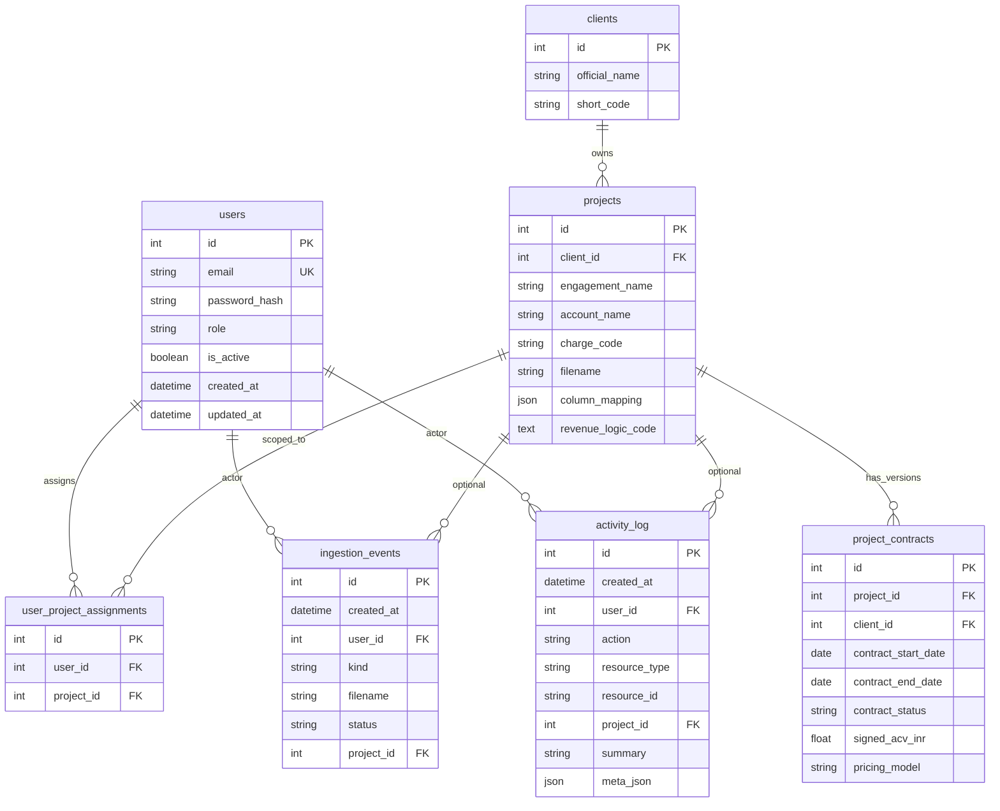
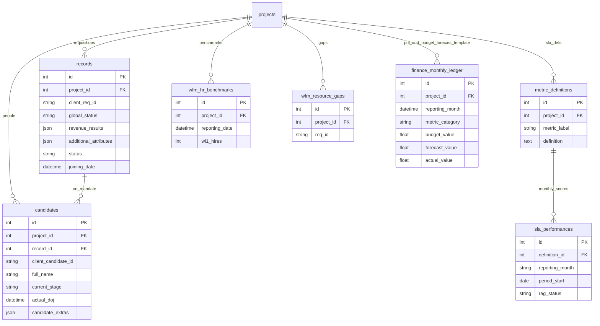
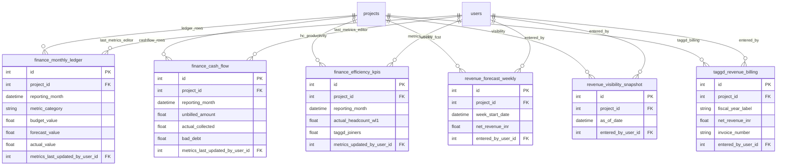
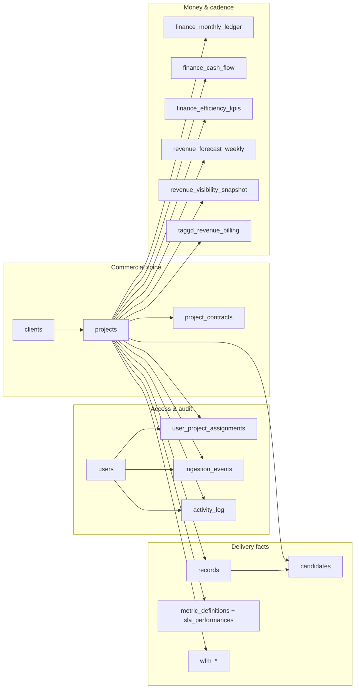

# Database schema reference

This document describes the application database as defined in SQLAlchemy (`backend/db/database.py`). Default connection: `DATABASE_URL` env var, else `sqlite:///./revenue_generator.db`.

## Design overview

| Theme              | Detail                                                                                                                                                                                                                           |
| ------------------ | -------------------------------------------------------------------------------------------------------------------------------------------------------------------------------------------------------------------------------- |
| **ORM**            | SQLAlchemy declarative `Base`; `init_db()` runs `create_all` plus SQLite-safe migrations for legacy DBs (including one-shot migration from removed planning tables into `finance_monthly_ledger`).                               |
| **Spine**          | `**clients`** (legal / rollup account) → `**projects`** (engagement / SBU / tracker container) → `**records`** (requisitions) and `**candidates`** (people on mandates).                                                         |
| **Auth & scope**   | `**users`** + `**user_project_assignments`**; managers (and optionally scoped executives) are limited to assigned `project_id`s at query time (application layer).                                                               |
| **Audit**          | `**ingestion_events`**, `**activity_log`**; `**AuditMixin**` on most domain tables (`system_created_at`, `system_updated_at`, `source_filename`, `uploaded_by`).                                                                 |
| **Commercial**     | `**project_contracts`** (signup/renewal snapshot); `**taggd_revenue_billing`** (TAGGD revenue tracker row); finance master + **budget/forecast template** rows in `**finance_monthly_ledger`** (finer `metric_category` values). |
| **RevOps cadence** | `**revenue_forecast_weekly`**, `**revenue_visibility_snapshot`** (unique per project + week / as-of date).                                                                                                                       |

---

## Entity relationship overview (how tables connect)

| From                                          | To                   | FK / link                         | `ON DELETE` (where set) | Typical access                                                                                                                              |
| --------------------------------------------- | -------------------- | --------------------------------- | ----------------------- | ------------------------------------------------------------------------------------------------------------------------------------------- |
| `user_project_assignments`                    | `users`              | `user_id`                         | `CASCADE`               | **R/W** assignments                                                                                                                         |
| `user_project_assignments`                    | `projects`           | `project_id`                      | `CASCADE`               | **R/W**                                                                                                                                     |
| `ingestion_events`                            | `users`              | `user_id`                         | `SET NULL`              | **W** on ingest, **R** feeds                                                                                                                |
| `ingestion_events`                            | `projects`           | `project_id`                      | `SET NULL`              | **W** / **R**                                                                                                                               |
| `activity_log`                                | `users`              | `user_id`                         | `SET NULL`              | **W** append-only from app, **R** timeline                                                                                                  |
| `activity_log`                                | `projects`           | `project_id`                      | `SET NULL`              | **W** / **R**                                                                                                                               |
| `projects`                                    | `clients`            | `client_id`                       | `RESTRICT`              | **R/W** project; **R** client roll-up                                                                                                       |
| `project_contracts`                           | `projects`           | `project_id`                      | `CASCADE`               | **R/W** contract rows                                                                                                                       |
| `project_contracts`                           | `clients`            | `client_id`                       | `SET NULL`              | **R/W** optional                                                                                                                            |
| `records`                                     | `projects`           | `project_id`                      | (default)               | **R/W** heavy ingest + UI patch                                                                                                             |
| `candidates`                                  | `projects`           | `project_id`                      | `CASCADE`               | **R/W**                                                                                                                                     |
| `candidates`                                  | `records`            | `record_id`                       | `CASCADE`               | **R/W**                                                                                                                                     |
| `metric_definitions`                          | `projects`           | `project_id`                      | (default)               | **R/W** SLA defs                                                                                                                            |
| `sla_performances`                            | `metric_definitions` | `definition_id`                   | (default)               | **R/W** performance rows                                                                                                                    |
| `wfm_hr_benchmarks`, `wfm_resource_gaps`      | `projects`           | `project_id`                      | (default)               | **R/W**                                                                                                                                     |
| `finance_monthly_ledger`, `finance_cash_flow` | `projects`           | `project_id`                      | (default)               | **R** aggregates; **W** finance master ingest, manual upsert, **budget/forecast workbook** (planning categories + `Revenue` monthly budget) |
| `finance_monthly_ledger`, `finance_cash_flow` | `users`              | `metrics_last_updated_by_user_id` | `SET NULL`              | **W** audit who edited                                                                                                                      |
| `finance_efficiency_kpis`                     | `projects`           | `project_id`                      | (default)               | **R/W**                                                                                                                                     |
| `finance_efficiency_kpis`                     | `users`              | `metrics_updated_by_user_id`      | `SET NULL`              | **W**                                                                                                                                       |
| `revenue_forecast_weekly`                     | `projects`           | `project_id`                      | `CASCADE`               | **R/W** weekly forecast                                                                                                                     |
| `revenue_forecast_weekly`                     | `users`              | `entered_by_user_id`              | `SET NULL`              | **W**                                                                                                                                       |
| `revenue_visibility_snapshot`                 | `projects`           | `project_id`                      | `CASCADE`               | **R/W**                                                                                                                                     |
| `revenue_visibility_snapshot`                 | `users`              | `entered_by_user_id`              | `SET NULL`              | **W**                                                                                                                                       |
| `taggd_revenue_billing`                       | `projects`           | `project_id`                      | `CASCADE`               | **R/W** billing grid                                                                                                                        |
| `taggd_revenue_billing`                       | `users`              | `entered_by_user_id`              | `SET NULL`              | **W**                                                                                                                                       |

**Read vs write (workload pattern, not SQL privileges)**

- **Read-heavy / analytical:** `sla_performances` + `metric_definitions` (dashboards), `finance_`* rolled up in API, `records`/`candidates` for listings and monitors, `taggd_revenue_billing` for Billing UI.  
- **Write-heavy / transactional:** `records` (ingest + delta sync), `ingestion_events` / `activity_log` (every significant action), `revenue_forecast_weekly` / `revenue_visibility_snapshot` (weekly ops), `finance_monthly_ledger` / `finance_cash_flow` (finance master ingest, budget/forecast template ingest, manual upsert).  
- **Append-once then update:** `candidates` (pipeline progression), `project_contracts` (renewal edits).

---

## Constraints and indexes (beyond `index=True` on columns)

| Name                               | Table                         | Rule                                                                                     |
| ---------------------------------- | ----------------------------- | ---------------------------------------------------------------------------------------- |
| `uq_user_project_assignment`       | `user_project_assignments`    | Unique (`user_id`, `project_id`)                                                         |
| `uq_candidate_project_client_id`   | `candidates`                  | Unique (`project_id`, `client_candidate_id`)                                             |
| `uq_rev_fcst_week`                 | `revenue_forecast_weekly`     | Unique (`project_id`, `week_start_date`)                                                 |
| `uq_rev_vis_asof`                  | `revenue_visibility_snapshot` | Unique (`project_id`, `as_of_date`)                                                      |
| `uq_finance_ledger_proj_month_cat` | `finance_monthly_ledger`      | Unique (`project_id`, `reporting_month`, `metric_category`) — created at init if missing |
| `uq_finance_cash_proj_month`       | `finance_cash_flow`           | Unique (`project_id`, `reporting_month`) — created at init if missing                    |
| `ix_projects_charge_code`          | `projects`                    | Index on `charge_code` (migration)                                                       |
| `ix_projects_client_id`            | `projects`                    | Index on `client_id` (migration)                                                         |

---

## Tables (column-level)

### `users`

| Column                     | Type        | Notes            |
| -------------------------- | ----------- | ---------------- |
| `id`                       | Integer     | PK               |
| `email`                    | String(255) | Unique, not null |
| `password_hash`            | String(255) | Not null         |
| `role`                     | String(32)  | `admin`          |
| `is_active`                | Boolean     | Default true     |
| `created_at`, `updated_at` | DateTime    |                  |

### `user_project_assignments`

| Column       | Type    | Notes                                   |
| ------------ | ------- | --------------------------------------- |
| `id`         | Integer | PK                                      |
| `user_id`    | Integer | FK → `users.id`, `ON DELETE CASCADE`    |
| `project_id` | Integer | FK → `projects.id`, `ON DELETE CASCADE` |

### `ingestion_events`

| Column        | Type        | Notes                                    |
| ------------- | ----------- | ---------------------------------------- |
| `id`          | Integer     | PK                                       |
| `created_at`  | DateTime    |                                          |
| `user_id`     | Integer     | FK → `users.id`, nullable, `SET NULL`    |
| `actor_email` | String(255) |                                          |
| `kind`        | String(64)  |                                          |
| `filename`    | String(512) |                                          |
| `status`      | String(32)  |                                          |
| `label`       | String(255) |                                          |
| `project_id`  | Integer     | FK → `projects.id`, nullable, `SET NULL` |

### `activity_log`

| Column          | Type        | Notes                                    |
| --------------- | ----------- | ---------------------------------------- |
| `id`            | Integer     | PK                                       |
| `created_at`    | DateTime    |                                          |
| `user_id`       | Integer     | FK → `users.id`, nullable, `SET NULL`    |
| `actor_email`   | String(255) |                                          |
| `action`        | String(32)  |                                          |
| `resource_type` | String(64)  |                                          |
| `resource_id`   | String(128) |                                          |
| `project_id`    | Integer     | FK → `projects.id`, nullable, `SET NULL` |
| `summary`       | String(512) |                                          |
| `meta_json`     | JSON        |                                          |

### Audit mixin (on listed tables below)

| Column              | Type     | Notes            |
| ------------------- | -------- | ---------------- |
| `system_created_at` | DateTime |                  |
| `system_updated_at` | DateTime |                  |
| `source_filename`   | String   |                  |
| `uploaded_by`       | String   | Default `System` |

**Tables using mixin:** `clients`, `projects`, `project_contracts`, `records`, `candidates`, `metric_definitions`, `sla_performances`, `wfm_hr_benchmarks`, `wfm_resource_gaps`, `finance_monthly_ledger`, `finance_cash_flow`, `finance_efficiency_kpis`, `taggd_revenue_billing`.

### `clients`

| Column          | Type    | Notes             |
| --------------- | ------- | ----------------- |
| `id`            | Integer | PK                |
| `official_name` | String  | Not null, indexed |
| `short_code`    | String  | Nullable, indexed |

`projects` back-reference: `Client.projects`. Legacy DBs get `client_id` backfilled per project in `init_db()` when missing.

### `projects`

| Column                                                                       | Type    | Notes                                                            |
| ---------------------------------------------------------------------------- | ------- | ---------------------------------------------------------------- |
| `id`                                                                         | Integer | PK                                                               |
| `client_id`                                                                  | Integer | FK → `clients.id`, `ON DELETE RESTRICT`, nullable until backfill |
| `engagement_name`                                                            | String  | SBU / engagement label; indexed                                  |
| `filename`                                                                   | String  | Indexed                                                          |
| `tracker_sheet`, `contract_sheet`                                            | String  |                                                                  |
| `account_name`, `charge_code`                                                | String  | Indexed                                                          |
| `account_status`, `region`, `sub_region`                                     | String  |                                                                  |
| `practice_head`, `project_head`, `regional_head`, `function_head`, `be_spoc` | String  |                                                                  |
| `category`, `vertical`, `practice`                                           | String  |                                                                  |
| `column_mapping`                                                             | JSON    |                                                                  |
| `revenue_logic_code`                                                         | Text    |                                                                  |
| `logic_explanation`                                                          | Text    |                                                                  |
| `pos_id_column`                                                              | String  | Dedup key for ingest                                             |

### `project_contracts`

Commercial snapshot per project (contract workbook / platform). **Audit mixin**.

| Column                                                                                  | Type    | Notes                                   |
| --------------------------------------------------------------------------------------- | ------- | --------------------------------------- |
| `id`                                                                                    | Integer | PK                                      |
| `project_id`                                                                            | Integer | FK → `projects.id`, `CASCADE`           |
| `client_id`                                                                             | Integer | FK → `clients.id`, nullable, `SET NULL` |
| `customer_name`                                                                         | String  |                                         |
| `account_type`                                                                          | String  |                                         |
| `contract_start_date`, `contract_end_date`, `renewal_reminder_date`                     | Date    |                                         |
| `duration_months`                                                                       | Integer |                                         |
| `signed_acv_inr`, `agreed_rate_fee_inr`, `est_annual_value_inr`, `revenue_run_rate_inr` | Float   |                                         |
| `contract_status`, `renewal_status`                                                     | String  | Indexed where noted in model            |
| `signed_cm_pct`, `headcount_contracted`, `hiring_volume`, `overall_rph`                 | Float   |                                         |
| `taggd_source_mix`, `other_source_mix`                                                  | String  |                                         |
| `mmf_applicable`, `opening_fee_applicable`                                              | Boolean |                                         |
| `payment_terms`, `contract_detail`, `remarks`, `reason_for_lapse`                       | Text    |                                         |
| `pricing_model`                                                                         | String  |                                         |
| `sow_msa_reference`                                                                     | String  |                                         |
| `sla_terms_summary`                                                                     | Text    |                                         |
| `positions_contracted`, `positions_filled`                                              | Integer |                                         |
| `client_signoff_authority`, `internal_signoff`                                          | String  |                                         |
| `practice_head_snapshot`                                                                | String  |                                         |

### `records` (requisitions / mandates)

**Audit mixin.** Tracker + RPO scorecard fields.

**Core / legacy:** `project_id` → `projects`; `candidate_name`, `position_title`, `status`, `hiring_manager`, `offered_ctc`, `joining_date`, `creation_date`, `location`, `department`; `additional_attributes` (JSON); `revenue_results` (JSON); `global_status`; `fingerprint`, `excel_provided_id`, `excel_row_index`.

**RPO / mandate (indexed where noted):** `client_req_id`; `rpo_client_name`; `positions_open`; `rpo_priority`, `rpo_job_type`, `experience_years_required`, `ctc_budget_lpa`; sourcing funnel ints (`profiles_sourced`, `profiles_submitted`, `interviews_scheduled`, `offers_released`, `offers_accepted`); `assigned_recruiter_rpo`; `rpo_mandate_status`; org dimensions (`rpo_vertical`, `rpo_division`, `rpo_bu_sbu`, `rpo_zone`, `rpo_grade_band`, `rpo_business_hrbp`, `rpo_sourcer`, `rpo_taggd_pm`, `rpo_hiring_agency`, `rpo_ijp_referral`, `rpo_source_of_hire`, `rpo_sub_source`); milestone dates (`mandate_received_date`, `intake_date`, `first_cv_share_date`, `selection_date_req`, `loi_date_req`, `closure_date_req`); `rpo_stage`; ageing (`ageing_days`, `ageing_bracket`, `dead_days`, `tto_days`, `ttf_days`); `taggd_fees_amount`, `billing_month`, `fy_label`; `requisition_extras` (JSON).

### `candidates`

**Audit mixin.** Unique (`project_id`, `client_candidate_id`).

| Column                | Type                                                                                                                                                                                                                        | Notes                                         |
| --------------------- | --------------------------------------------------------------------------------------------------------------------------------------------------------------------------------------------------------------------------- | --------------------------------------------- |
| `id`                  | Integer                                                                                                                                                                                                                     | PK                                            |
| `project_id`          | Integer                                                                                                                                                                                                                     | FK → `projects`, `CASCADE`                    |
| `record_id`           | Integer                                                                                                                                                                                                                     | FK → `records`, `CASCADE`                     |
| `client_candidate_id` | String                                                                                                                                                                                                                      | Required; with `project_id` forms natural key |
| Identity / CV         | `full_name`, `contact_no`, `email_id`, `gender`, `current_location`, `qualification`, `specialization`, `total_experience_yrs`, `current_organization`, `current_designation`, `notice_period_days`, `alternate_contact_no` |                                               |
| Sourcing              | `source_of_hire`, `sub_source`, `sourcer_name`                                                                                                                                                                              |                                               |
| Compensation          | `current_ctc_lpa`, `expected_ctc_lpa`, `offer_ctc_lpa`, `offered_gross_ctc`, `offered_stvs`, `hike_pct_offered`                                                                                                             |                                               |
| Workflow              | `resume_screening`, `assigned_recruiter`, `hiring_manager`, `current_stage`, `taggd_pm`                                                                                                                                     |                                               |
| Offer / join          | `offer_release_date`, `offer_acceptance`, `offer_date`, `offer_accepted_flag`, `decline_reason`, `expected_doj`, `actual_doj`, `joining_status`, `selection_date`, `loi_issue_date`, `cb_closure_date`                      |                                               |
| Check-ins             | `checkin_30_day`, `checkin_60_day`, `checkin_90_day`, `early_exit_risk`                                                                                                                                                     |                                               |
| Compliance            | `bgv_date`, `bgv_status`, `medical_initiation_date`, `candidate_staff_no`, `msil_staff_no`                                                                                                                                  |                                               |
| System                | `fingerprint`, `excel_row_index`, `revenue_results` (JSON), `global_status`, `candidate_extras`, `offer_onboarding_extras` (JSON)                                                                                           |                                               |

### `metric_definitions` / `sla_performances`

**Audit mixin.** `metric_definitions`: `project_id`, `metric_label`, `metric_group`, `metric_nature`, `target_threshold`, `definition`, `calculation_method`, `formula`, `source_system`.  
`sla_performances`: `definition_id` → `metric_definitions`, `reporting_month`, `period_start` (Date), `score`, `rag_status`.

### `wfm_hr_benchmarks` / `wfm_resource_gaps`

**Audit mixin.** Benchmarks: `reporting_date`, lateral targets, `ideal_hc`, `actual_hc_total`, `wl1_hires`–`wl4_hires`. Gaps: `req_id`, `status`, `hiring_type`, `designation_level`, `target_date`.

### Budget / forecast template (no separate tables)

**Removed:** `project_budgets` and `project_forecasts` are **not** in the ORM anymore. On `init_db()`, if those legacy tables still exist in an older SQLite file, rows are **copied into** `finance_monthly_ledger` and the legacy tables are **dropped** (see `backend/core/budget_forecast_ledger.py`).

**Current storage:** all template data lives in `**finance_monthly_ledger`** under the same natural key as finance master rows: **unique (`project_id`, `reporting_month`, `metric_category`)** — see index `uq_finance_ledger_proj_month_cat`.

| Source                              | `metric_category`                                                                                                              | Typical fields                                                  | Notes                                                                                                                       |
| ----------------------------------- | ------------------------------------------------------------------------------------------------------------------------------ | --------------------------------------------------------------- | --------------------------------------------------------------------------------------------------------------------------- |
| Finance master / P&L ingest         | `Revenue`, `Contribution Margin`, `Cost`, …                                                                                    | `actual_value`, `budget_value`, `forecast_value`, `actual_cost` | Primary dashboards aggregate **exact** `Revenue` (not `Revenue_`* suffix categories).                                       |
| Budget template (quarters → months) | `Revenue`                                                                                                                      | `budget_value` per month                                        | Indian FY (Apr–Mar); each quarter spread evenly across three month-starts.                                                  |
| Forecast template (“Detail” lines)  | `Revenue_MMF`, `Revenue_JoiningFee`, `Revenue_OpeningFee`, `Revenue_ToBeOfferFee`, `Forecast_Joiners`, `Revenue_PlanningOther` | `forecast_value`                                                | Closed list normalized in `backend/core/finance_planning_categories.py`. `Forecast_Joiners` stores **headcounts**, not INR. |

**Re-upload behavior:** for projects matched in a budget/forecast workbook, **planning** categories above are **deleted** for those `project_id`s, then re-inserted; `**Revenue` rows are not deleted** — monthly `budget_value` for the template FY is **upserted** so corporate `Revenue` actuals/forecasts on the same rows are preserved where not overwritten.

**Traceability:** template rows often set `source_filename` like `budget_forecast:<file>` and `uploaded_by` like `bf:<excel project name>` for fuzzy re-linking when `project_id` was unset.

### `finance_monthly_ledger`

**Audit mixin.** `project_id` → `projects` (nullable in DB for edge cases; template re-linking targets nulls). `reporting_month`, `metric_category`, `budget_value`, `forecast_value`, `actual_value`, `actual_cost`; `metrics_last_updated_at`, `metrics_last_updated_by_user_id` → `users`.

`**metric_category`:** finance master uses coarse labels (`Revenue`, `Contribution Margin`, …). Budget/forecast template adds **finer** planning labels (table above); they share the ledger unique index and ingest upsert pattern.

### `finance_cash_flow`

**Audit mixin.** `reporting_month`, `unbilled_amount`, `collection_target`, `actual_collected`, `bad_debt`, `adjustments`; same metrics audit columns as ledger.

### `finance_efficiency_kpis`

**Audit mixin.** `reporting_month`, RPR/HC fields, `actual_headcount_wl1`, `taggd_joiners`, `target_ppc_inr`; `metrics_updated_at`, `metrics_updated_by_user_id` → `users`.

### `revenue_forecast_weekly`

No audit mixin. Timestamps: `created_at`, `updated_at`.

| Column                                           | Type                                                                                                                                                            | Notes                    |
| ------------------------------------------------ | --------------------------------------------------------------------------------------------------------------------------------------------------------------- | ------------------------ |
| `id`                                             | Integer                                                                                                                                                         | PK                       |
| `project_id`                                     | Integer                                                                                                                                                         | FK `CASCADE`             |
| `week_start_date`, `month_anchor`, `update_date` | DateTime                                                                                                                                                        |                          |
| `week_label`                                     | String                                                                                                                                                          |                          |
| Fee breakdown INR                                | `revenue_forecast_inr`, `adjustment_inr`, `penalty_inr`, `bad_debts_inr`, `mmf_inr`, `open_fee_inr`, `joiner_fee_inr`, `to_be_offer_fee_inr`, `net_revenue_inr` |                          |
| Counts                                           | `open_req`, `joiner_count`, `to_be_offer_count`, `achievement_pct`                                                                                              |                          |
| `remarks`                                        | Text                                                                                                                                                            |                          |
| `entered_by_user_id`                             | Integer                                                                                                                                                         | FK → `users`, `SET NULL` |

### `revenue_visibility_snapshot`

No audit mixin. `project_id` `CASCADE`; `as_of_date`; pipeline/fee fields (`mmf_inr`, `open_req`, `opening_fee_inr`, joiners/YTJ counts and fees, `conversion_rate_pct`, `revenue_realised_pct`, `gap_to_mmf_inr`, `status`, `practice_head`); `entered_by_user_id` → `users` `SET NULL`; `created_at`, `updated_at`.

### `taggd_revenue_billing`

**Audit mixin.** TAGGD FY-style revenue row per project.

| Column                                                | Type                                                                                                                                                                                                                                                                     | Notes        |
| ----------------------------------------------------- | ------------------------------------------------------------------------------------------------------------------------------------------------------------------------------------------------------------------------------------------------------------------------ | ------------ |
| `id`                                                  | Integer                                                                                                                                                                                                                                                                  | PK           |
| `project_id`                                          | Integer                                                                                                                                                                                                                                                                  | FK `CASCADE` |
| `update_date`, `fiscal_year_label`, `project_manager` |                                                                                                                                                                                                                                                                          |              |
| Revenue composition                                   | `revenue_booked_inr`, `mmf_inr`, `opening_req`, `opening_fee_inr`, joiner splits (`total_joiners`, `taggd_joiner`, fees), ER/IJP/campus counts & fees, `total_joining_fee_inr`, `adjustment_reason`, `adjustment_amt_inr`, `net_revenue_inr`, `rph_inr`, `pct_of_target` |              |
| Invoice / collection                                  | `invoice_number`, `invoice_amount_inr`, `invoice_raised_date`, `payment_due_date`, `actual_payment_received_date`, `collection_received_inr`                                                                                                                             |              |
| Other                                                 | `attachment_ref`, `approver_name`, `notes`, `entered_by_user_id` → `users` `SET NULL`                                                                                                                                                                                    |              |

---

## Mermaid ER diagrams

Render in GitHub, VS Code, or any Mermaid viewer. Split by bounded context to keep diagrams legible.

### 1 — Identity, audit, client → project spine

### 2 — Delivery: requisitions, candidates, SLA, WFM, planning

### 3 — Finance masters, efficiency KPIs, revenue ops

### Combined lineage (read path)

---

## Schema evolution notes (gap-aligned, schema-only)

**Planning tables consolidated (ledger):** `project_budgets` and `project_forecasts` were removed from the ORM; budget/forecast workbook data is stored in `finance_monthly_ledger` using additional `metric_category` values (see section *Budget / forecast template*). Existing DBs still containing the old tables are migrated automatically on `init_db()`.

Aligned with broader RevOps specs (e.g. Part 2 plan): the **current schema does not define tables** for — among other things — **minutes-of-meeting**, **customer governance cadence**, **resume vendor / supply-chain partners**, **per-day recruiter sourcing rows**, **invoice validation workflow** (states, TDS, GST, partial payments as first-class rows), **HubSpot entity IDs**, **customer-portal identities**, **notification / job queue**, or **meeting action items** as standalone entities. Those would be **new tables** (or extensions) rather than reinterpretations of existing ones.

**Already partially covered by existing tables (not 1:1 with external specs):** `project_contracts` and `taggd_revenue_billing` address pieces of **signup/renewal** and **billing tracker** narratives; `records` RPO columns hold **mandate-level funnel counts** (not daily sourcing grain); `candidates` supports **offer/join** tracking per mandate **without** a separate global candidate master across projects.

---

## Source of truth

Single ORM module: `backend/db/database.py`. Runtime migrations in `_ensure_`* and `init_db()` may add columns/indexes on older SQLite files. Budget/forecast template behavior and legacy-table migration: `backend/core/budget_forecast_ledger.py`, `backend/core/finance_planning_categories.py`.