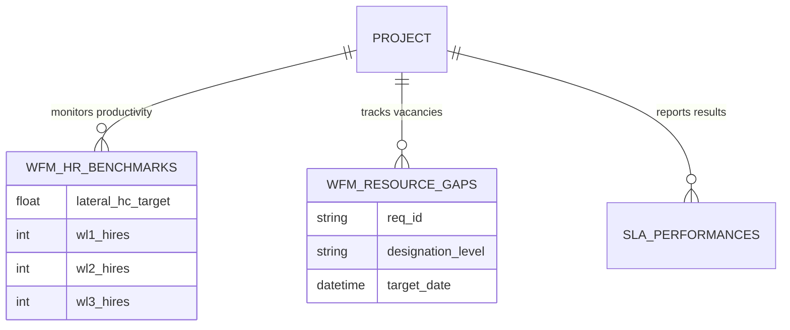

# Database Architecture Upgrade: Workforce Management (WFM)

This document records the architectural expansion of the `revenue_generator.db` to support **Taggd Workforce Management** and internal Resource Planning. This upgrade enables the system to correlate client-level SLA performance with internal recruiter staffing and productivity.

## 1. Overview
The WFM extension transitions the system from tracking "What" is happening (SLA scores) to "Why" it is happening (Staffing levels and Recruiter productivity). It focuses on the internal human capital of Taggd assigned to client projects.

---

## 2. Updated Table: `projects` (Contextual Enhancement)
Added industry-standard metadata to provide a better grouping for "Vertical Benchmarking."

| Column | Type | Meaning & Use Case |
| :--- | :--- | :--- |
| **`vertical`** | VARCHAR | Industry segment (e.g., **Pharma, IT, Auto**). Allows comparing recruiter efficiency across similar industries. |
| **`practice`** | VARCHAR | The recruitment model (e.g., **RPO, Lateral, Hybrid**). Essential for normalizing productivity targets. |

---

## 3. New Table: `wfm_hr_benchmarks`
This table captures the monthly operational snapshots. It measures the "Density" of Taggd employees on an account and their resulting output.

| Column | Type | Meaning & Use Case |
| :--- | :--- | :--- |
| `project_id` | INTEGER | FK linking to the Account/Project. |
| `lateral_hc_target` | FLOAT | The **Planned Headcount** of Taggd recruiters for this account. |
| `ideal_hc` | FLOAT | The **Theoritical Headcount** required based on client contract volume. |
| `actual_hc_total` | INTEGER | The **Current Headcount** of Taggd employees actually working on the account. |
| **`wl1_hires` to `wl4_hires`**| INTEGER | **The Core KPI**: Measures how many successful placements were made by Taggd recruiters at each specific **Work Level (WL)** designation. |
| `lateral_productivity_target`| FLOAT | The standard output target (hires per recruiter) expected for this account. |

---

## 4. New Table: `wfm_resource_gaps`
Tracks **Internal Hiring Needs**. This table identifies where Taggd itself needs to hire more people to satisfy client contracts.

| Column | Type | Meaning & Use Case |
| :--- | :--- | :--- |
| `req_id` | VARCHAR | Internal Taggd Requisition code (e.g., TGD/A-W/1610192). |
| `status` | VARCHAR | **Approved, Open, or Replacement.** Indicates the workflow state of the internal hire. |
| `hiring_type` | VARCHAR | **New vs. Replacement.** Identifies if we are growing or fixing turnover. |
| `designation_level` | VARCHAR | The **Work Level (WL1, WL3)** of the recruiter we are trying to hire for this specific project. |
| `target_date` | DATETIME | The deadline to fill this internal role before it impacts client SLAs. |

---

## 5. Strategic Connectivity Model

The power of this upgrade lies in the **Correlation Chain**:

1.  **The Trigger**: The `sla_performances` table shows a "NOT MET" for "Time to Fill" on Project A.
2.  **The Analysis**: The system checks `wfm_hr_benchmarks` and sees `actual_hc_total` (4) is less than `ideal_hc` (6).
3.  **The Root Cause**: The system identifies 2 entries in `wfm_resource_gaps` for Project A that have passed their `target_date`.

### **Entity Relationships**

---

## 6. Maintenance
- **Scripts**: Ingestion will be handled by `backend/scripts/ingest_wfm.py`.
- **Database**: Models are defined in `backend/db/database.py` as `WFMHRBenchmark` and `WFMResourceGap`.
