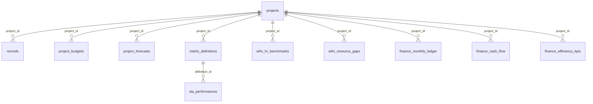

# Analysis Agent — Implementation Plan

This document describes an in-depth view of the **current SQLite data model**, how data hangs together from a **client / project** perspective, and a concrete plan to implement a **chat-based analysis agent** that can reason over the database, call **controlled tools** to fetch facts, and return **grounded** answers with explicit citations.

---

## 1. Purpose and success criteria

| Goal | Description |
|------|-------------|
| **Grounded answers** | Every numeric claim or row-level statement should trace to DB rows or aggregated queries; the agent cites `project_id`, `record_id`, table name, or query scope. |
| **Scope awareness** | User may ask at portfolio, client, metric, or single-requisition grain; the agent resolves **which project(s)** and **which domain** (reqs, finance, SLA, WFM) apply. |
| **Safe access** | No arbitrary raw SQL from the LLM against production; tools expose **parameterized** reads (and optional audited writes later). |
| **Conversation** | Multi-turn chat retains **client context**, **last focus** (e.g. “that Honeywell req”), and **token-efficient** summaries of prior tool results. |

---

## 2. Database inventory (all tables)

All business tables inherit **`AuditMixin`**: `system_created_at`, `system_updated_at`, `source_filename`, `uploaded_by`. These support lineage and ingestion debugging for the agent (“when was this loaded?”).

### 2.1 Core hub: `projects`

| Column | Role |
|--------|------|
| `id` | Primary key; **foreign key target** for almost all domain data. |
| `account_name` | **Client-facing identity** (may repeat across multiple `Project` rows → multiple trackers/files for same logical client). |
| `filename`, `tracker_sheet`, `contract_sheet` | Ingestion routing. |
| `region`, `vertical`, `practice`, `practice_head`, `be_spoc`, `category` | Account metadata. |
| `column_mapping` | JSON: Excel header → universal keys. |
| `revenue_logic_code`, `logic_explanation` | Generated Python + explanation for revenue. |
| `pos_id_column` | Dedup / identity column (e.g. Req ID). |

**Implication for the agent:** “Client” is not always 1:1 with `projects.id`. Disambiguation must use `account_name` + `id` + `filename`.

### 2.2 Requisitions / operational truth: `records`

| Column | Role |
|--------|------|
| `project_id` → `projects.id` | **Required** join for “all reqs for client X”. |
| `candidate_name`, `position_title`, `status`, `global_status`, `req_status` | Pipeline and reporting. |
| `hiring_manager`, `department`, `location`, `offered_ctc`, `creation_date`, `joining_date` | Dimensions and ageing. |
| `revenue_results` (JSON) | `revenue`, `opening_fee`, `closing_fee`, `status` from executed logic. |
| `additional_attributes` (JSON) | **Wide** extra columns from Excel — agent may need “search in JSON” tools. |
| `fingerprint`, `excel_provided_id`, `excel_row_index` | Identity and audit. |

**Scale:** Typically tens of thousands of rows — **never** dump full `records` into the LLM context.

### 2.3 Budget & forecast: `project_budgets`, `project_forecasts`

| Table | Role |
|-------|------|
| `project_budgets` | Quarterly budget (`q1`–`q4`, `total`), `fiscal_year`, `raw_project_name` for matching. |
| `project_forecasts` | Month-level forecast rows (`month_year`, `metric_name`, `value`) e.g. MMF, joiners, fees. |

**Join:** `project_id` → `projects.id`.

### 2.4 SLA: `metric_definitions` + `sla_performances`

| Table | Role |
|-------|------|
| `metric_definitions` | `project_id` + **per-account metric catalog**: `metric_label`, `metric_group`, `target_threshold`, `definition`, `formula`, etc. |
| `sla_performances` | **Time series**: `definition_id` → `metric_definitions.id`, `reporting_month`, `score`, `rag_status`. |

**Shape:** One metric definition per (project, metric_label); **many** performance snapshots per definition over months. **Not** a single “latest only” table — the API may expose latest; the agent must be able to query history when the user asks “trend”.

### 2.5 WFM: `wfm_hr_benchmarks` + `wfm_resource_gaps`

| Table | Role |
|-------|------|
| `wfm_hr_benchmarks` | `project_id`, `ideal_hc`, `actual_hc_total`, WL hires (`wl1`–`wl4`), lateral targets, `reporting_date`, optional **`sheet_metrics_json`** (quarterly laterals, open-position counts, variances, RPH/CPH — from legacy **Projected HC** workbook ingest). |
| `wfm_resource_gaps` | Open gap lines: `req_id`, `status`, `hiring_type`, `designation_level`, `target_date`. Populated from the legacy workbook **Open Positin List** when using **`ingest_wfm_master`** / **`POST /wfm/upload`** (`uploaded_by = ingest_wfm_master`). |

### 2.6 Finance: `finance_monthly_ledger`, `finance_cash_flow`, `finance_efficiency_kpis`

| Table | Role |
|-------|------|
| `finance_monthly_ledger` | `project_id`, `reporting_month`, `metric_category` (e.g. Revenue, CM), `budget_value`, `forecast_value`, `actual_value`, `actual_cost`. |
| `finance_cash_flow` | Collections/unbilled, etc. |
| `finance_efficiency_kpis` | Recruiter productivity / HC / PPC. |

**Corporate finance master ingest** (`ingest_finance_master` / `POST /finance/upload`) does not mirror every Excel tab: see **`docs/DATA_INGESTION_RUNBOOK.md` §6** for sheet aliases, datetime **`reporting_month`** behaviour, the Lacs heuristic, and tabs that are commonly skipped (e.g. **`PPC_Actual`**, **`Revenue_Adjustment`**).

---

## 3. Entity–relationship model (conceptual)

**Center of gravity:** `projects.id` (one row per uploaded tracker / workbook identity). **`account_name`** is the human label for **client**; duplicates are possible.

---

## 4. Client-centric data traces (how the agent should reason)

### 4.1 “Everything for client X”

1. **Resolve client → project(s)**  
   - Query `projects` where `account_name` ILIKE / exact match / fuzzy match.  
   - If multiple rows: list `id`, `filename`, `source_filename` and ask user to pick or aggregate across all.

2. **Requisitions**  
   - `records` WHERE `project_id IN (...)`.  
   - Filter by `global_status`, `department`, `creation_date`, `excel_provided_id`, JSON `additional_attributes` (domain-specific tools).

3. **Revenue**  
   - Row-level: `records.revenue_results`  
   - Project logic: `projects.revenue_logic_code` / `logic_explanation`  
   - Portfolio finance: `finance_monthly_ledger` (+ cashflow) keyed by `project_id`.

4. **SLA**  
   - `metric_definitions` WHERE `project_id` → join `sla_performances` for trends or latest.

5. **WFM**  
   - `wfm_hr_benchmarks` + `wfm_resource_gaps` WHERE `project_id`.

### 4.2 “Single requisition”

- Primary keys: `records.id` OR business key `excel_provided_id` + `project_id` (and `fingerprint` for integrity).  
- Agent tools should support **lookup by id** and **search by partial** with limits.

### 4.3 “Specific metric”

- **SLA:** `(project_id, metric_label)` or `metric_definitions.id`  
- **Finance:** `(project_id, reporting_month, metric_category)`  
- **WFM:** `(project_id)` or gap row `req_id`  
- **Req KPIs:** aggregates over `records` (fill rate, ageing, revenue sum).

---

## 5. Why this needs an agent (not a single SQL dump)

| Challenge | Implication |
|-----------|-------------|
| **Wide JSON** | `additional_attributes` and `revenue_results` vary by file; tools need JSON path or “sample keys” introspection. |
| **Duplicate clients** | Same `account_name` may map to multiple `projects`; agent must disambiguate or aggregate explicitly. |
| **Mixed time semantics** | SLA `reporting_month` is string (e.g. `Apr24`, `YTD`); finance uses `DateTime`; agent must normalize in tools or document caveats. |
| **Volume** | Full table scans are not LLM-context safe; **bounded queries + summaries** only. |

---

## 6. Architecture: analysis agent

### 6.1 High-level components

| Layer | Responsibility |
|-------|----------------|
| **Chat API** | `POST /agent/chat` — accepts `messages[]`, optional `client_hint`, `project_id`. |
| **Orchestrator** | Loads conversation state, selects model, calls tools in a loop (ReAct / tool-calling pattern). |
| **LLM** | Gemini (already used in the repo via `instructor` + `google.generativeai`) for reasoning + structured tool calls. |
| **Tool layer** | Parameterized Python functions that run SQLAlchemy queries or call existing FastAPI-style aggregates. |
| **Grounding layer** | Forces final answer to cite tool result IDs / row counts / hashes; optional “verification” pass. |

### 6.2 Recommended pattern: **tool-calling loop** (not one-shot prompt)

1. User message → model may emit **tool calls** (JSON schema).  
2. Backend executes tools (read-only, time-bounded).  
3. Tool results (JSON) appended to conversation.  
4. Repeat until model returns **final** message with analysis + citations.  
5. Max iterations (e.g. 5–8) and max tool latency per request.

### 6.3 Model choice

- **Reasoning + tool use:** `gemini-2.0-flash` or `gemini-1.5-pro` (or current `gemini-flash-latest` as in existing agents) — align with existing `GEMINI_API_KEY`.  
- **Structured outputs:** Pydantic models via `instructor` for tool arguments and final “answer” schema (optional).

---

## 7. Tooling design

### 7.1 Principles

1. **Parameterized only** — no free-text SQL from the model.  
2. **Bounded results** — default `limit`, `max_rows`, `date_range`.  
3. **Explicit scope** — `project_id` or `account_name` resolution step first.  
4. **Explainable** — each tool returns `{ "data": ..., "meta": { "query_scope", "row_count", "truncated" } }`.

### 7.2 Suggested tool catalog (read path)

| Tool | Purpose |
|------|---------|
| `resolve_client` | Input: name string → list `projects` (id, account_name, filename, region) with match scores. |
| `get_project_summary` | `project_id` → counts, date ranges, revenue logic excerpt (not full code if huge). |
| `search_records` | Filters: `project_id`, status, dates, department, `excel_provided_id` substring, `limit`, `offset`. |
| `get_record_by_id` | `record_id` or (`project_id` + `excel_provided_id`). |
| `aggregate_records` | KPIs: counts by `global_status`, sum `revenue_results`, ageing buckets, etc. |
| `get_sla_metrics` | `project_id`, optional `metric_label`, optional month range → definitions + performances. |
| `get_wfm_snapshot` | `project_id` → benchmark row(s), gap list (capped). |
| `get_finance_ledger` | `project_id`, optional month range, `metric_category`. |
| `get_budget_forecast` | `project_id` or portfolio — budgets + forecast rows. |
| `portfolio_overview` | Pre-aggregated: reuse `/stats/global/monitor` style aggregates if exposed internally. |

**Optional later:** `explain_revenue_logic` — returns `logic_explanation` + truncated `revenue_logic_code`.

### 7.3 Writes (out of scope for v1)

- No destructive writes from the agent.  
- Future: “create task”, “flag record” → separate tools with auth + audit log.

### 7.4 “SQL tool” (optional, dangerous)

- If introduced: **read-only** connection, **allowlist** of views, **statement timeout**, **row limit**, **no DDL/DML**.  
- Prefer **not** exposing raw SQL to the model; use the catalog above.

---

## 8. Conversation and context management

### 8.1 What to store per session

| Field | Use |
|-------|-----|
| `session_id` | Stable chat key. |
| `messages` | User/assistant turns; **tool results** stored as structured JSON (not only prose). |
| `resolved_project_ids` | Last chosen project(s) for “client” follow-ups. |
| `last_record_id` / `last_focus` | For “drill into that one”. |
| `summary` | Rolling summary of older turns when token budget grows (optional). |

### 8.2 Context window strategy

1. **System prompt** — short: schema hints + tool rules + grounding rules.  
2. **Last N turns** — e.g. 10–20 messages.  
3. **Tool results** — truncate large arrays; keep **totals** + **sample rows** (e.g. 5 rows) + **“truncated”** flag.  
4. **Client pack** — when user locks a client, inject **one** compact `get_project_summary` snapshot per turn (refresh if stale).

### 8.3 Grounding instructions (system prompt bullets)

- “Do not invent numbers; if a tool fails, say so.”  
- “Always state which `project_id` or `record_id` you used.”  
- “If multiple projects match a client name, list them and ask.”

---

## 9. Security, tenancy, and future auth

| Topic | v1 | Later |
|-------|-----|--------|
| **API auth** | None or internal — document risk. | JWT/API keys; per-user allowed `project_id` list. |
| **PII** | Candidate names in `records` — treat as sensitive. | Redaction in logs; role-based masking. |
| **Rate limits** | Per IP / per key. | — |

---

## 10. Implementation phases

### Phase 1 — **Read-only agent + tools**

- Implement tool functions as Python (SQLAlchemy) in `backend/agent_tools/` or similar.  
- Wire `/agent/chat` with tool loop.  
- Frontend: chat panel (existing app shell or new page).  

### Phase 2 — **Client resolution UX**

- When ambiguous, return structured `clarify` options in UI (pick project).  

### Phase 3 — **Caching & performance**

- Cache `resolve_client` and project summaries (short TTL).  
- Heavy aggregates use existing optimized endpoints where possible.  

### Phase 4 — **Advanced**

- Embeddings over `metric_definitions.definition` / `logic_explanation` for semantic metric search.  
- Optional **read-only** SQL view layer for analysts.

---

## 11. Integration with existing codebase

| Asset | Reuse |
|-------|--------|
| `backend/db/database.py` | ORM models — single source of truth. |
| `backend/agents/*` | Same Gemini + `instructor` pattern as `ColumnMapperAgent`, `LogicGeneratorAgent`. |
| FastAPI `main.py` | Mount new router `/agent` or `/api/agent`. |

---

## 12. Risks and mitigations

| Risk | Mitigation |
|------|------------|
| Hallucinated numbers | Tool-only facts; optional second pass “check numbers against tool JSON”. |
| Context overflow | Hard caps, summarization, sample rows only. |
| Ambiguous client | `resolve_client` + UI clarification. |
| SLA month chaos | Document in tool response; normalize in aggregator for trends. |

---

## 13. Appendix: Table count summary

| Table | Parent key |
|-------|------------|
| `projects` | PK `id` |
| `records` | `project_id` → projects |
| `project_budgets` | `project_id` → projects |
| `project_forecasts` | `project_id` → projects |
| `metric_definitions` | `project_id` → projects |
| `sla_performances` | `definition_id` → metric_definitions |
| `wfm_hr_benchmarks` | `project_id` → projects |
| `wfm_resource_gaps` | `project_id` → projects |
| `finance_monthly_ledger` | `project_id` → projects |
| `finance_cash_flow` | `project_id` → projects |
| `finance_efficiency_kpis` | `project_id` → projects |

---

*Document version: 1.0 — aligned with `backend/db/database.py` and current ingestion architecture.*
