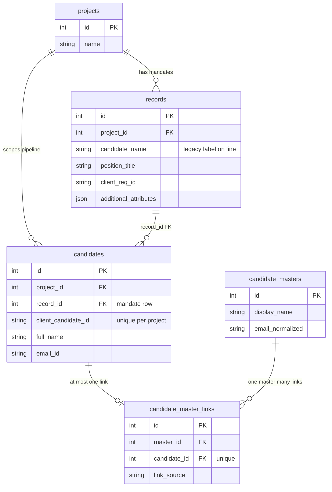
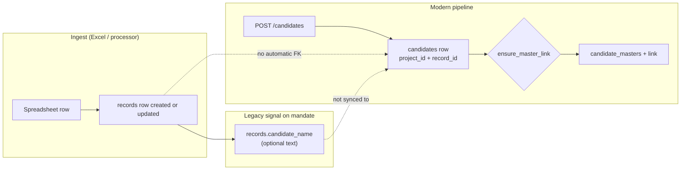
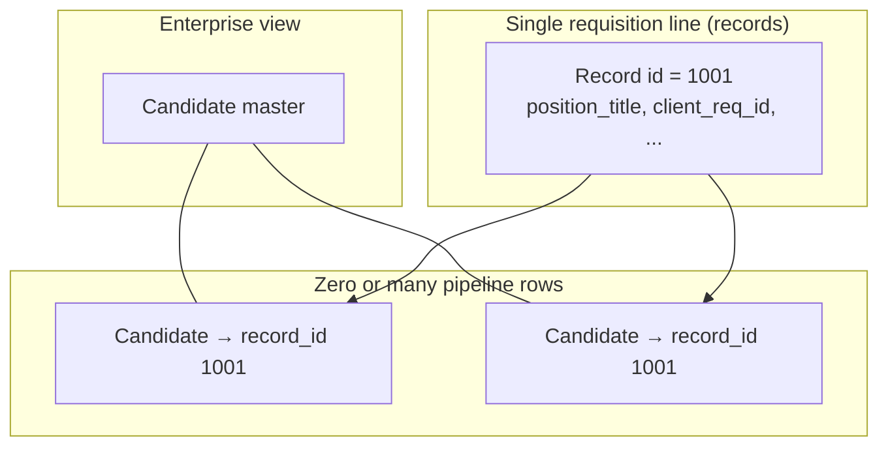
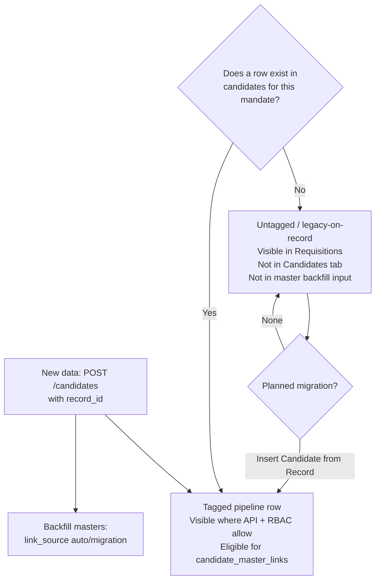
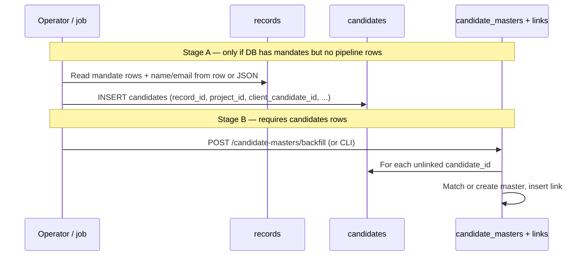

# Requisitions (`records`) and Candidates — How They Connect

**Purpose:** One place to see how **mandate / requisition rows** (`records`), **pipeline candidate rows** (`candidates`), and **enterprise identity** (`candidate_masters`) relate, including what happens to **legacy name-only fields on records** versus **new API-created candidates**.

**Related:** Implementation detail, APIs, and backfill mechanics live in `[CANDIDATE_MASTER_IMPLEMENTATION_REPORT.md](../CANDIDATE_MASTER_IMPLEMENTATION_REPORT.md)` at the repository root.

---

## 1. Glossary (three layers)

| Concept                          | Table                                          | Role                                                                                                                                                                                                           |
| -------------------------------- | ---------------------------------------------- | -------------------------------------------------------------------------------------------------------------------------------------------------------------------------------------------------------------- |
| **Requisition / mandate line**   | `records`                                      | One row per ingested tracker line: position, client req id, counts, `candidate_name` (legacy column), RPO fields, revenue, etc. Filled mainly by **Excel / processor ingest**.                                 |
| **Placement / pipeline row**     | `candidates`                                   | One row per person **on a specific requisition**, with full pipeline fields. Requires `project_id` + `**record_id`** (FK to `records.id`). Filled mainly by `**POST /candidates**` (and any future migration). |
| **Talent identity (enterprise)** | `candidate_masters` + `candidate_master_links` | Logical “person” across mandates. **Only** links to rows in `candidates`, not directly to `records`.                                                                                                           |

Important: `**records.candidate_name`** is a string on the mandate row. It is **not** a foreign key and does **not** automatically create or update a row in `**candidates`**.

---

## 2. Entity relationship (how tables link)

**Reading the diagram:** Every `**candidates`** row **must** point at exactly one `**records`** row via `record_id`. The **Requisitions** UI reads `**records`**; the **Candidates** tab reads `**candidates`**. Masters hang off `**candidates**`, not off `**records**`.

---

## 3. Data paths: ingest vs modern pipeline

**Solid arrows:** implemented primary flows. **Dotted:** there is **no** automatic database trigger today that turns every `records.candidate_name` into a `candidates` row, or that keeps them in sync.

---

## 4. How requisition data and candidate data stay “linked”

| Link type                      | Mechanism                                                                                                                                                                                             |
| ------------------------------ | ----------------------------------------------------------------------------------------------------------------------------------------------------------------------------------------------------- |
| **Structural (DB)**            | `candidates.record_id` → `records.id`. Deleting a record can cascade-delete its candidate rows (per ORM / FK `ondelete="CASCADE"`).                                                                   |
| **Human / client id**          | `candidates.client_candidate_id` is unique per **project** (not per record). Same person on two mandates → two `candidates` rows (two `record_id`s), optionally **one** `candidate_master` via links. |
| **Duplicate mandate identity** | `records` uses `fingerprint`, `excel_provided_id`, etc., for ingest dedupe; `candidates` has its own `fingerprint` / extras for pipeline-specific sync.                                               |

A mandate can have **zero** `candidates` (common after ingest-only history) or **multiple** (e.g. several applicants for the same requisition).

---

## 5. Treatment: “untagged” names on `records` vs new candidate data

This section uses **“untagged”** to mean: **person-like text exists only on the requisition row** (`records.candidate_name` or JSON in `additional_attributes` / `requisition_extras`) **without** a corresponding `**candidates`** row.

| Situation                                                                        | Where it shows                      | Master program                                                                     |
| -------------------------------------------------------------------------------- | ----------------------------------- | ---------------------------------------------------------------------------------- |
| **Only** `records` + optional `candidate_name`                                   | Requisitions / reports on `records` | No `candidates` id → **no** `candidate_master_links`                               |
| `**candidates`** created via API                                                 | Candidates tab, detail APIs         | `**ensure_master_link_for_candidate**` on create; backfill for older unlinked rows |
| **Bulk migration** (future / custom): derive `Candidate` from `Record` + columns | Same as API-created                 | Run **master backfill** after candidates exist                                     |

---

## 6. Practical backfill order (two stages)

1. **Stage A:** Create `**candidates`** from `**records**` (and/or from spreadsheet columns mapped once). Define idempotent keys (`client_candidate_id`, or synthetic stable ids) to avoid duplicates on re-run.
2. **Stage B:** Run **candidate master backfill** so `**candidate_master_links`** attach; this does **not** replace Stage A.

---

## 7. Summary

- `**records`** = requisition / mandate grain (ingest-heavy).  
- `**candidates**` = person-on-mandate grain (API-heavy today); **must** reference `records.id`.  
- `**candidate_masters`** = cross-mandate identity; **only** connected through `**candidates`**.  
- **Untagged** legacy = name (or similar) **only** on `records` → **not** part of the modern candidate or master tables until **Stage A** migration (or manual API) creates `**candidates`** rows.

---

*Document version: 1.0 — 2026-03-28*