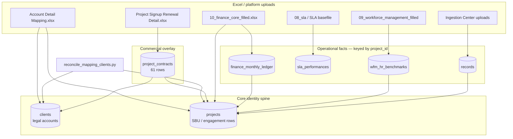

# Clients, projects, and contracts — why the numbers differ

**Last verified:** 2026-06-04 (against Cloud SQL `tgddata-pg-prod` project spine + local DB analysis aligned to prod `projects: 179`)

This document explains why Executive Overview shows **179 “clients”** while Client Contracts shows **61 contracts**, where each number comes from, and whether the 61 contracts contain all operational data.

---

## Executive summary

| What you see in UI | Number shown | What it actually counts | Primary table / API |
|--------------------|-------------:|-------------------------|---------------------|
| Executive Overview pill — **“179 clients”** | 179 | **Project rows** (mislabeled) | `GET /stats/global` → `total_projects` = `COUNT(projects.id)` |
| Client Contracts KPIs | 61 | **Commercial contract rows** | `GET /contracts` → `project_contracts` |
| Clients hub (legal accounts) | ~168–169 | **Distinct legal clients** linked to projects | `GET /clients` → `clients` grouped by `client_id` |
| Cloud Run `/ready` (health) | 179 projects | Same as project spine | `COUNT(projects)` |

**Short answer:** **179** and **61** are not two ways of counting the same thing. **179** is the **project directory spine** used by finance, SLA, WFM, and ingestion. **61** is the **signed-contract registry** loaded from the Project Signup / renewal workbook. Most dashboards join on **`projects`**, not **`project_contracts`**, so operational data often exists **without** a contract row.

---

## The three layers (conceptual model)



### 1. `clients` — legal / rollup account

- **Table:** `clients`
- **Meaning:** Parent account (e.g. a group name from the directory). One client can own multiple `projects` in a full BU/SBU model; in the current prod spine most rows are **1 project ↔ 1 client** (bootstrap via `ensure_project_client`).
- **Typical source:** Created or updated when directory ingest runs (`ingest_project_master`, `reconcile_mapping_clients`) or when any flow calls `ensure_project_client(project)`.
- **Lifecycle:** `active` vs `prospect` (commercial pursuit vs operating client).
- **Current counts (DB aligned to prod project spine):**
  - **169** rows in `clients`
  - **168** distinct `client_id` values on `projects`
  - **1** client row with no linked project

### 2. `projects` — directory / engagement spine (the “179”)

- **Table:** `projects`
- **Meaning:** The **primary foreign key** for finance, WFM, records, SLA resolution, and most KPI rollups. Each row is usually one **account label** (`account_name`) from the master directory or an ingest-created engagement — not necessarily a signed contract.
- **Typical sources:**
  1. **`Account Detail Mapping.xlsx`** — `run_account_mapping_sync.py` / `ingest_project_master.py` (updates metadata; matching by charge code / group name).
  2. **`reconcile_mapping_clients.py`** — links SBU-style `account_name` rows to sheet **Group Name** / client.
  3. **Finance ingest** — `ingest_finance.py` / filled `10_finance_core` workbook can create or touch projects when resolving account names.
  4. **Contract ingest with `--create-missing`** — can add projects for orphan `Customer` names (use sparingly).
  5. **Legacy SQLite migration** and historical tracker uploads.
- **Production:** Cloud Run `/ready` reports **`projects: 179`** (authoritative for what the live API uses).

### 3. `project_contracts` — commercial signup / renewal (the “61”)

- **Table:** `project_contracts`
- **Meaning:** One **commercial contract snapshot per project** (ACV, dates, status, pipeline stage, MSA refs). This is what **Client Contracts** lists.
- **Typical source:**
  - **`Project Signup Renewal Detail.xlsx`** — sheet **Contract Data**
  - CLI: `backend/scripts/ingest_project_contracts.py`
  - API: `POST /contracts/upload` (same parser)
- **Matching:** Workbook **`Customer`** → `resolve_project_for_sla` → `projects.id`, then `ensure_project_client` for `client_id`.
- **Upsert rule:** One contract row per **`project_id`** per ingest file basename; re-runs update the same row.
- **Current counts:**
  - **61** contract rows
  - **61** distinct `project_id` (1:1)
  - **61** distinct `client_id` (1:1 in practice)
  - All 61 ingested from the same workbook upload (`source_filename` pattern `tmpxaxuo860.xlsx` in current DB)

---

## Why Executive Overview shows 179 (not 61)

The hero pill is wired to **`total_projects`**, not contract count or client count:

```tsx
// frontend/src/pages/Dashboard.tsx (and CeoView.tsx — same pattern)
<span>{stats?.total_projects ?? "—"} clients</span>
```

```python
# backend/main.py — GET /stats/global
total_projects = db.query(func.count(Project.id))  # after role scope
```

So **179 = `COUNT(*)` from `projects`**, labeled **“clients”** in the UI. That label is **misleading**; the correct labels would be **“179 projects”** or **“179 accounts in directory”**.

---

## Side-by-side: what each number means

| Metric | Value | Includes prospects? | Includes accounts without signed contract? | Used by |
|--------|------:|:--------------------:|:------------------------------------------:|---------|
| **Projects** | **179** | Yes (53 prospect-tagged project rows w/o contract) | Yes (**118** project rows have **no** `project_contracts` row) | `/stats/global`, `/ready`, finance join, WFM join, most ingestion |
| **Contracts** | **61** | 2 contract rows tie to `prospect` clients; 59 to `active` | No — only rows in `project_contracts` | Client Contracts page, contract KPIs |
| **Clients (table)** | **169** | Yes (54 `prospect`) | Yes — many clients have projects but **no** contract | `GET /clients`, Clients hub |
| **Distinct clients on projects** | **168** | Yes | Yes | Grouped client navigation |

---

## Project spine breakdown (179 rows)

Every `projects` row falls into one of four buckets (current DB):

| Bucket | Project rows | Meaning |
|--------|-------------:|---------|
| **contract + finance** | 49 | Has `project_contracts` row **and** `finance_monthly_ledger` data |
| **contract only** | 12 | Has contract row but **no** finance ledger rows yet |
| **finance, no contract** | 53 | Finance data loaded on a project **without** a contract row |
| **directory only** | 65 | In project master spine only — no contract, no finance ledger |

```text
179 projects total
├── 61 with project_contracts  ← “signed commercial” overlay
│   ├── 49 also have finance
│   └── 12 contract but no finance rows
└── 118 without project_contracts
    ├── 53 have finance (e.g. P&G, Tata Power, FedEx — active/prospect on spine)
    └── 65 directory-only (no finance, no contract)
```

### Projects without contracts (118) — lifecycle split

| `clients.lifecycle_state` | Project rows (no contract) |
|---------------------------|---------------------------:|
| `active` | 65 |
| `prospect` | 53 |

These are **not** missing contract uploads only — they include **prospects**, **directory placeholders**, and **finance-loaded accounts** that were never matched to the signup workbook.

### Examples: finance without contract

Accounts with substantial `finance_monthly_ledger` rows but **no** `project_contracts` row include (sample):

- P&G, Tata Power, FedEx, L&T Energy, DRL, Ultratech, Jindal Stainless, Atomberg Technologies, M2P Fintech, Thyssenkrupp, …

So **finance ingest does not require a contract row**; it keys off **`projects.account_name`** resolution like SLA.

---

## Do the 61 contracts contain all data?

**No.** The 61 contracts are the **commercial source of truth for signed deals**, but **operational facts are stored on the 179-project spine**.

### Module-by-module join behavior

| Domain | Table(s) | Join key | Rows (local DB) | Tied to contracted projects? |
|--------|----------|----------|------------------:|:----------------------------:|
| **Finance ledger** | `finance_monthly_ledger` | `project_id` | 7,452 | **49** of **102** finance projects have contracts; **53** finance projects have **no** contract |
| **WFM benchmarks** | `wfm_hr_benchmarks` | `project_id` | 50 (49 projects) | 39 projects with contracts; ~10 without |
| **Records / ingestion** | `records` | `project_id` | 10,832 (prod `/ready`: **2,525**) | ~90% of local record rows on contracted projects; only **17** distinct `project_id`s in `records` |
| **SLA performances** | `sla_performances` | via `metric_definitions` | 5,173 | Not directly filtered by `project_contracts` |
| **Contracts UI** | `project_contracts` | `project_id` | **61** | Definitionally contract-scoped |

**Important:** Local Docker Postgres may differ on **record/finance row counts** vs production (e.g. local `records: 10832` vs prod `/ready` `records: 2525`). The **project count (179)** and **contract count (61)** match the production spine described here.

---

## Where data comes from (ingestion order)

Recommended production order (from `docs/DATA_INGESTION_RUNBOOK.md`):

1. **Directory** — `Account Detail Mapping.xlsx` → `projects` + `clients` (**builds the 179 spine**).
2. **Reconcile** — `reconcile_mapping_clients.py` → SBU ↔ Group Name linkage.
3. **SLA** — SLA basefile / filled `08` → SLA tables (resolves account → `project_id`).
4. **Revenue trackers** — forecast / visibility workbooks → `records` / revenue fields.
5. **Finance** — filled `10_finance_core` → `finance_monthly_ledger` (**often >61 projects**).
6. **WFM** — filled `09` → `wfm_hr_benchmarks` (matches `account_name` on projects).
7. **Contracts** — `Project Signup Renewal Detail` → **`project_contracts` only (61 rows)** — does **not** replace or trim the project spine.

Contracts are step **6–7**, **after** the directory and finance loads. That ordering explains why **finance and directory can exist for accounts that never received a contract row**.

---

## UI surfaces and which count they use

| Surface | Count shown | Source | Accurate label? |
|---------|------------:|--------|-----------------|
| **Executive Overview / CEO View** hero pill | 179 | `stats.total_projects` | **No** — should say “projects” or “directory accounts” |
| **Client Contracts** KPI “total” | 61 | `contracts.length` / `contractsForKpis` | **Yes** — contracts |
| **Clients hub** header | varies | `GET /clients` grouped list | **Yes** — legal clients (~168–169 scoped) |
| **`/ready`** (ops) | 179 projects | `COUNT(projects)` | **Yes** — projects |

---

## Why two different numbers exist (root cause)

1. **Different business definitions**
   - **61** = signed commercial relationships (contract workbook).
   - **179** = operational / directory accounts the platform can attach SLA, finance, WFM, and uploads to.

2. **Different ingest pipelines**
   - Directory + finance expand the **`projects`** table.
   - Contract ingest only fills **`project_contracts`** for matched `Customer` names.

3. **No enforced constraint**
   - Nothing in the schema requires `finance_monthly_ledger.project_id` to have a matching `project_contracts` row.
   - Prospects and directory rows legitimately exist as `projects` without contracts.

4. **UI naming bug**
   - `total_projects` is displayed as **“clients”**, which sounds like legal clients (169) or contracts (61), but is actually **projects (179)**.

---

## What to show on Executive Overview

| Business question | Recommended metric | Typical count |
|-------------------|-------------------|--------------:|
| How many **signed contracts** do we have? | `COUNT(project_contracts)` | **61** |
| How many **legal clients** in CRM? | `COUNT(DISTINCT client_id)` on projects or `COUNT(clients)` | **168–169** |
| How many **directory / SBU rows** drive ops data? | `COUNT(projects)` | **179** |

If the executive narrative is **contract-backed portfolio only**, the dashboard must:

1. Show **61 contracts** (or distinct contracted clients) in the hero, **and**
2. Filter `/stats/global`, finance aggregates, and risk radar to **`project_id IN (SELECT project_id FROM project_contracts)`** — otherwise KPIs will still include the other **118** projects.

Showing **61** in the pill **without** filtering aggregates would disagree with revenue/finance charts that still include non-contract projects.

---

## Quick reference SQL (ops)

Run against Postgres (Cloud SQL or local copy synced from prod):

```sql
-- Spine sizes
SELECT 'projects' AS entity, COUNT(*) FROM projects
UNION ALL SELECT 'clients', COUNT(*) FROM clients
UNION ALL SELECT 'project_contracts', COUNT(*) FROM project_contracts;

-- Four buckets (see table above)
SELECT bucket, COUNT(*) FROM (
  SELECT p.id,
    CASE
      WHEN pc.id IS NOT NULL AND EXISTS (SELECT 1 FROM finance_monthly_ledger f WHERE f.project_id = p.id) THEN 'contract+finance'
      WHEN pc.id IS NOT NULL THEN 'contract_only'
      WHEN EXISTS (SELECT 1 FROM finance_monthly_ledger f WHERE f.project_id = p.id) THEN 'finance_no_contract'
      ELSE 'directory_only'
    END AS bucket
  FROM projects p
  LEFT JOIN project_contracts pc ON pc.project_id = p.id
) x GROUP BY bucket ORDER BY 2 DESC;

-- Finance vs contract gap
SELECT
  COUNT(DISTINCT f.project_id) AS finance_projects,
  COUNT(DISTINCT f.project_id) FILTER (
    WHERE EXISTS (SELECT 1 FROM project_contracts pc WHERE pc.project_id = f.project_id)
  ) AS finance_with_contract,
  COUNT(DISTINCT f.project_id) FILTER (
    WHERE NOT EXISTS (SELECT 1 FROM project_contracts pc WHERE pc.project_id = f.project_id)
  ) AS finance_without_contract
FROM finance_monthly_ledger f;
```

---

## Related docs

- `docs/DATA_INGESTION_RUNBOOK.md` — script order and tables per ingest
- `docs/CLOUD_DB_RE_INGESTION_RUNBOOK.md` — Cloud SQL re-ingest, contract matching rules
- `docs/GCS_WHITE_SCREEN_INCIDENT_2026-06-02.md` — unrelated frontend deploy issue (GCS staging URL)

---

## Changelog

| Date | Note |
|------|------|
| 2026-06-04 | Initial write: 179 vs 61 vs 169, ingestion lineage, four project buckets, finance/contract mismatch |
