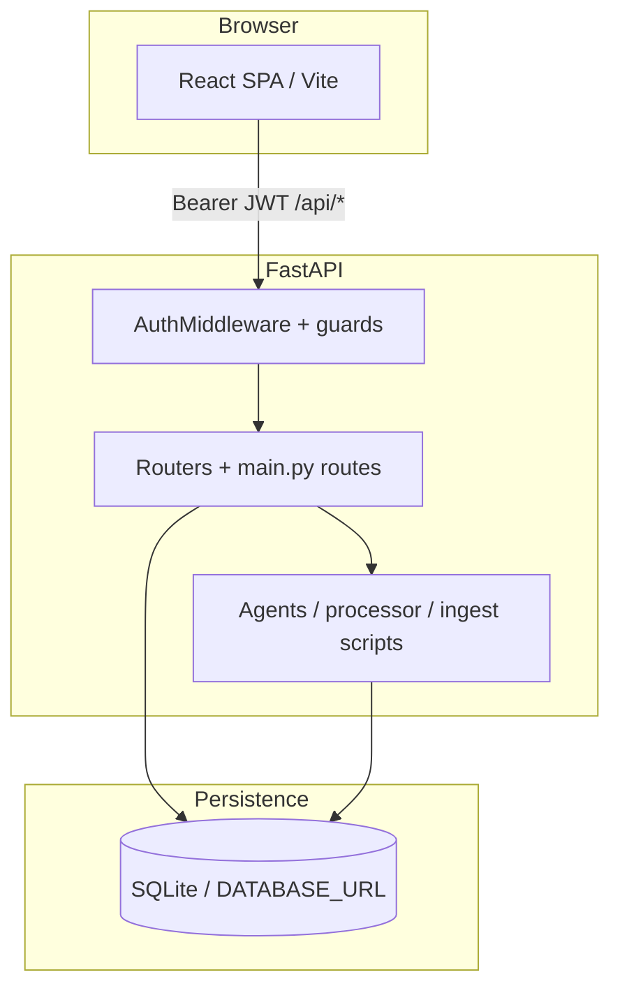
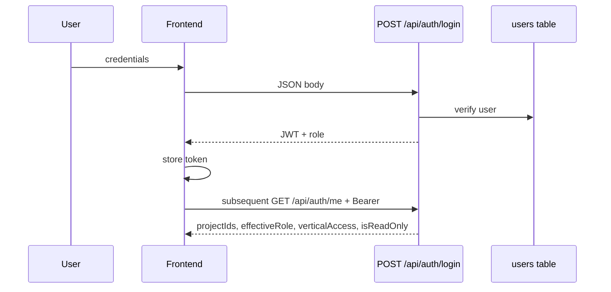
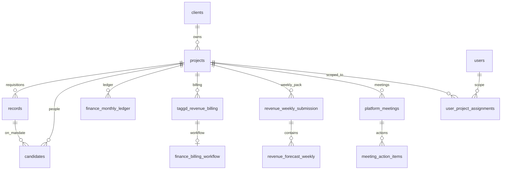
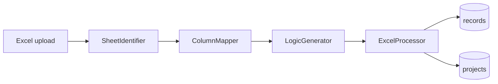
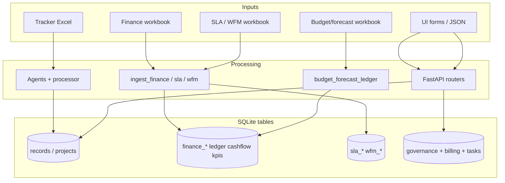
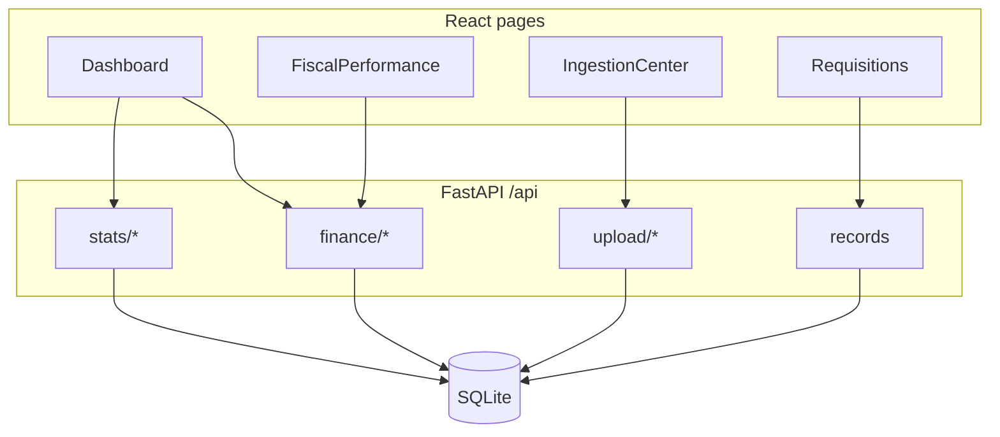

# Data, information flow, roles, and UI wiring

This document maps **who can do what**, how **inputs** become **stored data**, how **reads** reach the **UI**, and how **frontend routes** connect to **backend code**. It reflects the codebase under `backend/` and `frontend/` (branch-agnostic; verify exact route names in `backend/main.py` and `frontend/src/App.tsx` after merges).

**Primary sources of truth**

| Layer        | Path                                                                                                                                        |
| ------------ | ------------------------------------------------------------------------------------------------------------------------------------------- |
| ORM / tables | `backend/db/database.py`                                                                                                                    |
| Auth & scope | `backend/auth/profile.py`, `deps.py`, `scope.py`, `verticals.py`, `middleware.py`, `client_write_guard.py`, `client_vertical_read_guard.py` |
| HTTP surface | `backend/main.py` + `backend/routers/*.py` + `backend/auth/routes.py` + `backend/admin/routes.py`                                           |
| UI           | `frontend/src/App.tsx`, `frontend/src/lib/auth.tsx`, `frontend/src/lib/api.ts`, `frontend/src/pages/*.tsx`                                  |

---

## 1. High-level architecture

End users interact only with the **React SPA** (Vite). All authenticated API traffic uses Axios `baseURL: "/api"` (see `frontend/src/lib/api.ts`), so the browser calls paths like `/api/projects`, `/api/auth/me`, `/api/finance/data`. The **FastAPI** app validates **JWT** middleware, resolves **role + project scope + vertical modules**, runs business logic, and reads/writes **SQLite** (or `DATABASE_URL`) via SQLAlchemy.

---

## 2. Authentication and request identity

### 2.1 Login and token

1. `POST /api/auth/login` (`backend/auth/routes.py`) validates email/password, returns a **JWT** and user payload.
2. Frontend stores the token (e.g. `localStorage`) and attaches `Authorization: Bearer …` on every `api` request (`frontend/src/lib/api.ts`).

### 2.2 Per-request user

`AuthMiddleware` (`backend/auth/middleware.py`) decodes JWT, loads `User`, sets `request.state.user`. `get_current_user` (`backend/auth/deps.py`) is the FastAPI dependency used almost everywhere.

### 2.3 Project scope (`apply_project_scope`)

`allowed_project_ids(user, db)` comes from `resolve_user_profile` (`backend/auth/profile.py`):

| Effective role                                           | `project_ids` meaning                                                              |
| -------------------------------------------------------- | ---------------------------------------------------------------------------------- |
| `platform_admin`                                         | `None` → **no filter** (all projects)                                              |
| `executive`                                              | `None` if user has **zero** `user_project_assignments`; else **only assigned IDs** |
| `project_head`, `operations`, `recruiter`, `client_user` | **Only assigned IDs** (may be empty → no data)                                     |

`apply_project_scope(query, user, db, Model)` (`backend/auth/scope.py`) adds `Project.id.in_(ids)` or `Model.project_id.in_(ids)` unless `ids is None`. Empty set forces a query that matches nothing.

**Recruiter narrowing:** `apply_recruiter_record_scope` / `apply_recruiter_candidate_scope` further restrict `records` / `candidates` by recruiter FKs and legacy string match on hiring fields.

### 2.4 Vertical modules (`require_vertical`)

Routers declare `dependencies=[Depends(require_vertical("finance"))]` etc. (`backend/auth/verticals.py`). Allowed keys align with `VERTICAL_KEYS` in `backend/auth/profile.py` (e.g. `finance`, `sla`, `wfm`, `candidates`, `contracts`, `meetings`, `revenue_billing`, `finance_validation`, `vendor_licenses`, `tasks`, `transitions`, …). `**client_user`** must have a non-empty allow-list that includes the module; `**operations`** / staff use `vertical_access_json` when set.

### 2.5 Client portal guards

- `**ClientWriteGuardMiddleware`** (`client_write_guard.py`): for `client_user`, blocks mutating HTTP methods except profile/avatar allowlist.
- `**ClientVerticalReadGuardMiddleware**` (`client_vertical_read_guard.py`): maps legacy `main.py` GET prefixes to vertical keys for read access.

### 2.6 Frontend mirroring

`frontend/src/lib/auth.tsx` loads `GET /api/auth/me`, exposes `effectiveRole`, `projectIds`, `verticalAccess`, `isReadOnlyClient`, and filters nav via `navAllowedForRole`, `staffVerticalNavEnforced`, `ROLE_NAV_PATHS`. `**persona.tsx**` is a **UX-only** overlay (demo personas); it does **not** replace server enforcement.

---

## 3. What different users can do (summary)

| Effective role                      | Project data                  | Verticals                                  | Typical powers                                                                   |
| ----------------------------------- | ----------------------------- | ------------------------------------------ | -------------------------------------------------------------------------------- |
| **platform_admin** (`admin` stored) | All projects                  | Not gated by `require_vertical` helper     | User admin `/api/admin/users`, assignments, destructive/ops APIs, all dashboards |
| **executive**                       | All *or* assigned (see §2.3)  | Filtered if `vertical_access_json` set     | Portfolio, finance, governance; `can_create_unmatched_project`                   |
| **project_head** (`manager` stored) | Assigned only                 | Filtered when JSON set                     | Account ops, tasks (assignee validation), billing submit patterns                |
| **operations**                      | Assigned only                 | **Required** module list when JSON present | Ops workflows; billing practice submit tied to vertical in UI                    |
| **recruiter**                       | Assigned + row-level filter   | Filtered when JSON set                     | Narrow requisitions/candidates; recruiter nav groups in `App.tsx`                |
| **client_user**                     | Assigned (non-empty in admin) | **Required** non-empty vertical list       | Read-only except `/api/auth/me/profile` + avatar; read guard on legacy paths     |

**Admin UI:** `backend/admin/routes.py` uses `require_roles("admin")` which also accepts `platform_admin` via equivalence in `require_roles`.

---

## 4. Where data lives (database groups)

Logical groupings (physical tables in `backend/db/database.py`):

| Domain        | Tables (representative)                                                                                                                                                          | Purpose                                                       |
| ------------- | -------------------------------------------------------------------------------------------------------------------------------------------------------------------------------- | ------------------------------------------------------------- |
| Identity      | `users`, `user_project_assignments`                                                                                                                                              | Login, RBAC, project attachment                               |
| Spine         | `clients`, `projects`                                                                                                                                                            | Legal client → SBU / tracker container                        |
| Delivery      | `records`, `candidates`                                                                                                                                                          | Requisitions + mandate-level candidate rows                   |
| Talent master | `candidate_masters`, `candidate_master_links`                                                                                                                                    | Optional cross-mandate identity                               |
| SLA           | `metric_definitions`, `sla_performances`                                                                                                                                         | Definitions + monthly scores / RAG                            |
| WFM           | `wfm_hr_benchmarks`, `wfm_resource_gaps`                                                                                                                                         | HC benchmarks + open gaps                                     |
| Finance core  | `finance_monthly_ledger`, `finance_cash_flow`, `finance_efficiency_kpis`                                                                                                         | Monthly ledger (revenue, margin, cost), cash, HC productivity |
| Revenue ops   | `revenue_forecast_weekly`, `revenue_visibility_snapshot`, `revenue_weekly_submission`                                                                                            | Weekly forecast + visibility + governance envelope            |
| Billing       | `taggd_revenue_billing`, `finance_billing_workflow`, `finance_billing_validation_events`, `finance_payment_receipts`, `finance_tds_certificates`, `finance_bank_statement_lines` | TAGGD row + validation + receipts + TDS + bank stub           |
| Commercial    | `project_contracts`                                                                                                                                                              | Contract snapshot per project                                 |
| Governance    | `platform_meetings`, `meeting_action_items`, `project_transitions`, `platform_tasks`, `task_assignees`                                                                           | Meetings, onboarding milestones, tasks                        |
| Supply        | `resume_supplier_licenses`                                                                                                                                                       | Org-level vendor license costs                                |
| Audit         | `ingestion_events`, `activity_log`                                                                                                                                               | Upload feed + unified activity                                |

---

## 5. Information flow: inputs → processing → storage

### 5.1 Revenue tracker Excel (`POST /api/upload`, Pro flow)

| Stage                  | Code                                                                | Output tables                                                                                                                         |
| ---------------------- | ------------------------------------------------------------------- | ------------------------------------------------------------------------------------------------------------------------------------- |
| Upload                 | `main.py` `upload_file`                                             | Temp file                                                                                                                             |
| Classify / map / logic | `SheetIdentifierAgent`, `ColumnMapperAgent`, `LogicGeneratorAgent`  | In-memory mapping + Python revenue function text                                                                                      |
| Persist project + rows | `ExcelProcessor.process_file_into_db` (`backend/core/processor.py`) | `projects` (mapping, `revenue_logic_code`, …), `**records**` (fingerprint upsert), optional `**clients**` via `ensure_project_client` |
| Audit                  | `log_ingestion_event`                                               | `ingestion_events`                                                                                                                    |

### 5.2 Corporate finance master (`POST /api/finance/upload`)

| Stage          | Code                                                          | Output tables                                                                                          |
| -------------- | ------------------------------------------------------------- | ------------------------------------------------------------------------------------------------------ |
| Parse workbook | `ingest_finance_master` (`backend/scripts/ingest_finance.py`) | `finance_monthly_ledger`, `finance_cash_flow`, `finance_efficiency_kpis`, touch `projects` / `clients` |
| Dedupe         | `dedupe_finance_tables`                                       | Merges duplicate natural keys                                                                          |

### 5.3 SLA master (`POST /api/sla/upload`)

`ingest_sla` → `metric_definitions`, `sla_performances`, `projects`, `clients`. Period canonicalization / `period_start` backfill may run in `init_db`.

### 5.4 WFM master (`POST /api/wfm/upload`)

`ingest_wfm_master` → `wfm_hr_benchmarks`, `projects`, `clients`.

### 5.5 Budget / forecast workbook (`POST /api/upload/budget-forecast`)

`MatchmakerAgent` → `ingest_budget_forecast_workbook` (`backend/core/budget_forecast_ledger.py`) → `**finance_monthly_ledger**` only (quarters → `Revenue.budget_value`; forecast lines → finer `metric_category` rows). Legacy `project_budgets` / `project_forecasts` migrated on `init_db` if present.

### 5.6 Project metadata directory (`POST /api/projects/metadata/upload`)

`ingest_project_master_file` → updates `**projects**` (+ `clients` when creating parent).

### 5.7 Manual JSON APIs

Examples: `POST /api/records` creates a **record**; ledger upserts via `/api/finance/ledger-upsert` (`routers/finance_ledger.py`); routers under `backend/routers/` for meetings, tasks, contracts, billing workflow, revenue weekly submission, candidates, candidate masters, vendor licenses, transitions — each writes its respective tables with `assert_project_access` / `apply_project_scope` as implemented per router.

---

## 6. Read paths: how data reaches the UI

1. **Browser** calls `queries.*` or `api.get/post` (`frontend/src/lib/api.ts`) with cache key + TTL (`TTL_MS`).
2. **FastAPI** applies `get_current_user`, `apply_project_scope` on list endpoints, aggregates (often in `main.py` or routers) using SQLAlchemy `func` / JSON fields on `records.revenue_results`.
3. **Response JSON** is rendered in page components (tables, charts in Recharts, cards).

**Global dashboard** (`Dashboard.tsx`): combines `globalStats`, `globalMonitor`, `projects`, `financeStats`, `financeData`, `slaStats`, `wfmStats`, `requisitionKpis`, `globalDrilldown` — each maps to `GET` handlers in `main.py` (e.g. `/api/stats/global`, `/api/finance/data`, …).

**Scoped lists:** Any endpoint using `apply_project_scope` automatically respects `user_project_assignments` for non-admin roles.

---

## 7. Backend router map (`include_router`)

Mounted from `backend/main.py` (prefixes are those declared in each `APIRouter`):

| Prefix                        | Module                                 | Typical vertical key         |
| ----------------------------- | -------------------------------------- | ---------------------------- |
| `/auth`                       | `auth/routes.py`                       | —                            |
| `/admin`                      | `admin/routes.py`                      | admin                        |
| `/sla`                        | `routers/sla_metrics.py`               | `sla`                        |
| `/finance`                    | `routers/finance_ledger.py`            | `finance`                    |
| `/wfm`                        | `routers/wfm_benchmark.py`             | `wfm`                        |
| `/revenue-trackers`           | `routers/revenue_trackers.py`          | `revenue_forecast` / related |
| `/revenue-weekly-submissions` | `routers/revenue_weekly_submission.py` | `revenue_kpi_governance`     |
| `/revenue-billing`            | `routers/revenue_billing.py`           | `revenue_billing`            |
| `/candidates`                 | `routers/candidates.py`                | `candidates`                 |
| `/candidate-masters`          | `routers/candidate_masters.py`         | `candidates` / admin ops     |
| `/contracts`                  | `routers/project_contracts.py`         | `contracts`                  |
| `/meetings`                   | `routers/meetings.py`                  | `meetings`                   |
| `/vendor-licenses`            | `routers/resume_supplier_licenses.py`  | `vendor_licenses`            |
| `/tasks`                      | `routers/tasks.py`                     | `tasks`                      |
| `/transitions`                | `routers/transitions.py`               | `transitions`                |
| `/finance-billing-workflow`   | `routers/finance_billing_workflow.py`  | `finance_validation`         |

Many **legacy** high-traffic routes remain on `**main.py`** under `/api/...` (stats, projects list, uploads, etc.).

---

## 8. Frontend routes and API wiring

`frontend/src/App.tsx` registers authenticated routes under `RequireAuth` → `AppShell`. Nav groups: `**RECRUITER_NAV_GROUPS`** vs `**ALL_NAV_GROUPS`**, filtered by `navAllowedForRole`.

### 8.1 Route → primary backend dependencies

| UI path               | Page component                           | Primary API / queries (see `api.ts`)                                                                                                                        |
| --------------------- | ---------------------------------------- | ----------------------------------------------------------------------------------------------------------------------------------------------------------- |
| `/`                   | `RoleHome` → `Dashboard` (non-recruiter) | `globalStats`, `globalMonitor`, `projects`, `financeStats`, `financeData`, `slaStats`, `wfmStats`, `requisitionKpis`, `globalDrilldown`                     |
| `/portfolio`          | `PortfolioIntelligence`                  | `globalMonitor`, `projects`                                                                                                                                 |
| `/clients`            | `ClientsHub`                             | `clients`, `globalMonitor`, `projects`                                                                                                                      |
| `/clients/:clientId`  | `ClientDetail`                           | `clientDetail`, `projects`, `recordsAll`, `slaTimeseries`, `wfmData`, `contractsByProject`, logic regenerate endpoints                                      |
| `/client-contracts`   | `ClientContracts`                        | `contractsList`, `projects`, `clients`, contract CRUD + workbook upload                                                                                     |
| `/meetings`           | `Meetings`                               | `meetingsList`, `projects`, meeting CRUD → `/api/meetings`                                                                                                  |
| `/transitions`        | `Transitions`                            | `transitionsList`, `projects`, `/api/transitions`                                                                                                           |
| `/requisitions`       | `Requisitions`                           | `projects`, `globalMonitor`, `requisitionKpis`, `recordsAll`                                                                                                |
| `/candidates`         | `Candidates`                             | `projects`, `candidatesList`, CV download `/api/candidates/{id}/cv`                                                                                         |
| `/candidate-store`    | `CandidateStore`                         | `candidateMastersList`, `candidateMaster`, backfill → `/api/candidate-masters`                                                                              |
| `/finance`            | `FiscalPerformance`                      | `financeStats`, `financeData`, `budgetForecastWaterfall`, `POST /api/finance/upload`                                                                        |
| `/revenue-trackers`   | `RevenueTrackers`                        | `revenueForecastWeekly`, `revenueVisibilitySnapshots`, `revenueWeeklyPack`, submission actions → `/api/revenue-trackers`, `/api/revenue-weekly-submissions` |
| `/billing`            | `Billing`                                | `revenueBillingList`, `projects`, workflow submit → `/api/revenue-billing`, `/api/finance-billing-workflow`                                                 |
| `/finance-validation` | `FinanceValidation`                      | queue/detail/events/receipts → `/api/finance-billing-workflow`                                                                                              |
| `/revenue-governance` | `RevenueGovernance`                      | weekly submission queue → `/api/revenue-weekly-submissions`                                                                                                 |
| `/vendor-licenses`    | `VendorLicenses`                         | `/api/vendor-licenses`                                                                                                                                      |
| `/sla-performance`    | `SLAPerformance`                         | `slaStats`, `slaData`, `slaTimeseries`, `POST /api/sla/upload`                                                                                              |
| `/wfm`                | `WorkforceManagement`                    | `wfmStats`, `wfmData`, `POST /api/wfm/upload`                                                                                                               |
| `/data-operations`    | `DataOperations`                         | `dataOpsSummary`, anomaly lists, `recalculateProject`, `regenerateProjectLogic`                                                                             |
| `/ingestion`          | `IngestionCenter`                        | `ingestionEvents` + posts to `/api/upload`, pro flow, `/api/sla/upload`, `/api/wfm/upload`, `/api/finance/upload`                                           |
| `/tasks`              | `Tasks`                                  | `/api/tasks` + assignable users                                                                                                                             |
| `/activity`           | `ActivityLog`                            | `queries.activityLog` → `GET /api/activity/log`                                                                                                             |
| `/agent`              | `Agent`                                  | `agent-api.ts` → `POST /api/agent/chat`                                                                                                                     |
| `/admin/users`        | `AdminUsers`                             | `adminApi` → `/api/admin/users`, project assignment                                                                                                         |
| `/profile`            | `Profile`                                | `authProfileApi` → `/api/auth/me/profile`, avatar                                                                                                           |
| `/login`              | `Login`                                  | `useAuth().login` → `/api/auth/login`                                                                                                                       |

**Unrouted page:** `BudgetForecast.tsx` exists but is **not** in `App.tsx`; `FiscalPerformance` still uses `budgetForecastWaterfall` / finance paths. Budget template upload remains `POST /api/upload/budget-forecast`.

### 8.2 Axios path convention

- `**api`** instance: `baseURL = "/api"` → `api.get("/projects")` hits `**/api/projects`**.
- `**adminApi`**: `/api/admin/...`
- `**authProfileApi**`: `/api/auth/me/...`
- **Budget-forecast helpers** in `api.ts` intentionally call `**/api/api/budget-forecast/...`** so a reverse proxy that strips one `/api` still reaches FastAPI’s `/api/budget-forecast/...` (see inline comment in `api.ts`).

---

## 9. Cross-cutting concerns

| Concern                                | Mechanism                                                                 |
| -------------------------------------- | ------------------------------------------------------------------------- |
| **Duplicate finance rows**             | `dedupe_finance_tables` after ingest (`backend/db/finance_dedupe.py`)     |
| **Activity narrative**                 | `log_activity` → `activity_log`; uploads also `ingestion_events`          |
| **Agent tools**                        | `backend/agent_tools/tools.py` — read-only SQL helpers for analysis agent |
| **Optional candidate master backfill** | Env `CANDIDATE_MASTER_BACKFILL_ON_INIT` in `init_db`                      |

---

## 10. Mental model: one sentence per flow

- **Tracker upload:** Excel → agents → Python logic on `Project` → row-level `**records`** with `revenue_results` JSON.
- **Finance upload:** Excel → row per account/month → `**finance_monthly_ledger`** (+ cashflow + KPI tables) → dedupe.
- **Budget/forecast template:** Excel → match projects → ledger `**Revenue` budget** + planning `**metric_category`** rows.
- **SLA / WFM uploads:** Excel → `**metric_definitions` / `sla_performances`** or `**wfm_*`** tables.
- **Billing UI:** User edits `**taggd_revenue_billing`**; validation `**finance_billing_workflow`** drives state machine + receipts + events.
- **Weekly governance:** `**revenue_weekly_submission`** groups `**revenue_forecast_weekly`** + `**revenue_visibility_snapshot`** rows for approval.
- **Dashboard:** Aggregated `**GET`** queries join `projects` + `records` + finance/SLA/WFM tables under `**apply_project_scope`**.

---

## 11. Suggested follow-up reading

- `DATABASE_SCHEMA.md` — column-level reference.
- `backend/auth/profile.py` — exact `VERTICAL_KEYS` list.
- `frontend/src/lib/auth.tsx` — `ROLE_NAV_PATHS` vs recruiter nav.
- `backend/main.py` — grep `apply_project_scope` for endpoint-level scope behavior.

This file is descriptive; for security reviews, trace each sensitive router with `Depends(require_vertical(...))` and `assert_project_access` in the same file.

---

## 12. In-app “Tasks” vs analysis workflow

- **Operational tasks (database):** `platform_tasks` + `task_assignees` (`backend/db/database.py`), API `backend/routers/tasks.py` under `**/api/tasks`**, UI `**/tasks`**. These are cross-cutting work items with optional `project_id`, status, due date, and multiple assignees (`user_id` FKs).
- **Documentation analysis:** This document was assembled using structured exploration of the repo (auth, ingest routers, `App.tsx`, `api.ts`) so headings match real modules; always re-verify line-level behavior in Git before audits.

---

## 13. Glossary

| Term                  | Meaning                                                                                                              |
| --------------------- | -------------------------------------------------------------------------------------------------------------------- |
| **Vertical**          | Named module flag in `vertical_access_json`; enforced by `require_vertical` on routers and mirrored in frontend nav. |
| **Project scope**     | Set of `project_id`s from `user_project_assignments`; `None` means all projects (admin).                             |
| **Fingerprint**       | Stable hash on `records` for delta sync across tracker uploads.                                                      |
| `**revenue_results`** | JSON on each `Record` holding computed fees/revenue from synthesized logic.                                          |
| `**metric_category`** | On `finance_monthly_ledger`; coarse values for finance master + finer values for budget/forecast planning lines.     |

