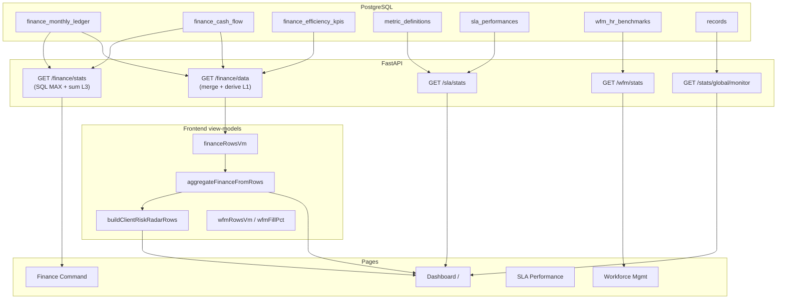

# Metrics vs Database Reality — Data Flow & Implications

**Companion to:** `docs/METRICS_COMPREHENSIVE_REFERENCE.md`  
**Database snapshot:** `dumps/tgddata_dev-full-20260616-023908.sql` (PostgreSQL dev, June 2026)  
**Purpose:** Compare what the platform *documents* vs what the DB *actually stores*, classify stored vs derived metrics, and trace **DB → API → view-model → UI** for every major module.

---

## 1. Executive summary

| Finding | Implication |
|---------|-------------|
| **Finance is the richest dataset** (7.5k ledger rows, 103 projects) | Executive & Finance Command KPIs are finance-ledger-driven and generally reliable for those accounts |
| **Only 34 projects have requisition `records`** vs 103 with finance ledger | Pipeline, requisition KPIs, Portfolio Intel, and revenue-leakage cover a **small subset** of clients |
| **SLA has 551 definitions / 9.3k performances across 57 projects** | SLA dashboards work for contracted accounts; Met% excludes ~35% "Not Reported" rows |
| **WFM has only 55 benchmark rows / 50 projects** | WFM page shows sparse portfolio; fill rate is over ~50 clients not 180 |
| **`target_ppc_inr` is empty in dev dump (0 rows)** | PPC achievement % (`ppc_ach_pct`) will be **blank everywhere** until manual upsert or ingest adds targets |
| **`non_taggd_joiners` populated on 598/2868 KPI rows** | CEO RPH blend uses α×non-Taggd credit but data is partial |
| **`has_taggd_joiner_sheet=true` on 83/180 projects** | CEO cohort metrics exclude ~97 finance-only projects unless fallback kicks in |
| **Three revenue sources coexist** (ledger, `records.revenue_results`, billing tables) | Same "revenue" label in different modules can show **different numbers** |
| **`/finance/data` uses SUM merge; `/finance/stats` uses MAX** | No duplicate keys in current dump, but policy difference matters after re-ingest |

---

## 2. Current database inventory (dev dump)

### 2.1 Row counts

| Table | Rows | Projects / clients touched |
|-------|------|----------------------------|
| `finance_monthly_ledger` | 7,512 | 103 projects |
| `finance_cash_flow` | 2,868 | (paired with ledger months) |
| `finance_efficiency_kpis` | 2,868 | same |
| `metric_definitions` | 551 | 57 projects |
| `sla_performances` | 9,351 | via definitions |
| `wfm_hr_benchmarks` | 55 | 50 projects |
| `wfm_resource_gaps` | 134 | open req lines |
| `records` | 2,540 | 34 projects |
| `candidates` | 9 | offer/onboarding barely populated |
| `revenue_forecast_weekly` | 50 | seed/demo scale |
| `revenue_visibility_snapshot` | 50 | seed/demo scale |
| `taggd_revenue_billing` | 45 | billing module |
| `projects` | 180 | |
| `clients` | 170 | |

### 2.2 Finance ledger breakdown

| `metric_category` | Rows |
|-------------------|------|
| Revenue | 2,892 |
| Contribution Margin | 2,892 |
| Cost | 1,728 |

- Revenue rows with **actual &gt; 0:** 1,567 / 2,892 (~54%)
- **Duplicate (project, month, category) keys in dump:** 0 (clean grain today)

### 2.3 Efficiency KPI field coverage (non-zero / populated)

| Column | Populated rows | % of 2,868 |
|--------|----------------|------------|
| `target_revenue_per_recruiter` | 2,477 | 86% |
| `actual_headcount_finance` | 1,646 | 57% |
| `actual_headcount_wl1` | 1,639 | 57% |
| `taggd_joiners` | 1,241 | 43% |
| `non_taggd_joiners` | 598 | 21% |
| `rev_productivity_actual_inr` | 558 | 19% |
| `approved_headcount` | 955 | 33% |
| **`target_ppc_inr`** | **0** | **0%** |

### 2.4 SLA RAG distribution

| `rag_status` | Count |
|--------------|-------|
| Met | 3,596 |
| Not Reported | 3,273 |
| Not Met | 1,879 |
| (other / empty / NA) | 603 |

**Decisive rows (Met or Not Met bucket):** ~5,510 → portfolio Met% ≈ 3,596 / (3,596+1,879) ≈ **65.7%** (matches `/sla/stats` logic excluding not_reported)

### 2.5 Records pipeline state

| `global_status` | Count |
|-----------------|-------|
| UNPROCESSED | 1,638 |
| ON HOLD | 358 |
| CLOSED | 279 |
| ACTIVE | 221 |
| PIPELINE | 41 |
| CANCELLED | 3 |

All 2,540 records have `revenue_results` JSON (tracker logic ran on ingest), but only **34 projects** contribute req data.

### 2.6 Project overlap

| Set | Count |
|-----|-------|
| Projects with finance ledger | 103 |
| Projects with SLA definitions | 57 |
| Projects with WFM benchmark | 50 |
| Projects with requisition records | 34 |
| Finance **without** records | 76 |
| Records **without** finance | 7 |

---

## 3. Metric taxonomy: stored vs derived

### Legend

- **STORED** — Value persisted in DB (ingest or manual save)
- **DERIVED (API)** — Computed in Python at read time in FastAPI
- **DERIVED (UI)** — Computed in TypeScript from API payloads
- **EXTERNAL** — SLA score/RAG ingested from client systems; formula in DB is metadata only

---

## 4. End-to-end data flow (global)



---

## 5. Module-by-module: DB → calculation → frontend

### 5.1 Corporate Finance

#### What the DB stores (L1 grain: project × month)

| UI field | DB location | Stored? |
|----------|-------------|---------|
| Revenue budget/forecast/actual | `finance_monthly_ledger` | STORED |
| CM actual | `finance_monthly_ledger` (Contribution Margin) | STORED |
| Cost | `finance_monthly_ledger.actual_cost` (Cost) | STORED |
| Unbilled, collected, target, bad debt | `finance_cash_flow` | STORED |
| HC, joiners, targets | `finance_efficiency_kpis` | STORED (partial) |

#### Backend derivation (`GET /finance/data`)

**Step 1 — Load:** Revenue ledger rows (driver), CM rows, Cost rows, all cashflow, all efficiency KPIs.

**Step 2 — Merge in Python:**
- Revenue budget/forecast/actual: **SUM** duplicates per `(project_id, reporting_month)`
- CM actual, Cost: **SUM** per key
- Cashflow fields: **SUM** per key
- KPI headcounts/joiners: **SUM**; targets/`rev_productivity_actual_inr`: **last non-null**

**Step 3 — Derive per row:**

```
attainment     = ra / rb × 100
cm_pct         = cm / ra × 100
ppc_inr        = total_cost / overall_hc        ← NULL if overall_hc=0 OR no Cost row
revenue_prod   = ra / wl1_hc                     ← NULL if wl1=0
taggd_prod     = taggd_joiners / wl1_hc
ppc_ach_pct    = ppc_inr / target_ppc × 100     ← NULL in dev (target_ppc_inr empty)
collection_pending = target - collected
```

**Step 4 — JSON response** → `financeRowsVm()` normalizes INR fields and passes through derived ratios.

#### Frontend derivation (Executive Dashboard example)

```
Dashboard.tsx loads:
  queries.financeData()  → financeRowsVm → financeRows state

Filters:
  filterFinanceRows(rows, projects, filters)     // region, account, month, quarter
  kpiRows = FY slice of filtered rows

Portfolio KPIs (NEVER uses /finance/stats on Dashboard):
  displayFinance = aggregateFinanceFromRows(kpiRows)
    Σ rev_actual, Σ cm, Σ collected, sumUnbilledAllMonths(), etc.

Hero cards bind:
  Revenue Actual     → displayFinance.revenue_actual_inr
  CM %               → total_cm / revenue_actual × 100
  Collection         → total_collected vs total_collection_target
```

#### Implications from current DB

| Metric | Will show in UI? | Why |
|--------|------------------|-----|
| Revenue / CM / Collection | **Yes** for FY-filtered accounts with ledger rows | 1,567 months with revenue actual |
| PPC (INR/HC) | **Partial** | Needs Cost row + `actual_headcount_finance`; Cost exists for fewer months than Revenue |
| PPC achievement % | **No (dev)** | `target_ppc_inr` = 0 rows populated |
| Taggd source productivity | **Partial** | Needs both `taggd_joiners` and `actual_headcount_wl1` on same month (43% / 57% coverage) |
| CEO RPH / Rev-WL1 blend | **Partial** | Cohort of 83 projects; `non_taggd_joiners` only 21% of KPI rows; constants calibrated to workbook |

#### `/finance/stats` vs Dashboard (important)

| | `/finance/stats` | Dashboard `aggregateFinanceFromRows` |
|--|------------------|--------------------------------------|
| Used by | Finance Command default tiles | Executive Overview, CEO's View |
| Merge | MAX per (project, month) then SUM | SUM via `/finance/data` merge |
| Unbilled | Latest month per project | Sum all months in FY filter |
| **Current dump** | Same totals (no duplicates) | Same totals |
| **After messy re-ingest** | Can under-count vs Dashboard | Workbook-parity (additive) |

---

### 5.2 SLA / KPI Performance

#### What the DB stores

| Field | Table | Stored? |
|-------|-------|---------|
| Metric definition, target, formula text | `metric_definitions` | STORED (metadata) |
| Monthly score | `sla_performances.score` | STORED (string from Excel) |
| RAG status | `sla_performances.rag_status` | STORED |

**The platform does NOT compute SLA scores from `formula` column.**

#### Backend derivation

`/sla/stats`:
```sql
COUNT metric_definitions → total_metrics
GROUP sla_performances.rag_status → bucket_sla_rag()
portfolio_health = met / (met + not_met) × 100
```

`/sla/timeseries`: per account per month, count met/not_met/not_reported → `met_pct`.

#### Frontend (`SLAPerformance.tsx`)

- Loads `/sla/stats`, `/sla/data`, `/sla/timeseries`
- **Metrics Met %** on page = same formula as doc, scoped by filters
- Account health tiers: RED &lt;50%, AMBER 50–74%, GREEN ≥75% on account Met%
- Bifurcation by `metric_nature` (Contractual / Internal / Penalty)

#### Implications from current DB

| Metric | Reality |
|--------|---------|
| Portfolio Met % (~66%) | Driven by 3,596 Met vs 1,879 Not Met; **3,273 Not Reported excluded** |
| Per-metric drilldown | 551 definitions but only for 57 projects |
| Risk Radar SLA score | Uses `/sla/data` latest RAG per client — sparse for finance-only accounts |

---

### 5.3 Workforce Management

#### What the DB stores (L1: project × reporting_date)

| Field | Source |
|-------|--------|
| ideal_hc, actual_hc_total, lateral_*_target | `wfm_hr_benchmarks` columns |
| wl1–wl4_hires | columns |
| open_positions, resignations, ideal_hc_by_wl | `sheet_metrics_json` |

#### Backend (`GET /wfm/stats`)

```python
# Latest snapshot per project only (_latest_wfm_benchmark_rows)
capacity_fill_rate = sum(actual) / sum(ideal) × 100
hc_gap = sum(ideal) - sum(actual)
wl_distribution = sum(wl1..wl4)
open_requisitions = count(wfm_resource_gaps)
```

#### Frontend (`WorkforceManagement.tsx` + `view-models/wfm.ts`)

- `/wfm/data` → `wfmRowsVm` → per-client rows
- **Derived in UI:** `wfmFillPct`, `wfmRowProjectedHc`, `wfmRowNetVarianceVsProjected`, aggregations by regional head / WL band
- Charts (`WfmTremorCharts.tsx`): ideal vs actual bars, WL distribution — **display only**, no new metrics

#### Implications from current DB

| Metric | Reality |
|--------|---------|
| Portfolio fill rate | Only **50 projects** with benchmarks — not full 180-project directory |
| Projected HC / variance | Depends on `sheet_metrics_json` completeness per upload |
| Executive "Workforce HC" pulse | Shows `/wfm/stats` totals — meaningful but narrow coverage |

---

### 5.4 Requisitions & Pipeline

#### What the DB stores (L0: `records`)

| Field | Stored? |
|-------|---------|
| global_status, status, dates | STORED |
| profiles_sourced, offers_released, etc. | STORED (often null) |
| revenue_results | STORED (JSON from per-project logic) |
| tto_days, ttf_days, ageing_days | STORED (may be pre-computed at ingest) |

#### Backend derivation

**`/stats/requisitions/kpis`** — SQL counts on `records`:
```
open_req   = ACTIVE AND status NOT LIKE '%offer%'
offer_req  = NOT CLOSED AND (PIPELINE OR status LIKE '%offer%')
joiners    = CLOSED
```

**`/stats/global/monitor`** — SQL aggregates + Python ageing buckets

**`compute_pipeline_metrics(records)`** — full pipeline engine for client dashboard:
- All WIP/open/offered/joiner counts, TTO/TTF, diversity, OAR, JCR — **100% DERIVED** from records at request time

#### Frontend

| Page | API | UI computation |
|------|-----|------------------|
| Requisitions | `/stats/requisitions/kpis` | Direct display |
| Dashboard pulse | same | open_req, offer_req, joiners |
| Portfolio Intel | `/stats/global/monitor` → `portfolioCompositeVm` | fillScore, activityScore, composite |
| Client Dashboard | `/client-dashboard/summary` | pipeline blocks + optional finance strip |
| Risk Radar drawer | monitor project_stats | positions, closed, pipeline revenue |

#### Implications from current DB

| Metric | Reality |
|--------|---------|
| Open reqs / joiners (portfolio) | Based on **2,540 records / 34 projects** only |
| Portfolio Intel composite | **Misleading for finance-only clients** — they won't appear in project_stats |
| Pipeline revenue in Risk Radar | Sum of `revenue_results.revenue` from tracker — **not finance ledger** |
| Revenue Leakage | Only **3 CANCELLED** in dump — module nearly empty |

---

### 5.5 Offer & Onboarding

**DB:** 9 `candidates` rows — module is **non-functional in dev data**.

Metrics (`offer_accept_rate_pct`, etc.) are DERIVED in `summarize_offer_onboarding_rows()` but will show zeros or empty.

---

### 5.6 Revenue Governance (Trackers / Billing)

**DB:** ~45–50 rows each — demo/seed scale.

| Metric | Stored in DB | UI aggregation |
|--------|--------------|----------------|
| achievement_pct | `revenue_forecast_weekly` | Mean on Visibility tab |
| conversion_rate_pct, revenue_realised_pct | `revenue_visibility_snapshot` | Mean / sum |
| pct_of_target, rph_inr | `taggd_revenue_billing` | Billing page sums/means |

Mostly **STORED** with light **UI sum/mean** — not cross-linked to finance ledger.

---

### 5.7 Executive Risk Radar

**100% DERIVED (UI)** from:
- `aggregateFinanceFromRows` per client (finance rows)
- Prior FY rows for YoY
- `/sla/data` rows for SLA Met%

**Not stored in DB.**

Implication: Clients with finance but no SLA show composite from 3 domains (budget, YoY, CM) only — SLA weight redistributed.

---

## 6. Stored vs derived — master table

| Metric | Stored | Derived API | Derived UI | Primary DB table(s) |
|--------|--------|-------------|------------|---------------------|
| Revenue actual | ✓ | | | finance_monthly_ledger |
| CM % | | ✓ | ✓ | ledger (CM + Revenue) |
| Attainment % | | ✓ | ✓ | ledger |
| PPC INR | | ✓ | ✓ | ledger Cost + efficiency KPI |
| PPC ach % | | ✓ | | needs target_ppc_inr (**empty**) |
| Taggd prod | | ✓ | ✓ | efficiency KPI |
| Collection efficiency | | ✓ | ✓ | finance_cash_flow |
| SLA score | ✓ | | | sla_performances.score |
| SLA Met % | | ✓ | ✓ | sla_performances.rag_status |
| WFM fill % | | ✓ | ✓ | wfm_hr_benchmarks |
| Projected HC | | | ✓ | wfm + sheet_metrics_json |
| Open reqs | | ✓ | | records |
| Pipeline OAR/JCR/TTF | | ✓ | ✓ | records |
| Tracker revenue | ✓ (JSON) | ✓ sum | ✓ | records.revenue_results |
| Portfolio composite | | | ✓ | records via monitor |
| Risk radar composite | | | ✓ | finance + sla |
| Data quality score | | ✓ | | records + projects |
| Projections forward rev | | | ✓ | finance history only |

---

## 7. Frontend load pattern (Dashboard as reference)

On mount, `Dashboard.tsx` parallel-fetches:

| API call | VM transform | Used for |
|----------|--------------|----------|
| `queries.financeData()` | `financeRowsVm` | All financial KPIs, charts, scorecard, risk radar finance |
| `queries.globalMonitor()` | raw | Risk radar drawer, optional |
| `queries.slaStats()` | `slaStatsVm` | Operational pulse SLA tile |
| `queries.wfmStats()` | raw | Operational pulse WFM tile |
| `queries.requisitionKpis()` | raw | Operational pulse pipeline tile |
| `queries.slaData()` | map to rows | Risk radar SLA domain |
| `queries.wfmData()` | optional detail | Risk radar / drawer |
| `queries.projects()` | raw | Filters, cohort flags, regional labels |

**All FY-scoped financial hero metrics** flow through:

```
financeData → financeRowsVm → filterFinanceRows → kpiRows (FY slice)
  → aggregateFinanceFromRows(kpiRows) → displayFinance → ExecutiveMetricHeroCard
```

**Explicit design choice:** Dashboard does **not** call `/finance/stats` to avoid showing portfolio totals when account filter returns zero rows.

---

## 8. Critical implications for stakeholders

### 8.1 "Why does Executive revenue differ from Billing?"

- **Executive** uses `finance_monthly_ledger.Revenue.actual_value` (corporate master).
- **Billing** uses `taggd_revenue_billing.revenue_booked_inr` (FY tracker template).
- **Portfolio Intel** uses `records.revenue_results.revenue` (AI/rule per req).
- These are **three different sources** — reconciliation is manual.

### 8.2 "Why is PPC achievement blank?"

Dev DB has **zero** `target_ppc_inr` values. Formula exists in code but denominator is missing → UI shows `—`.

### 8.3 "Why does SLA Met % ignore many metrics?"

3,273 performances are **Not Reported** — excluded from Met% numerator and denominator. Portfolio health reflects only decisive RAG rows.

### 8.4 "Why is WFM fill rate not for all clients?"

Only **50/180** projects have WFM benchmarks. `/wfm/stats` sums only those snapshots.

### 8.5 "Why is pipeline empty for major accounts?"

**76 finance projects have no `records`.** Client dashboard pipeline and requisition KPIs require tracker ingest (`records` table).

### 8.6 CEO cohort metrics

83 projects flagged `has_taggd_joiner_sheet`. RPH and Rev/WL1 use calibrated constants (`NON_TAGGD_JOINER_CREDIT_FOR_RPH`, `CEO_REV_PER_WL1_PORTFOLIO_WEIGHT`) to match a specific board workbook — if ingest data changes, constants may drift.

---

## 9. Verification queries (run against live DB)

```sql
-- Finance coverage
SELECT metric_category, COUNT(*), COUNT(DISTINCT project_id) 
FROM finance_monthly_ledger GROUP BY 1;

-- KPI field fill rates
SELECT 
  COUNT(*) AS rows,
  COUNT(NULLIF(target_ppc_inr, 0)) AS has_target_ppc,
  COUNT(NULLIF(non_taggd_joiners, 0)) AS has_non_taggd,
  COUNT(NULLIF(rev_productivity_actual_inr, 0)) AS has_rev_prod_actual
FROM finance_efficiency_kpis;

-- Project overlap
SELECT 
  (SELECT COUNT(DISTINCT project_id) FROM finance_monthly_ledger) AS finance_projects,
  (SELECT COUNT(DISTINCT project_id) FROM records) AS record_projects,
  (SELECT COUNT(DISTINCT project_id) FROM metric_definitions) AS sla_projects,
  (SELECT COUNT(DISTINCT project_id) FROM wfm_hr_benchmarks) AS wfm_projects;

-- SLA Met% (portfolio, decisive only)
SELECT 
  SUM(CASE WHEN LOWER(TRIM(rag_status)) IN ('met','green','rag_g') THEN 1 ELSE 0 END) AS met,
  SUM(CASE WHEN LOWER(TRIM(rag_status)) IN ('not met','red','amber','not_met') 
            OR rag_status ILIKE '%not met%' THEN 1 ELSE 0 END) AS not_met
FROM sla_performances;
```

---

*Update this document when ingesting new masters or changing merge/derive logic.*
