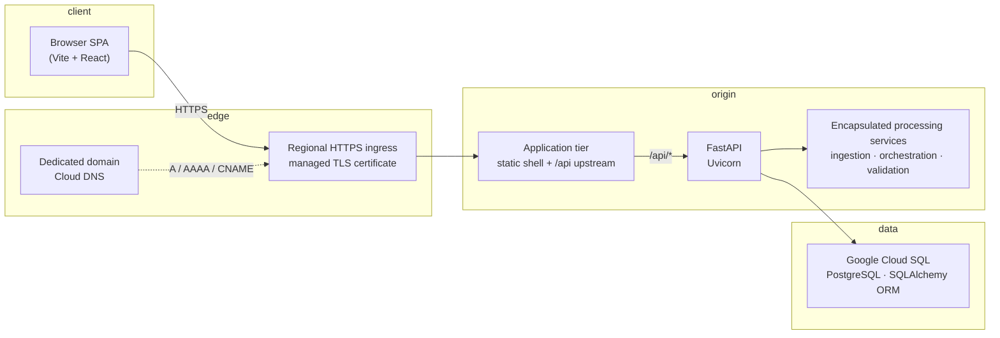

# Product architecture, APIs, deployment, and AI governance

This note describes how the Taggd data / revenue intelligence platform is engineered for **technical due diligence**, **security questionnaires**, and **customer-facing assurance**. It is written as an **architecture and controls narrative**: authentication, authorization, data residency patterns, and **bounded execution** for model-assisted workflows are first-class design choices.

**Scope.** The document summarizes **observable architecture** (browser, edge, API, data, AI boundaries), **security-relevant contracts** (HTTP, JWT, optional Microsoft linkage), and **operational expectations** (Cloud SQL, dedicated URLs, secrets). It does not reproduce proprietary prompt libraries, internal scoring models, or full endpoint inventories—those remain in code and OpenAPI for engineers and integrators who are under contract.

Formal penetration artefacts and customer-specific attestations remain **outside** this repository by convention—while the implementation choices documented here are what reviewers validate against during staging and production hardening.

---

## System architecture and technology stack

The product is a **single-page web application** served at a **stable, customer-owned HTTPS URL**—a **dedicated fully qualified domain name** (for example `https://analytics.customer.com`) published in **DNS** and fronted by **regional HTTPS ingress** with **managed TLS certificates**. There is no reliance on ad hoc tunnel hostnames or disposable preview URLs for production traffic; the browser’s address bar always reflects the **approved corporate domain**. Behind TLS, a **Python API** handles business logic, **encapsulated ingestion and reasoning services** (spreadsheet intake, structured classification, and guided automation), and persistence—**Google Cloud SQL** anchors transactional consistency. Local engineering builds may still use plain HTTP for velocity only.

**Typical request path.** The browser loads the SPA shell from the **dedicated origin**. XHR/fetch calls use a **relative `/api` prefix** (or equivalent gateway strip) so the same hostname serves static assets and API traffic. The **ingress tier** terminates TLS, optionally enforces **WAF / rate limits**, and forwards to **backend pool members**. The FastAPI process resolves the JWT (middleware), applies **role- and scope-aware** filters on data access, and returns JSON. Long-running uploads or spreadsheet work may use **extended proxy timeouts** at the edge so sessions complete without spurious **504** responses.

**Encapsulated processing services.** Work that is central to product differentiation—multi-stage **ingestion** (identification of workbook intent, normalization of columns, deterministic landing of rows into the relational model), **orchestration** of model-assisted steps with human review gates where the product requires them, and **validation** bridges between spreadsheets and governed finance or operations artefacts—is exposed only through **stable HTTP contracts** and persisted outcomes. Internal sequencing, prompts, and heuristics are treated as **implementation detail** behind those boundaries; integrators and auditors reason about **inputs, outputs, roles, and audit metadata**, which is the posture expected in enterprise procurement.

**Product surface (high level).** The platform spans **executive and operational analytics** (portfolio, finance, SLA, WFM), **requisition and candidate workflows**, **contracts and meetings**, **data operations and ingestion centers**, **revenue forecast and billing governance**, **tasks and transitions**, and **administration**—each area guarded by the authorization model described later in this document.

**Frontend.** React **18.2** with **TypeScript**, built with **Vite 5.x**, styled with **Tailwind CSS 3.x** and component patterns aligned with **Radix** / **Headless UI** / **Tremor**. Routing uses **react-router-dom 7.x**. Charts use **Chart.js**, **react-chartjs-2**, and **Recharts** where applicable. Production images build on **Node 20**; the static bundle and API upstream are delivered through the **same dedicated hostname** the customer publishes—so relative paths such as **`/api/...`** always resolve under that **trusted origin**, with TLS and certificate renewal owned by the **ingress tier** rather than by end-user tooling. The SPA stores the session token client-side for API calls; production hardening often pairs this with **short-lived tokens**, **strict CORS**, and **Content-Security-Policy** at the edge.

**Backend.** **FastAPI** (see `requirements.txt` for pinned ranges, currently **0.115+**), served by **Uvicorn**. Spreadsheet handling uses **Pandas 2.x** and **openpyxl** inside controlled ingestion paths. Container builds target **Python 3.11** (`Dockerfile.backend`); developer workstations may vary slightly without affecting contract compatibility. A **layered middleware stack** (authentication, client write/read guards) runs before route handlers so cross-cutting policies apply consistently across monolithic routes and modular routers.

**Database.** **Google Cloud SQL (PostgreSQL)** is the **documented production system of record**: managed maintenance windows, automated backups, encryption at rest aligned with GCP defaults, and connectivity via **`DATABASE_URL`** using **Cloud SQL Auth Proxy**, private IP, or equivalent VPC patterns recommended by Google. The stack is **ORM-first** (**SQLAlchemy 2.x**); engineering workflows may attach ephemeral local databases for unit work, but **customer-facing assurance packages describe Cloud SQL**, not embedded single-file engines. Application code uses **migrations and additive schema helpers** to evolve tables without manual DBA intervention for every release.

**Message and queue infrastructure.** Lifecycle and approval flows that behave like queues (finance billing workflow, revenue weekly governance, and similar) are implemented as **database-backed state machines** surfaced through REST—preserving **strong consistency**, straightforward replay for auditors, and avoiding extra moving parts (Kafka, SQS, etc.) for core contractual paths unless an integration explicitly introduces them downstream.

---

## HTTP API specification and integration authentication

**OpenAPI.** FastAPI publishes **`/openapi.json`** plus **`/docs`** (Swagger UI) and **`/redoc`**. The service title in code is **“Agentic Revenue Generator API.”** Production deployments routinely **gate schema exposure** at **HTTPS ingress or API gateway policy** (operator paths, IP allow lists, path-based blocks, or disabled routes on the **dedicated hostname**) so discovery does not expose contract metadata to unauthenticated callers—while engineering retains the OpenAPI artefact for **contract-first integrations**.

**API shape.** Besides the central **`main.py`** application, capability areas are mounted as **routers** with stable prefixes—for example **`/auth`**, **`/admin`**, **`/finance`**, **`/sla`**, **`/wfm`**, **`/revenue-trackers`**, **`/revenue-billing`**, **`/finance-billing-workflow`**, **`/revenue-weekly-submissions`**, **`/candidates`**, **`/candidate-masters`**, **`/contracts`**, **`/meetings`**, **`/vendor-licenses`**, **`/tasks`**, **`/transitions`**, **`/ceo-deck`**, **`/integrations/composio`**, **`/sla/insights/generate`** (SLA AI insights under the **`/sla`** prefix), **`/client-dashboard`**, and related routes—each combining **Pydantic request/response models** with **FastAPI dependencies** for authentication and, where applicable, **vertical (module) checks**. This modular layout keeps OpenAPI accurate for integrators while allowing independent evolution of domains.

**Platform sign-in, sessions, and who may use the product.** Access to the application is **not open to the public internet by default**: only users that exist in the platform **`users`** table may obtain a session. Individuals authenticate with **corporate email and password** via **`POST /auth/login`**; successful verification yields a **JWT** (`access_token`, `token_type: bearer`) used on subsequent calls as **`Authorization: Bearer <token>`**. The **`sub`** claim carries the numeric **user id**; middleware loads the user row on each request and rejects disabled accounts. Tokens are signed (**HS256**, **`JWT_SECRET`**) and expire per **`JWT_EXPIRE_MINUTES`** (commonly **1440** minutes unless tightened). Passwords are stored as **bcrypt** hashes (**Passlib** with a pinned bcrypt range for compatibility).

**Bootstrap and admin lifecycle.** On an **empty** `users` table, optional environment variables **`AUTH_BOOTSTRAP_EMAIL`** and **`AUTH_BOOTSTRAP_PASSWORD`** may create the first administrator—after which routine user lifecycle is handled through **`/admin/users`** (create, patch, deactivate, assign projects). **`AUTH_PLATFORM_ADMIN_EMAILS`** can normalize listed emails to full platform administrator privilege for break-glass operations. These controls keep **who may exist** under explicit operator configuration rather than anonymous self-registration.

In practice, customer administrators **provision accounts** (and retire them) so the user population stays aligned with **workforce identity**—often the **same Microsoft 365–backed mailbox** the organization already issues for email—without granting database or infrastructure access to unmanaged identities.

**Microsoft 365 connection (delegated, per user).** Beyond platform login, users may **link their Microsoft work account** through an **OAuth-style flow** mediated by **Composio** (provider **`microsoft`** stored in **`user_composio_connections`**), for example to sync **Outlook / Microsoft Calendar** into meeting features. That connection is **optional**, **per signed-in user**, and **scoped to Microsoft APIs the user consents to** during the vendor handoff; linkage and callback paths are **middleware-allowlisted** (`/integrations/composio/callback`, `/integrations/composio/webhook`), **state-signed** (HMAC over a short-lived payload) to prevent cross-user session fixation, and **webhook-verified** when shared secrets are configured—so Microsoft identity strengthens **calendar and collaboration** surfaces while remaining **orthogonal** to the platform JWT used for the rest of the API.

**Authorization and user control inside the application.** After authentication, every request is evaluated against **role**, **project scope**, and **module (vertical) entitlements** persisted on the user record and related tables:

- **Roles.** Canonical stored roles include **`platform_admin`**, **`executive`**, **`operations`**, **`project_head`**, **`recruiter`**, and **`client_user`**. Legacy values **`admin`** and **`manager`** are normalized at read time to **`platform_admin`** and **`project_head`** respectively so older rows remain compatible without forcing a one-shot data migration before cutover.
- **Project scope.** **`user_project_assignments`** ties users to **`projects.id`**. Resolution logic distinguishes **unrestricted org-wide** access (typical for platform administrators and often executives with no explicit assignment rows) from **scoped** access where queries filter to an allowed id set—preventing accidental cross-customer reads when assignments are partial.
- **Module entitlements (`vertical_access_json`).** A JSON array of **string keys** (for example `finance`, `sla`, `ingestion`, `revenue_forecast`, `meetings`, `admin_users`, `client_dashboard`, …—see `VERTICAL_KEYS` in `backend/auth/profile.py`) gates which **routers and UI modules** apply. **`operations`**, **`recruiter`**, **`project_head`**, **`executive`**, and **`client_user`** respect this list when populated; **`client_user`** additionally requires **non-empty** verticals and **at least one** project assignment. **`platform_admin`** may carry verticals for UI consistency but is not limited by them for back-office operations.
- **Client portal hardening.** **`client_user`** accounts are **read-only** for mutating HTTP methods except for an explicit **allow-list** (profile patch, avatar upload/delete, stateless assistant chat). Combined with vertical checks, this preserves **safe collaboration** with external stakeholders.

Together, **dedicated-domain HTTPS**, **provisioned platform identities**, **optional Microsoft 365 linkage for consent-based productivity features**, and **layered authorization** present a coherent story: the surface users see matches **corporate DNS and identity policy**, while the engine enforces **who exists, what they may see, and what they may change**.

**Service-to-service integration.** Automation and integrations reuse the same **JWT contract** using **service principals provisioned as users** via **`/admin/users`**. Callers obtain tokens through **`POST /auth/login`** (or a future IdP-wrapped equivalent at the edge) and attach **`Authorization: Bearer`**. **Composio** vendor ingress remains explicitly allowlisted and cryptographically verified where configured.

**CORS.** Shipping defaults in development favour rapid iteration; production on a **dedicated domain** should **pin `Access-Control-Allow-Origin`** (and related headers) at **HTTPS ingress or API gateway** to that hostname (and any explicitly approved sibling origins)—completing the browser security story alongside JWT discipline.

---

## Security testing and penetration assessments

Independent penetration exercises (dated scope, findings, remediation owners) follow **customer and organizational policy** and are typically **attached to procurement packs** rather than checked into application source control. That separation is deliberate: **code describes controls**; **reports describe exercised risk**. Teams preparing SOC2 or customer security schedules cross-link release tags to assessment summaries and ticketing systems—mirroring mature SaaS practice.

**Suggested exercise scope** for a third party against a staging deployment aligned with this document includes: **TLS configuration and certificate chain** on the dedicated hostname; **JWT forgery / expiry / replay** handling; **horizontal privilege** attempts across **project ids** and **client ids**; **vertical bypass** on representative routers; **upload size and type** abuse on ingestion endpoints; **OpenAPI and admin** path exposure when ingress policy is mis-set; **Composio callback and webhook** handling; and **prompt-injection resilience** of user-visible AI features (qualitative). Results should map to tickets with **severity, owner, and target release**.

---

## Deployment artifacts and operating model

Production references combine **container images** (frontend + API) with **Google Compute Engine** (or comparable compute), **Google Cloud SQL**, and a **customer-owned DNS name** fronted by **Google Cloud HTTPS Load Balancing** with a **Google-managed TLS certificate** (or customer-managed certs uploaded per policy). Traffic flows **`https://<dedicated-domain>` → regional external HTTPS proxy → backend service / instance group → origin application tier**; the **canonical product URL** is always that **FQDN**, not transient third-party hostnames.

**Origin tier.** Inside the VM or instance group, **Docker Compose** (or orchestrator equivalent) runs **frontend** and **backend** containers. The frontend image serves the built SPA and **reverse-proxies `/api/`** to the API container on the internal network. Health checks from the load balancer should target **`/`** and optionally **`/api/`** (or a dedicated **`/health`** if introduced) so unhealthy members drain before user impact.

Operational detail—including DNS records, backend health checks, firewall tags, and rollout commands—is summarized in **`DEPLOYMENT_DOC.md`**. Artefacts include **`Dockerfile.backend`**, **`Dockerfile.frontend`**, **`docker-compose.yml`**, **origin routing configuration** inside the container stack, and **`requirements.txt`**.

**Infrastructure-as-code.** Helm charts and Terraform roots for the core application may live in customer-specific repos; this codebase ships **images and contracts**. **`scripts/deploy-gcp.sh`** illustrates tarball-and-compose rollout on a reference VM.

**Configuration and secrets.** The following categories of secret are typical and should live in **Secret Manager** or a sealed **`.env`** on the host—not in git: **`GEMINI_API_KEY`** (AI provider), **`JWT_SECRET`** (session signing), **Cloud SQL credentials** or proxy binding, **`COMPOSIO_*`** and webhook secrets where Composio is enabled, **`AUTH_BOOTSTRAP_*`** for first boot, and optional **`NGROK_*`** / tunnel tokens **only** if non-production demos require them. **Rotation** and **least-privilege DB users** are operational habits, not application code changes.

---

## Artificial intelligence capabilities, data flow, and validation

**Model provider.** Generative assists run against **Google Gemini** via **`google-generativeai`** and, in several agents, **`instructor`** for structured outputs. The product path consistently targets **`models/gemini-flash-latest`** for: **sheet identification** (workbook taxonomy), **column mapping** (universal + RPO field alignment), **matchmaking** (filename to project), **logic drafting** (contract + tracker → `calculate` source text), **analysis agent** chat, **SLA insights** narrative generation, and **CEO deck JSON** editing. **`GEMINI_API_KEY`** (or workload identity where adopted) resides **only server-side**; browsers never observe provider secrets.

**Trust boundary.** Prompt composition and completions traverse the boundary operators define between Cloud Runtime(s) and Google’s AI endpoints—governed by **commercial and data-processing terms** customers negotiate with Google. Operators align retention, **logging redaction**, and **classification** with internal policy. Where spreadsheets contain **PII**, ingestion and AI prompts should apply **minimum necessary** excerpts (headers + small sample sets) rather than full workbook dumps unless a workflow explicitly requires more.

**Inputs.** Depending on capability, prompts may incorporate **spreadsheet headers**, **bounded sample rows**, **sheet taxonomy hints**, **natural-language instructions**, **serialized executive deck JSON**, or **aggregated SLA summaries**. Exposure is limited to what each authenticated workflow requires.

**Outputs and guardrails.**

- **Structured agent outputs** (mappings, classifications) are validated with **Pydantic** models before persistence where the pipeline uses Instructor.
- **CEO deck edits** accept optional **`focus_paths`** so the model may receive and return **only fragments** of deck JSON, merged server-side with validation for **`version: 1`**—reducing truncation risk and unintended wholesale rewrites; the browser holds unsaved state until the user commits.
- **SLA insights** and similar routers return **assistant text** plus metadata suitable for UI display; they do not silently overwrite authoritative SLA tables without a separate write path.

**Finance-adjacent assurance.**

- **Deterministic ingestion:** Ledger-style loaders persist numeric facts through validated pipelines into **Cloud SQL**, independent of narrative models.
- **Model-assisted revenue rules:** Contract-and-tracker-derived **`calculate(row)`** logic is **compiled under RestrictedPython**—limited builtins and **allow-listed imports** (`math`, `re`, `datetime`)—before execution. This supersedes earlier unrestricted interpreter binding for stored logic strings and is documented in detail in **`docs/REVENUE_LOGIC_SANDBOX.md`**.
- **Executive deck edits:** Responses are JSON-validated (**`version: 1`**), optionally merged along declared paths, and remain **client-held** until explicit save—preventing silent wholesale replacement of curated narratives.

Across these layers, AI **accelerates** structured outcomes while **identity, authorization, relational durability, and bounded execution** remain the reviewers’ anchors—consistent with how enterprises expect modern analytics platforms to present combined human and machine reasoning.

---

## Version anchors (check at release time)

Consult **`requirements.txt`** and **`frontend/package.json`** on the exact **release tag** you ship. Current baselines include:

| Layer | Typical anchor |
|-------|----------------|
| Backend runtime | **Python 3.11** (`Dockerfile.backend`) |
| API framework | **FastAPI 0.115+**, **Uvicorn 0.30+**, **SQLAlchemy 2.x** |
| Revenue logic sandbox | **RestrictedPython 8.x** |
| Frontend runtime | **Node 20** (`Dockerfile.frontend`) |
| UI | **React 18.2**, **Vite 5.x**, **TypeScript 5.x**, **Tailwind 3.4** |

Ensure **PostgreSQL client libraries** in `requirements.txt` match **Cloud SQL** major version when connecting to managed instances.

---

*Extend this overview with named penetration-test summaries and IaC pointers when procurement requires explicit annexes.*
